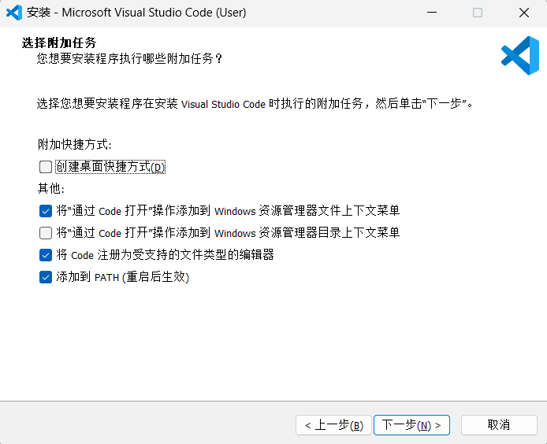
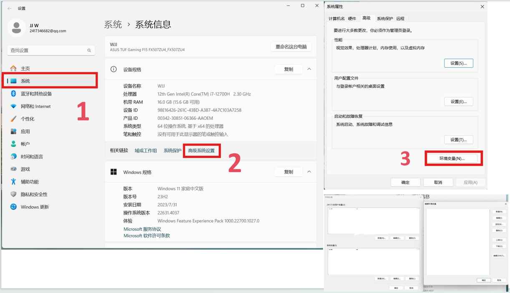
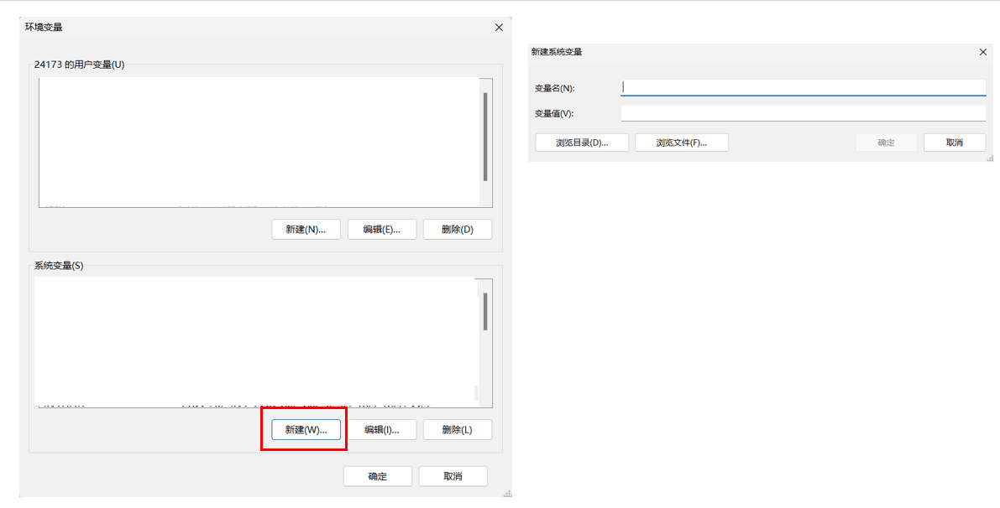
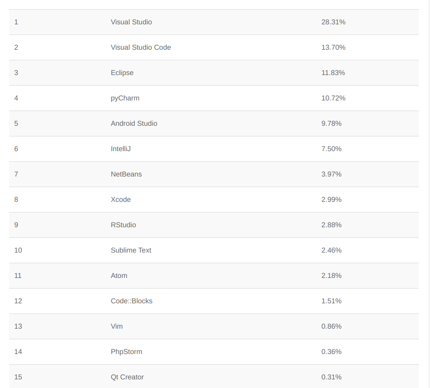

<h1 align="center">做e时代的主人</h1>

#### 前言

###### [注:这不仅是一份预习文档，也可以当作以后学习期间的长期方向指导]

​	推荐用手机或者平板，可以躺在床上或者沙发上。在电脑上也可以使用 WIN + ← 将此文档放到屏幕一侧，右边可以用自己的IDE动手做实验。

​	可以按照顺序阅读，也可以直接跳到感兴趣的章节。

**符号约定**：

 这个用来表示暂时无需完全理解的细节问题，供深入研究和思考所用；

 这个用来表示联想内容或是温馨提示;

 这个用来表示下面的内容是一段笑话或是在项目开发过程出现的梗;

 这个用来表示下面的内容是容易犯错的地方，特此警告；

**写给读者:**

​	这只是一份参考文档，并不能作为学习的唯一工具，我们推荐自己动手查阅更多资料，学习如何阅读官方文档，**这对以后的学习开发非常重**要。我们的培训不能覆盖到所有方面，而现实情况下我们遇到的问题和困难却是防不胜防的。本文档也将着力向大家传授部分阅读官方文档的方法。

​	另一方面，我们也不希望读者会对开发项目和写代码这些概念理解的过于沉重，代码只是我们在信息时代的一款语言，我们不需要去死记硬背各种标签或是函数，但是我们需要理解它们是一种什么样的存在，以及为什么而存在。

​	最后一点，在计算机领域虽然看似很抽象，但是却比现实世界要单纯许多。希望我们社团的培训能够使大家产生对计算机的兴趣，进一步学会更多技能。也希望大家正确对待计算机，多多学习和实践，成为e时代的主人。


#### 章节列表

<h6><b>入门篇</b></h6>

1. 你好, 0和1的世界
2. 网页是什么(上):元素
3. 开发环境和基础平台配置
4. 进入代码(上):基本类型和逻辑
5. 让函数再次伟大!

<h6><b>进阶篇</b></h6>

1. 进入代码(下):指针和自定义类型，更多特性
2. 编程思想浅谈
3. 了解网络协议和应用
4. 同步与异步

<h6><b>实战篇</b></h6>

1. 网页是什么(下):前端和后端
2. 前后端通用工具简介
3. 前端学习浅谈和开发规范
4. 后端学习浅谈和开发规范


## 施工中


#### 入门篇其3-开发环境和基础平台配置


##### 开发平台选择：

> ​	推荐Arch Linux或者Ubuntu作为开发环境，当然我们培训是基于windows开展的。


**编译器，编辑器和IDE**

$$
编译器 \neq IDE！
$$


	编译器是将源代码转换为可执行程序的工具，比如gcc,llvm,go build等。编译器通过多个阶段（如词法分析、语法分析、语义分析、代码⽣成等）将源代码转换成可执⾏⽂件或库。特点是可以⼀次性转换整个源代码。可以进⾏语法和语义检查，提⾼代码质量。⽣成的代码执⾏效率⾼，但编译过程可能耗时较⻓。


	s编辑器是程序员⽤于编写和修改源代码的软件⼯具。它提供了⽂本编辑的基本功能，如插⼊、删除、复制和粘贴等，以及针对编程语⾔的特定功能，如语法⾼亮、代码折叠和⾃动完成等。本⾝并不参与代码的执⾏和转换，如vscode，记事本。


	IDE是⼀种集成了多种开发⼯具和功能的软件应⽤程序，旨在提⾼软件开发的效率和质量。它通常包括源代码编辑器、编译器、调试器、构建⼯具、版本控制系统等，为程序员提供了⼀个全⾯的开发环境。集成了多种开发⼯具，⽅便程序员在同⼀个界⾯下完成开发任务。提供了丰富的功能和插件，满⾜不同开发需求。⽀持代码⾃动完成、语法⾼亮、代码重构等，提⾼编程效率和质量。可以⾃动管理代码库、构建⼯具和⽂档等，减少⼿动操作的时间和错误。如Visual Studio，IDEA，Pycharm。

 我们在入门过程中不需要完全理解编译器的原理，而是选择使用合适的编辑器或者IDE来开发项目。我们推荐使用vscode来进行开发工作。


##### 编辑器vscode 配置

使用记事本来写代码显示我们太逊了:innocent:，我们需要一个更酷炫更方便的开发工具。

这里推荐大家使用 `Visual Studio Code` 编辑器，先到其[官网下载](https://code.visualstudio.com/)安装。选择适合自己电脑的发行版进行安装。windows就一条龙到底就行了。记得选择添加到PATH中，这样方便以后在终端直接 `code .`打开这个项目文件夹。桌面快捷方式可以自行选择是否创建。



> 有关 vscode 可以看我们B站的一个视频了解一下。为什么 Visual Studio Code 被誉为 IDE 中最强的男人：https://www.bilibili.com/video/BV13v411w7Fb

现在我们已经完成了软件的安装。但是打开vscode的话里面还是空空的，因为它本身只是一个文本编辑器，我们需要安装一些插件来让它变得强大(:yum:vscode补全计划)


下面我们以配置html开发环境为例，其他语言如何配置可以查阅相关文档。先介绍vscode上几个常用组件。

**插件市场**

vscode 自身的产品思路就是一个轻量级的开发工具加上繁荣开放的插件市场组成。因此很多强大的功能需要通过安装插件来实现，目前 vscode 的插件市场中已经有着几万个插件。通过 `侧边栏上的按钮` 或快捷键 `Ctrl + Shift + X` 打开 vscode 的插件市场。


**命令面板**

vscode 的命令面板能让我们快速方便地执行很多功能与命令，包括自身的设置和插件提供的功能等。

通过 `View -> Command Palette` 或者快捷键 `Ctrl + Shift + P` 可以打开命令面板。


**配置面板**

通过 `File -> Preferences -> Settings` 或 `Ctrl + ,` 打开配置面板。


**简单的配置**

在插件市场搜索并下载一些插件，下面是一些常用的，当然你也可以自行下载：

1.中文插件

2.`Live Server` 可以将当前项目映射到本地的 IP 的端口，通过这个端口就可以像访问网站一样访问项目文件，对我们前端项目开发中的实时预览很有帮助。

3.`Prettier` 是一款强大的格式化插件，支持多种前端语言。

安装插件后还要配置一下，按下 `Ctrl + ,` 打开配置面板，输入 format 过滤配置项。将 `Default Formatter （默认格式化工具）` 选择为 `Prettier`，我个人还习惯将 `Format On Save （保存时格式化）` 勾选上。

4.`CSS Peek` 能够帮助我们快速地定位、预览样式的定义。

5.`JavaScript (ES6) code snippets` 可以帮助我们快速地插入代码块，支持以下多个前端语言。

- JavaScript (.js)
- TypeScript (.ts)
- JavaScript React (.jsx)
- TypeScript React (.tsx)
- Html (.html)
- Vue (.vue)

下载了一些插件之后，就可以进行简单的html网页开发了。

新建一个 HTML 文件，输入代码保存。右键 `Open with Live Server` 便会打开一个浏览器实时显示我们的页面


##### 系统变量设置

我们经常需要将某些路径添加到系统变量中，这样方便我们可以快速调用它们。下面以windows平台为例，演示如何添加环境变量。



点击“环境变量”选项后，可以设置变量名和值。

 

完成以后点击确定，就可以保存到环境变量了:blush:


##### 更多的开发工具

我们上网冲浪的时候，经常会看到好多人在吵用什么工具写程序是最好的。下面是全网统计的编译器/IDE受欢迎图：



​	但是 :cold_sweat: `visual studio`太重了！！而且vs主要经营.Net的开发和调试，也不是我们的主力语言。相比之下`vscode`便捷而且拥有海量插件，配置的好的话也不会比vs差到哪去。

​	不过市场上其他的编译器和IDE同样值得推荐，比如Jetbrains全家桶中的idea(收费，建议使用学信网去申请个教育包)，vim(门槛较高)，用起来也是很爽的。IDE的好处是开盖即用，不需要再过多配置，但是可能比较重而且不够自由。


#### 入门篇其4-进入代码(上):基本类型和逻辑

##### 走入代码的世界

正如同现实世界中将物质分成了各种类型一样，计算机世界里也将数据存储为了各种类型。相对的，也存在这最小的存储单元：位(bit，或者缩写为b)，也就是一个0或者1。我们通常的信息计量单位是字节(byte，缩写为B)，**一个字节是8个位**。同样的，数据的不同类型也有着不同的大小(size)。下图列举了一些常见的类型和其大小。

| 类型         | 占用存储空间               | 表示范围                         |
| ------------ | -------------------------- | -------------------------------- |
| byte         | 1字节                      | true或者false                    |
| 单精度float  | 4字节                      | -3.403e38 ~ 3.403e38             |
| 双精度double | 8字节                      | -1.798e308~1.798e308             |
| int          | 32位系统4字节64位系统8字节 | -2^31 ~ 2^31-1 或 -2^63 ~ 2^63-1 |
| uint         | 32位系统4字节64位系统8字节 | 0~2^32-1 或 0 ~ 2^64-1           |
| char         | 1字节                      | 存储ASCII字符                    |

另外还有类似int8，int64，string等类型，大家可以自行搜索做了解。

当我们知道了如何表示数据后，就可以来尝试来一段代码了：这里就用c语言来演示
定义变量的方式： [变量类型] 变量名 = 某个值或者表达式

```c
#include<stdio.h>
int main(void){
    int integer = 1;
    bool condition = false;
    char letter = 'a';
    
    printf("my first variable: %d",integer); // 输出 my first variable: 1
    // ... 其他也可以自行尝试查看如何输出
}
   
```

 我们也可能会遇到定义的变量类型和我们需要的类型不一致的情况，这时我们需要转换这个变量。一般情况下有隐式转换和显示转换两种方式，读者可以自行查阅了解相关内容，如何转换以及什么情形下可以转换。

##### 表达式

将变量通过某些运算符号连接起来，就是表达式了。比如：

```c
int v1 = 100;
float v2 = 200;
// 表达式举例
float expression_1 = v1+v2;
float expression_2 = v2-v1;
bool equal = v1==v2;

//表达式也可以连接起来：使用()来改变运算顺序
float expression_3 = 3*(expression_1+expression_2)
// 更多可以自行探索
```

##### 基本运算符
+，-， *， / ：这是表示四则运算的符号。使用%取余。

##### 逻辑运算和逻辑运算符
逻辑运算会返回真，假两个值其中之一，判断规则是第二列所示
| 符号 | 含义                         |
| ---- | ---------------------------- |
| ==   | 左右两个元素是否相等         |
| !=   | 左右两个是否不相等           |
| >    | 左边是否大于右边             |
| <    | 左边是否小于右边             |
| >=   | 左边是否不小于右边           |
| <=   | 左边是否不大于右边           |
| &&   | 左边和右边同时成立           |
| \|\| | 左边或者右边成立             |
| !    | 逻辑非，将真变为假，假变为真 |

> [注：不同语言中可能有更多的逻辑运算符，可自行查找]


##### 位运算和位运算符

(这一部分建议自行了解)

| 符号 | 描述     | 运算规则                                    |
| :--- | :------- | :------------------------------------------ |
| &    | 与       | 两个位都为1时，结果才为1                    |
| \|   | 或       | 两个位都为0时，结果才为0                    |
| ^    | 异或     | 两个位相同为0，相异为1                      |
| ~    | 取反(非) | 0变1，1变0                                  |
| <<   | 左移     | 各二进位全部左移若干位，高位丢弃，低位补0   |
| >>   | 右移     | 各二进位全部右移若干位，高位补0或符号位补齐 |

位运算我们一般用的不多，不过可能有时候会出现左移和右移的代码，通俗来讲，左移后移就是乘以2的某次幂：

``` c
int a =1;
a<<2; // = a*(2^2)
a>>1; // = a/(2^1)
```


##### 运算顺序

 在开发过程中往往会有多个运算符出现在一起，和数学上的运算一样，这时候需要规定运算顺序，以及如何改变运算顺序。

这里是一份以c语言为例的运算符优先级排序，其他语言可以自行查阅了解。有些运算符我们现在还没有提到，可以搜索看看都是什么。

| 优先级 | 操作符             | 描述                   |
| :----- | :----------------- | :--------------------- |
| 1      | `++` `--`          | 后缀自增自减运算符     |
|        | `()`               | 函数调用               |
|        | `[]`               | 数组下标               |
|        | `.`                | 类成员变量             |
|        | `−>`               | 类成员变量（指针访问） |
|        | `(*type*){*list*}` | 复合字面量             |
| 2      | `++` `--`          | 前缀自增自减运算符     |
|        | `+` `−`            | 一元加减法             |
|        | `!` `~`            | 逻辑非和位运算非       |
|        | `(*type*)`         | 显式类型转换           |
|        | `*`                | 解引用                 |
|        | `&`                | 取地址                 |
|        | `sizeof`           | Size-of                |
|        | `_Alignof`         | 对齐                   |
| 3      | `*` `/` `%`        | 乘法，除法，取余       |
| 4      | `+` `−`            | 加法和减法             |
| 5      | `<<` `>>`          | 左移和右移             |
| 6      | `<` `<=`           | 小于和不大于           |
|        | `>` `>=`           | 大于和不小于           |
| 7      | `==` `!=`          | 等于和不等于           |
| 8      | `&`                | 位运算与               |
| 9      | `^`                | 位运算异或             |
| 10     | `\|`                | 位运算或               |
| 11     | `&&`               | 逻辑运算与             |
| 12     | `\|\|`               | 逻辑运算或             |
| 13     | `?:`               | 三元条件判断符         |
| 14     | `=`                | 赋值运算               |
|        | `+=` `−=`          | 加、减到左边           |
|        | `*=` `/=` `%=`     | 乘、除、取余到左边     |
|        | `<<=` `>>=`        | 左移、右移到左边       |
|        | `&=` `^=` `|=`     | 位运算到左边           |
| 15     | `,`                | 逗号                   |

#### 实践篇其4-后端学习浅谈和开发规范


##### go语言基础


```go
package main

import "fmt"

func main(){
    fmt.Println("Hello World!")
}
```


##### go语言的代码结构

一个go语言项目的代码由不同的包组成，其中`main`包中包含主函数，即程序运行的起点

go语言的文件后缀是`.go`，每个文件必须在开头声明包，比如上例`Hello World`中，必须先声明此文件在`main`包中

然后需要引用此文件依赖的包，这部分vscode会帮你自动补全，比如，你只要在`main`函数中写`fmt.Println`，然后`Ctrl+S`保存此文件，那么`import`部分就会自动生成。一个文件有可能不依赖任何包，也有可能依赖于标准库（比如`fmt`），或者一些第三方包（比如`gin`）


##### 定义变量

使用`var`关键字定义变量

`var`关键字既可以在函数内又可以在函数外定义变量，在函数外定义的变量为全局变量，可以在此包内或者包外使用在函数内定义的变量为局部变量，只能在函数内部使用

```go
package main

var GlobalVar string = "global"

var intVar int = 5

func main(){
    var localVar string
    localVar = "local"
}
```
> go语言对变量的命名有较严格的要求。在函数外定义的变量，若变量名首字母为大写，则可以既可以在包内使用，也可以在包外使用，比如上例中的`GlobalVar`，若首字母为小写，那么只能在包内使用，比如上例中的`intVar`，

> 为了规范和合法，请遵循以下的命名规范
>
> + 大驼峰命名法：变量名中每个单词的首字母大写，比如`UserName`,`InterviewTime`
> + 小驼峰命名法：变量名中第一个单词的首字母小写，其他单词的首字母大写，比如`accessToken`,`timeLimit`
> + 变量名不以数字开头，不使用中文
> + 变量名不和go语言的关键字冲突，比如`for`,`func`


使用`:=`符号定义变量

`:=`只能在函数内定义变量，这种定义方法不需要声明类型。请使用和上面相同的命名规范

```go
package main

func main(){
    num := 25
}
```


##### go语言的基本数据类型

**`int`**:用来存储整数，可以进行基本数学运算，在64位的电脑上，其长度为64位，在32位的电脑上，其长度为32位，以64位电脑为例，其存储范围为
$$
-2^{63} \sim 2^{63}
$$

其他长度的`int`如下：`int8`,`int16`,`int32`,`int64`，长度分别为：8位，16位，32位，64位，其存储范围仿照上例

相应的，不存储符号的整数类型如下：`uint`,`uint8`,`uint16`,`uint32`,`uint64`以`uint64`为例，其存储范围是
$$
0 \sim 2^{64}
$$


**`float32`和`float64`**:用来存储浮点数类型，显然`float64`会比`float32`更加精确
```go
var percent float32 = 0.11253
```


**`string`**:用来存储字符串，定义字符串时，内容请使用双引号`"`或者反引号 ` 括起来。字符串可以进行加法操作，如下
```go

var a = "hello"
b := "world"
fmt.Println(a+b)
// 输出
// Hello World

```
可以进行索引查询操作来获取字符串中的某一个字符，如下（注意，计算机中的索引都是从0开始）

```go
str := "Hello World"
char := string(str[6])
fmt.Println(char)
// 输出
// W

```
**`bool`**:表示真和假，只有`true`,`false`，go语言中不能使用0和1来作为布尔值
```go
condition1 := true
condition2 := false
```

**数组** go语言支持动态数组，数组支持
```go
a := []int{1,2,3,4,5}
type Stu struct{
    Name string
    Age int
}
stus := []Stu{}
```


**`map`**:映射，用来存储键值对，可以将一个类型映射到另一个类型，如下：
```go
MyMap := map[string]string{
    "name":"wjj",
    "password":"123456",
}
```
根据键查值的用法，如果键在map中存储了，那么value会被赋值，ok为`true`
如果键不存在，则value不会被赋值，ok为`false`
```go
value,ok := MyMap["name"]
```


##### **fmt**

fmt包为我们提供了非常常用的输出函数
```go
fmt.Println("Why?")
```
`fmt.Println`接受多个参数，将它们都输出出来，参数之间用空格分开，输出的末尾会自动切换到下一行
```go
name := "wjj"
age := 80
fmt.Printf("My name is %s,and my age is %d",name,age)
// 输出结果是
// My name is wjj,and my age is 80
```
`fmt.Printf`接受多个参数，第一个参数中的`%s``%d`为占位符，后面的`name``age`会去填充前面的占位符。显然，你前面有多少占位符，后面就应该有多少参数
```go
status := "on going"
info := fmt.Sprintf("Our project is %s",status)
```
`fmt.Sprintf` 和 `fmt.Printf`的用法一样，但是会把本来应该的输出作为`string`类型返回出来

> 不同的类型有不同的占位符，请为每个类型使用正确的占位符，常用占位符如下

> + 十进制整数  `%d`
> + 字符串 `%s`
> + 浮点数（小数） `%f`
> + 通配符 `%v`


##### 运算符

|运算符|意义|
|--|--|
|`+`|加法|
|`-`|减法|
|`*`|乘法|
|`/`|除法|
|`%`|取余|
|`\|`|或，按位或|
|`&`|与，按位与|
|`^`|按位异或|
go语言的运算符要求两个变量的类型相同，比如下面这个例子
```go
a := 10
b := 2.2
c := float64(a) + b
// 那么c是float64类型，值为12.2

d := float(a) / b
e := a / int(b)
// d是float64类型，值为4.5454.....
// e是int类型，值为5
```


##### 分支结构

使用`if`关键字来进行分支结构，`if`的主要用法如下
```go
a := 100
if a < 100{
    fmt.Println("Hello World")
} else if a < 50 {
    fmt.Println("Hello Tenzor")
} else {
    fmt.Println("Ahhhhhh")
}
```
> 不同于其他语言，条件语句不需要加括号，但是`else`关键字必须紧跟在 `}` 所在的行

```go
var a int = 100
if a += 80;a < 200{
    fmt.Println(a)
}
```
> `if`关键字之后可以跟一个需要执行的语句，然后再跟上布尔值

使用`switch`关键字进行分支结构
```go
func main(){
    a := "技术部"
    switch a{
        case "技术部":{
            fmt.Println("tz-gin,vue")
        }
        case "美工部":{
            fmt.Println("ps,xd")
        }
        case "视频部":{
            fmt.Println("pr,ae")
        }
        default :{
            fmt.Println("你是什么部")
        }
    }
}
```


##### 循环结构

go语言使用`for`关键字进行循环结构，值得注意的是，go语言并没有`while`关键字，常见用法如下
```go
sum := 0
for i := 0;i<50;i++{
    sum += i
}
// 分号前第一个语句可以省略，中间是结束条件，后面是每次循环结束之后执行的语句

for {
    // infinite loop
}
// 可以用这个来执行无限循环
a := map[string]string{
    "name":"wjj",
    "password":"123456"
}

for key,value := range a{
    // code
}
// 使用range关键字遍历map或者数组
```


##### 定义函数

使用`func`关键字来定义函数，函数的传入值和传出值得类型可以是任意的，甚至连函数本身都可以作为参数传递给另一个函数。定义函数的范式如下：
```go
func UserInfo(name,password string,id int)string{
    // code
}

func Register(infos map[string]string,vip bool)(data string,ok bool){
    // code
}
```
当返回值只有一个值的时候，你可以不打括号，比如`UserInfo`函数，如果返回值有多个值，需要为返回值打括号，你可以为返回值命名，比如`Register`函数

go语言提供函数匿名函数，这使得在某些函数接受或者返回的类型也是函数时，能够很方便地编写，如下
```go
Anony := func(id int)string
```


##### 定义结构体

结构体可以将多个字段放在一个类型下方便使用，就像面向对象中的类一样，使用`struct`关键字创建结构体实例
```go
userInfo := struct{
    Name string
    College string
    Age int
}{
    Name:"wjj",
    College:"LZ",
    Age:80,
}
```
但是在大部分情况下，我们定义一个结构体类型都是会在多次使用的，所以可以使用`type`和`struct`关键字来定义结构体，然后可以像前面定义变量那样来实例化结构体
```go
type UserInfo struct{
    Name string
    College string
    Age int
}

func MyFunc(){
    info := UserInfo{
        Name:"syl".
        College:"Qian",
        Age:79,
    }
    fmt.Println(info)
}
```
结构体的字段我们也称之为结构体的属性。此外，我们可以像定义函数那样为结构体定义一些方法，这也是面向对象的思想

```go
type Student struct{
    Name string
    password string
    Hometon string
}

func (s Student) Login(password string)bool{
    if password == s.password{
        return true
    }    
    return false
}

func (s Student) Say(){
    fmt.Printf("Hello,my name is %s",s.Name)
}

```
> 请注意结构体字段的命名，像变量的命名那样，小写字母开头的字段只能在结构体内部的方法中使用，比如上例中的`password`而大写字母开头的字段可以在外部使用，比如`Name`
