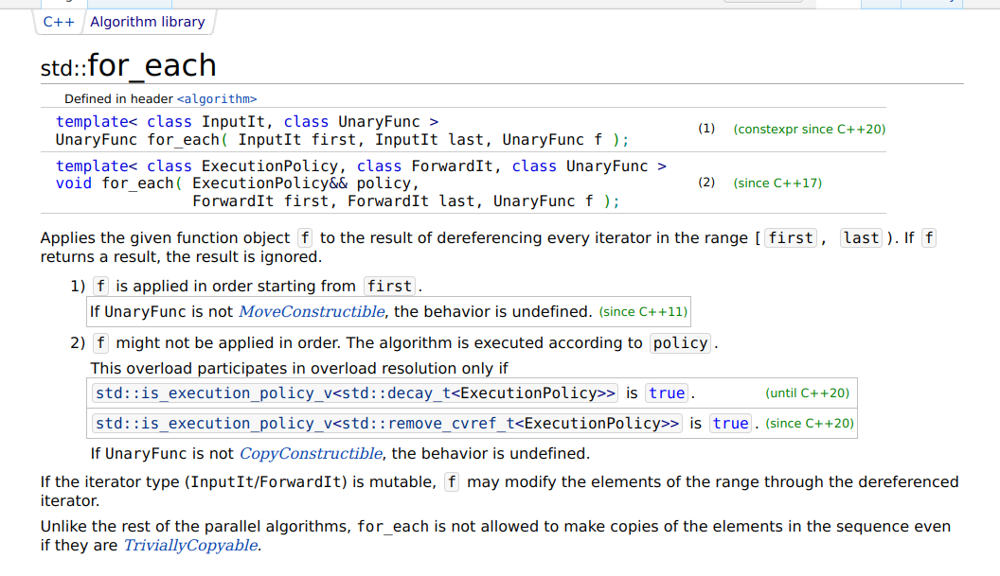

<h1 align="center">做e时代的主人</h1>

### 前言

<h6><b>[注:这不仅是一份预习文档，也可以当作以后学习期间的长期方向指导]</h6>

​	推荐用手机或者平板，可以躺在床上或者沙发上。在电脑上也可以使用 WIN + ← 将此文档放到屏幕一侧，右边可以用自己的IDE动手做实验。

​	可以按照顺序阅读，也可以直接跳到感兴趣的章节。

**符号约定**：

 这个用来表示暂时无需完全理解的细节问题，供深入研究和思考所用；

 这个用来表示联想内容或是温馨提示;

 这个用来表示下面的内容是一段笑话或是在项目开发过程出现的梗;

 这个用来表示下面的内容是容易犯错的地方，特此警告；

**写给读者:**

​	这只是一份参考文档，并不能作为学习的唯一工具，我们推荐自己动手查阅更多资料，学习如何阅读官方文档，**这对以后的学习开发非常重**要。我们的培训不能覆盖到所有方面，而现实情况下我们遇到的问题和困难却是防不胜防的。本文档也将着力向大家传授部分阅读官方文档的方法。

​	另一方面，我们也不希望读者会对开发项目和写代码这些概念理解的过于沉重，代码只是我们在信息时代的一款语言，我们不需要去死记硬背各种标签或是函数，但是我们需要理解它们是一种什么样的存在，以及为什么而存在。

​	最后一点，在计算机领域虽然看似很抽象，但是却比现实世界要单纯许多。希望我们社团的培训能够使大家产生对计算机的兴趣，进一步学会更多技能。也希望大家正确对待计算机，多多学习和实践，成为e时代的主人。


### 章节列表

<h6><b>入门篇</b></h6>

1. 你好, 0和1的世界
2. 网页简介:元素
3. 开发环境和基础平台配置
4. 进入代码(上):基本类型和逻辑
5. 让函数再次伟大!

<h6><b>进阶篇</b></h6>

1. 进入代码(下):指针和自定义类型，更多特性
2. 编程思想浅谈
3. 网络沉思录
4. 同步与异步

<h6><b>实战篇</b></h6>

1. 前后端以及通用工具简介
3. 前端学习浅谈和开发规范
4. 后端学习浅谈和开发规范


## 施工中

#### 入门篇其1-你好，0和1的世界

> [!NOTE]
>
> 本章作者：syl


##### 计算机的常规操作

###### 1.开机和关机：

开机方法比较简单，连接电源通电后按下电脑/机箱的开机键，如果有需要的话再开启显示屏即可开机。

关机的方法多样，可以通过系统提供的关机选项，也可以使用命令行(cmd,powershell,terminal等)关机。以cmd举例：

```cmd
#设置多少秒后关机
shutdown -s -t 秒数
```

###### 2.常用计算机的组件介绍：

1. 最常用的肯定就是浏览器，推荐Microsoft Edge或者Google Chrome浏览器，当然FireFox也很好。至于国内那些逆天厂商的，只能说懂得都懂。现在的浏览器一般除了访问网页的基本功能以外也可以增加丰富的插件，大家可以按需求添加。
2. 文件阅览的工具：大学中最常用到的就是word文档和PPT,也有pdf文档。可以使用系统自带的，当然pdf直接就可以在浏览器中打开。我们社团也会经常用到markdowm文档，这是Github主流的文档。可以使用Typora等工具预览和修改markdown文档，也可以使用vscode（配置vscode见入门篇其3）。
3. 


#### 入门篇其2-网页是什么(上):元素

> [!NOTE]
>
> 本章作者：cjx

网页是构成网站的基本元素，是承载各种网站应用的平台。通俗地说，网站就是由网页组成的。网页是一个包含HTML标签的纯文本文件，它可以存放在世界某个角落的某一台计算机中，是万维网中的一“页”，是超文本标记语言格式（标准通用标记语言的一个应用，文件扩展名为`.html`或`.htm`）。


网页由多个元素构成，每个元素都有其独特的功能和作用。

##### 文本

一般情况下，网页中最多的内容是文本，可以根据需要对其字体、大小、颜色、底纹、边框等属性进行设置。

##### 图像

丰富多彩的图像是美化网页必不可少的元素，用于网页上的图像一般为JPG格式和GIF格式(当然还有无限缩放而不失去清晰度的SVG格式)。网页中的图像主要用于点缀标题的小图片，介绍性的图片，代表企业形象或栏目内容的标志性图片，用于宣传广告等多种形式。

这个挑战logo就是由以下代码导入的

```html
<!-- .html文件 -->

```

上面的一串代码中，img标签被添加了三个属性，其中src属性规定了图像的路径、alt属性规定了图像无法显示时的替代文本、width属性规定了图像的宽度。除此之外，img标签还有height、draggable等属性，大家在后续学习中会逐渐接触到。

说起图像路径，我们就不得不提到两个名词：绝对路径和相对路径。

```
绝对路径是从硬盘的根目录或者Web站点的根目录开始，指明文件的真实位置，路径单一，不易更改。
相对路径是从当前工作目录出发，指定一个文件的路径。使用相对路径时，路径是相对于当前目录的，这样可以使得文件在不同的目录下可以被访问。

例：
F盘的绝对文件（夹）                      F:\Riot Games\VALORANT 
指向当前目录的子目录中的文件的相对路径   Genshin Impact Game\YuanShen.exe
指向从上一层目录开始的文件的相对路径     ..\osu!\scores.db

在相对路径中， .\ 指当前目录, ..\ 指当前目录的上一级目录, 后者可以嵌套使用, 如 ..\..\HMCL.exe

```

##### 超链接

超级链接是Web网页的主要特色，是指从一个网页指向另一个目的端的链接。这个“目的端”通常是另一个网页，也可以是下列情况之一：相同网页上的不同位置、一个下载的文件、一副图片、一个E-mail地址等。超级链接可以是文本、按钮或图片，鼠标指针指向超级链接位置时，会变成小手形状。

<a href='https://www.tiaozhan.com/'>跳转至挑战网首页</a>

```html
<!-- .html文件 -->
<a href='https://www.tiaozhan.com/'>跳转至挑战网首页</a>
```

##### 动画

动画是网页中最活跃的元素，创意出众、制作精致的动画是吸引浏览者眼球的最有效方法之一。但是如果网页动画太多，也会物极必反，使人眼花缭乱，进而产生视觉疲劳。

下面的代码定义了一个动画，实现了一个元素颜色的变化。

```css
/* .css文件 */
@keyframes animation {
  from {
    color: red;
  }
  to {
    color: green;
  }
}
```

##### 表单

表单是用来收集访问者信息或实现一些交互作用的网页，浏览者填写表单的方式是输入文本、选中单选按钮或复选框、从下拉菜单中选择选项等。

姓名：<input placeholder="请输入你的姓名" style="background-color:white">
性别：<input type='radio' name="gender" style="background-color:white">男 <input type='radio' name="gender" style="background-color:white">女

```html
<!-- .html文件 -->
<input placeholder="请输入你的姓名" style="background-color:white">
<input type='radio' name="gender" style="background-color:white">男
<input type='radio' name="gender" style="background-color:white">女
```


#### 入门篇其3-开发环境和基础平台配置

> [!NOTE]
>
> 本章作者：syl+wjj


##### 开发平台选择：

> ​	推荐Arch Linux或者Ubuntu作为开发环境，当然我们培训是基于windows开展的。


**编译器，编辑器和IDE**
$$
编译器 \neq IDE！
$$


	编译器是将源代码转换为可执行程序的工具，比如gcc,llvm,go build等。编译器通过多个阶段（如词法分析、语法分析、语义分析、代码⽣成等）将源代码转换成可执⾏⽂件或库。特点是可以⼀次性转换整个源代码。可以进⾏语法和语义检查，提⾼代码质量。⽣成的代码执⾏效率⾼，但编译过程可能耗时较⻓。


	编辑器是程序员⽤于编写和修改源代码的软件⼯具。它提供了⽂本编辑的基本功能，如插⼊、删除、复制和粘贴等，以及针对编程语⾔的特定功能，如语法⾼亮、代码折叠和⾃动完成等。本⾝并不参与代码的执⾏和转换，如vscode，记事本。


	IDE是⼀种集成了多种开发⼯具和功能的软件应⽤程序，旨在提⾼软件开发的效率和质量。它通常包括源代码编辑器、编译器、调试器、构建⼯具、版本控制系统等，为程序员提供了⼀个全⾯的开发环境。集成了多种开发⼯具，⽅便程序员在同⼀个界⾯下完成开发任务。提供了丰富的功能和插件，满⾜不同开发需求。⽀持代码⾃动完成、语法⾼亮、代码重构等，提⾼编程效率和质量。可以⾃动管理代码库、构建⼯具和⽂档等，减少⼿动操作的时间和错误。如Visual Studio，IDEA，Pycharm。

 我们在入门过程中不需要完全理解编译器的原理，而是选择使用合适的编辑器或者IDE来开发项目。我们推荐使用vscode来进行开发工作。


##### 编辑器vscode 配置

使用记事本来写代码显示我们太逊了:innocent:，我们需要一个更酷炫更方便的开发工具。

这里推荐大家使用 `Visual Studio Code` 编辑器，先到其[官网下载](https://code.visualstudio.com/)安装。选择适合自己电脑的发行版进行安装。windows就一条龙到底就行了。记得选择添加到PATH中，这样方便以后在终端直接 `code .`打开这个项目文件夹。桌面快捷方式可以自行选择是否创建。


> 有关 vscode 可以看我们B站的一个视频了解一下。为什么 Visual Studio Code 被誉为 IDE 中最强的男人：https://www.bilibili.com/video/BV13v411w7Fb

现在我们已经完成了软件的安装。但是打开vscode的话里面还是空空的，因为它本身只是一个文本编辑器，我们需要安装一些插件来让它变得强大(:yum:vscode补全计划)


下面我们以配置html开发环境为例，其他语言如何配置可以查阅相关文档。先介绍vscode上几个常用组件。

**插件市场**

vscode 自身的产品思路就是一个轻量级的开发工具加上繁荣开放的插件市场组成。因此很多强大的功能需要通过安装插件来实现，目前 vscode 的插件市场中已经有着几万个插件。通过 `侧边栏上的按钮` 或快捷键 `Ctrl + Shift + X` 打开 vscode 的插件市场。


**命令面板**

vscode 的命令面板能让我们快速方便地执行很多功能与命令，包括自身的设置和插件提供的功能等。

通过 `View -> Command Palette` 或者快捷键 `Ctrl + Shift + P` 可以打开命令面板。


**配置面板**

通过 `File -> Preferences -> Settings` 或 `Ctrl + ,` 打开配置面板。


**简单的配置**

在插件市场搜索并下载一些插件，下面是一些常用的，当然你也可以自行下载：

1.中文插件

2.`Live Server` 可以将当前项目映射到本地的 IP 的端口，通过这个端口就可以像访问网站一样访问项目文件，对我们前端项目开发中的实时预览很有帮助。

3.`Prettier` 是一款强大的格式化插件，支持多种前端语言。

安装插件后还要配置一下，按下 `Ctrl + ,` 打开配置面板，输入 format 过滤配置项。将 `Default Formatter （默认格式化工具）` 选择为 `Prettier`，我个人还习惯将 `Format On Save （保存时格式化）` 勾选上。

4.`CSS Peek` 能够帮助我们快速地定位、预览样式的定义。

5.`JavaScript (ES6) code snippets` 可以帮助我们快速地插入代码块，支持以下多个前端语言。

- JavaScript (.js)
- TypeScript (.ts)
- JavaScript React (.jsx)
- TypeScript React (.tsx)
- Html (.html)
- Vue (.vue)

下载了一些插件之后，就可以进行简单的html网页开发了。

新建一个 HTML 文件，输入代码保存。右键 `Open with Live Server` 便会打开一个浏览器实时显示我们的页面


##### 系统变量设置

我们经常需要将某些路径添加到系统变量中，这样方便我们可以快速调用它们。下面以windows平台为例，演示如何添加环境变量。


点击“环境变量”选项后，可以设置变量名和值。

 

完成以后点击确定，就可以保存到环境变量了:blush:


##### 更多的开发工具

我们上网冲浪的时候，经常会看到好多人在吵用什么工具写程序是最好的。下面是全网统计的编译器/IDE受欢迎图：


​	但是 :cold_sweat: `visual studio`太重了！！而且vs主要经营.Net的开发和调试，也不是我们的主力语言。相比之下`vscode`便捷而且拥有海量插件，配置的好的话也不会比vs差到哪去。

​	不过市场上其他的编译器和IDE同样值得推荐，比如Jetbrains全家桶中的idea(收费，建议使用学信网去申请个教育包)，vim(门槛较高)，用起来也是很爽的。IDE的好处是开盖即用，不需要再过多配置，但是可能比较重而且不够自由。


#### 入门篇其4-进入代码(上):基本类型和逻辑

> [!NOTE]
>
> 本章作者：syl


##### 走入代码的世界

正如同现实世界中将物质分成了各种类型一样，计算机世界里也将数据存储为了各种类型。相对的，也存在这最小的存储单元：位(bit，或者缩写为b)，也就是一个0或者1。我们通常的信息计量单位是字节(byte，缩写为B)，**一个字节是8个位**。同样的，数据的不同类型也有着不同的大小(size)。下图列举了一些常见的类型和其大小。

| 类型         | 占用存储空间               | 表示范围                         |
| ------------ | -------------------------- | -------------------------------- |
| bool         | 1字节                      | true或者false                    |
| 单精度float  | 4字节                      | -3.403e38 ~ 3.403e38             |
| 双精度double | 8字节                      | -1.798e308~1.798e308             |
| int          | 32位系统4字节64位系统8字节 | -2^31 ~ 2^31-1 或 -2^63 ~ 2^63-1 |
| uint         | 32位系统4字节64位系统8字节 | 0~2^32-1 或 0 ~ 2^64-1           |
| char         | 1字节                      | 存储ASCII字符                    |

另外还有类似int8，int64，string等类型，大家可以自行搜索做了解。

**这些数据在计算机底层都是存储在某个地址中**，可能是0x00这个位置上存了一个int 值1，地址就相当于是变量家的门牌号，变量值就像家里的东西，知道了门牌号自然就知道了如果找到这个房子，进而知道了家里的东西是什么。


当我们知道了如何表示和存储数据后，就可以来尝试来一段代码了：这里就用c语言来演示
**声明/定义变量的方式： [变量类型] 变量名 = 某个值或者表达式**

```c
#include<stdio.h>
int main(void){
    int integer = 1;
    bool condition = false;
    char letter = 'a';
    
    printf("my first variable: %d",integer); // 输出 my first variable: 1
    // ... 其他也可以自行尝试查看如何输出
}
   
```

 我们也可能会遇到定义的变量类型和我们需要的类型不一致的情况，这时我们需要转换这个变量。一般情况下有隐式转换和显示转换两种方式，读者可以自行查阅了解相关内容，如何转换以及什么情形下可以转换。

**注意：有些符号我们称之为“关键字”，这是语言本身提供的，用来编写代码的元素。比如上面的int, bool等。我们给变量起名时不可以和关键字重名。大家可以自行查阅常用关键字。**

有没有想过把一堆同样类型的变量放到一起？就像我们学校每个专业都是同学的集合一样。我们可以使用一个叫做**数组**的数据结构来存储。顺便一提，数组本身也是一个变量，我们会在指针章节细说。

```c
//声明和使用数组：以c语言为例
// 变量类型 数组名[大小] = {好多变量 用“，”隔开}
//举一个整型数组的例子：
int arr1[3]={1,2,3}; //这里的3是数组大小，如果后面括号里写出了所有要存储的变量的话可以省略大小，编译器会自动推断出来。

//访问数组：通过 数组名[索引]  找到对应位置的变量值 
int a1 = arr1[0]; //注意不同语言索引计数可能不一样，c语言是从0开始的
arr[2] = 10; //给对应位置赋值/修改值
int a3=arr1[3]; //出界啦！
```


##### 表达式

将变量通过某些运算符号连接起来，就是表达式了。比如：

```c
int v1 = 100;
float v2 = 200;
// 表达式举例
float expression_1 = v1+v2;
float expression_2 = v2-v1;
bool equal = v1==v2;

//表达式也可以连接起来：使用()来改变运算顺序
float expression_3 = 3*(expression_1+expression_2)
// 更多可以自行探索
```


##### 基本运算符

+，-， *， / ：这是表示四则运算的符号。使用%取余。


##### 逻辑运算和逻辑运算符

逻辑运算会返回真，假两个值其中之一，判断规则是第二列所示
| 符号 | 含义                         |
| ---- | ---------------------------- |
| ==   | 左右两个元素是否相等         |
| !=   | 左右两个是否不相等           |
| >    | 左边是否大于右边             |
| <    | 左边是否小于右边             |
| >=   | 左边是否不小于右边           |
| <=   | 左边是否不大于右边           |
| &&   | 左边和右边同时成立           |
| \|\| | 左边或者右边成立             |
| !    | 逻辑非，将真变为假，假变为真 |

> [注：不同语言中可能有更多的逻辑运算符，可自行查找]


##### 简单语句

一般情况下，编程语言中都是在 if 关键字语句中使用逻辑运算，也称"控制语句"，例如：

```c
//格式： if(condition){
// 	herein code will run if condition is true
// }else{
//	herein code will run if condition is false
// }
int a=10;
int b=20;
if(a>=0 && b<=30){ //判断如果a不小于0，同时b不大于30，如果成立则执行if语句内部的代码
	printf("right!");
}
if(a!=b){ //判断如果a不等于b，成立则执行内部代码
	//...
}else if(a<b){ // 继续判断，如果a小于b,执行内部代码
	printf("a is smaller!");
}else{ //如果之前的判断都不成立，执行这个内部的代码
	pritnf("b is smaller!");
}
```

另一方面，我们也有所谓的“循环语句”，以 for 关键字为例，

```c
//全写格式是： for(initial;final;operation)
int i=0;
for(;i<10;){
	printf("%d",i);
	i=i+1;
}
// 这个等价于
for(int j=0;j<10;j++){
	printf("%d",j);
}
```

可以自行查询 switch, while等控制、循环语句关键字的作用


##### 位运算和位运算符

(这一部分建议自行了解)

| 符号 | 描述     | 运算规则                                    |
| :--- | :------- | :------------------------------------------ |
| &    | 与       | 两个位都为1时，结果才为1                    |
| \|   | 或       | 两个位都为0时，结果才为0                    |
| ^    | 异或     | 两个位相同为0，相异为1                      |
| ~    | 取反(非) | 0变1，1变0                                  |
| <<   | 左移     | 各二进位全部左移若干位，高位丢弃，低位补0   |
| >>   | 右移     | 各二进位全部右移若干位，高位补0或符号位补齐 |

位运算我们一般用的不多，不过可能有时候会出现左移和右移的代码，通俗来讲，左移后移就是乘以2的某次幂：

``` c
int a =1;
a<<2; // = a*(2^2)
a>>1; // = a/(2^1)
```


##### 运算顺序

 在开发过程中往往会有多个运算符出现在一起，和数学上的运算一样，这时候需要规定运算顺序，以及如何改变运算顺序。

这里是一份以c语言为例的运算符优先级排序，其他语言可以自行查阅了解。有些运算符我们现在还没有提到，可以搜索看看都是什么。

| 优先级 | 操作符             | 描述                   |
| :----- | :----------------- | :--------------------- |
| 1      | `++` `--`          | 后缀自增自减运算符     |
|        | `()`               | 函数调用               |
|        | `[]`               | 数组下标               |
|        | `.`                | 类成员变量             |
|        | `−>`               | 类成员变量（指针访问） |
|        | `(*type*){*list*}` | 复合字面量             |
| 2      | `++` `--`          | 前缀自增自减运算符     |
|        | `+` `−`            | 一元加减法             |
|        | `!` `~`            | 逻辑非和位运算非       |
|        | `(*type*)`         | 显式类型转换           |
|        | `*`                | 解引用                 |
|        | `&`                | 取地址                 |
|        | `sizeof`           | Size-of                |
|        | `_Alignof`         | 对齐                   |
| 3      | `*` `/` `%`        | 乘法，除法，取余       |
| 4      | `+` `−`            | 加法和减法             |
| 5      | `<<` `>>`          | 左移和右移             |
| 6      | `<` `<=`           | 小于和不大于           |
|        | `>` `>=`           | 大于和不小于           |
| 7      | `==` `!=`          | 等于和不等于           |
| 8      | `&`                | 位运算与               |
| 9      | `^`                | 位运算异或             |
| 10     | \|                 | 位运算或               |
| 11     | `&&`               | 逻辑运算与             |
| 12     | \|\|           | 逻辑运算或             |
| 13     | `?:`               | 三元条件判断符         |
| 14     | `=`                | 赋值运算               |
|        | `+=` `−=`          | 加、减到左边           |
|        | `*=` `/=` `%=`     | 乘、除、取余到左边     |
|        | `<<=` `>>=`        | 左移、右移到左边       |
|        | `&=` `^=` `|=`     | 位运算到左边           |
| 15     | `,`                | 逗号                   |


#### 入门篇其5-让函数再次伟大！

> [!NOTE]
>
> 本章作者：syl


##### 函数是将计算机和数学联系起来的桥梁

<h6> 注虽然讲这个有点早了， 但是如果你学习过抽象代数和范畴论的话，就会知道计算机学的函数和数学上的函数本质上就是一模一样的东西。</h6>

**什么是函数**：我们一般将某个可以**控制何时使用**，可以**传入参数**，处理后**存储返回信息**的代码块称作过程，在高级编程语言中，它也被称为函数。

举个例子：c语言中函数的结构是这样的：

```c
定义：
	[返回值类型]函数名(传入参数){
		//函数体
		return 某个需要返回的值或表达式
	}
调用：
	函数名(选择传入某些参数)  //这里()是必需的,调用函数会得到这个函数返回的类型和值
```

来几个术语：

```
调用：在代码中某个地方使用已经定义的函数
传参：将需要的参数传入函数进行处理
函数体：在{}中处理参数的过程
返回：函数处理传入的参数后返回结果
```

下面是一个完整的函数定义与调用：

```c
int twice(int i){
	return i*2；
}

int main(){
	int i=1;
	int j=twice(i);
	printf("%d",j);
}
```

你可以把定义过的函数视作一个待使用的变量，可以扔到另一个函数里调用(称为回调，会在指针章节谈到)，也可以自己调用自己(称为递归)。但是如何使用变量和函数需要注意它们的生命周期，我们会在后面介绍生命周期这个概念。

```c
//递归的例子：计算第n项斐波那契数列的值
int fibonacci(int n){
    if(n == 1)
        return 1;
    if(n == 2)
        return 1;
    return fibonacci(n-1)+fibonacci(n-2);
}
```


##### 变量的生命周期

1.变量和函数都遵循先声明后使用的原则，虽然近年来大部分语言支持了部分变量和函数的声明可以在调用的之后，但是出于良好的学习和实践代码开发规范的需求，我们还是推荐先声明再使用的原则。

2.一个{}里的全部内容称作代码块，代码块内部可以定义变量，调用函数等。我们称在某个代码块内部定义的变量为它的局部变量，对应的，在整个代码文件中、在所有{}之外定义的就是全局变量。如果A代码块在B代码块的外部，那么A代码块是不能使用B代码块的局部变量的。（相当于你的钥匙没法打开隔壁宿舍的门，更进一步的，你也可以认为某些实数域上的法则是不能放到复数域的）。

```c
int global_number = 1;

void foo(){
	int function_number = 2;
}

int main(){
	//这里是main函数的内部
	int local_number = 3;

	printf("global variable: %d",global_number); //可以使用这个变量
    printf("foo variable: %d",function_number); //出错啦，这是个foo的局部变量
    printf("main variable: %d",local_number); //可以，这是main函数自己的变量
}
```

当然你可以在一个{}内写另一个{}，而更内部的能访问外部的，类似于你能打开自己的宿舍门，也能打开宿舍里面的柜子门。

这边是变量的生命周期的概念之一，{}结束时，里面的局部变量会被自动销毁，除此之外我们还可以手动控制一些变量的生命周期。

我们需要介绍几个概念，栈、堆，静态区和常量区。这里它们不是数据结构的栈和堆，而是在内存中的位置。栈用来存储局部变量、函数以及函数的返回值，这一部分我们用户是没法去干涉的。堆则是我们手动分配的内存，可以去做改变。（这一部分我们会在讲到指针的时候讲解，先做了解）。静态区存储全局变量和静态变量，常量区则是存储常量。

顺便提一下，函数也是一个变量，函数名便是指向了它地址的指针。我们会在讲指针时细说。

```c
//常量
#define PI 3.14

//静态变量
static int zero = 0;

//栈上变量，也称为自动生命周期变量
void test(){
	int tmp=10;
}
int main(int argc, char** argv) {
	int tmp=20;
    test();
}
//在函数 test中声明的 tmp变量只有在test函数被调用时才会分配空间，当函数调用结束后自动释放。
//同时main中tmp变量也局部变量。虽然 test和main函数中有同名的 tmp变量，两者是互不可见的，或者说两者存在于 2 个不同的时空中

//手动分配内存,分配了10个int类型大小的内存给了数组array
int array[10]=(int *)malloc(10*sizeof(int))
```

大家可以自行了解更多相关概念，比如静态变量是什么，语言的内存结构是什么。

当然我们也有各种方式来管理变量生命周期，比如使用移动等方式。这些我们会在以后学习中遇到。


##### 传参和返回

我们写一个swap函数如下

```c
void swap(int a,int b){
    int tmp = a;
    a = b;
    b = tmp;
}

int main(){
    int a=1;
    int b=2;
    swap(a,b);
    printf("a= %d,b= %d",a,b); //仍然是a=1 b=2;
}
```

 我们说调用函数时传入了实际参数，简称实参; 而函数接收的参数是形式参数，简称形参，顾名思义这就是实参的副本，所以对形参动手动脚是不会影响实参的。我们称这种传参方式为值传递。导致值传递没有交换成功的原因，还是之前说的那个生命周期的问题。**要明确的一点是，形参其实就是函数的局部变量**。

```c
//这是古早的c的写法，可以看到形参真正的样子是这样的
void swap(){
    int a;
    int b;
    // ...
}
```

看了这个古早c语言，你应该立刻理解了为什么说形参就是实参的副本这个原理。所以如果想要改变实参，方法有两个，一个是用返回值把实参覆盖掉，另一个就是传入实参的地址。后者便是下文的解决方法。

一个解决方法是使用引用传递，对于变量进行修改，我们不传入变量的值，而是传入变量的地址，我们会在指针章节细说这是怎么实现的，现在可以先做了解：

```c
void swap(int *a,int *b){
	int tmp = *a;
	*a = *b;
	*b = tmp;
}
int main(){
    int a=1,b=2;
    swap(&a,&b);
    printf("a=%d,b=%d",a,b); //现在就是a=2 b=1了
}
```

((((这其实就像我们数学上，先设了一个矩阵是A,然后把A带入了某个变换中，得到了B是变换后的值。但是A还是原来的A.


另一种曲线救国，但是其实本质上还是引用传递。

我们之前提过数组这个概念，所以可以这样设计：

``` c
void swap(int arr[]){
	int tmp = arr[0];
	arr[0] = arr[1];
    arr[1] = tmp;
}

int main(){
    int arr[] = {1,2};
    swap(arr);
    printf("a=%d,b=%d",arr[0],arr[1]);
}
```


#### 进阶篇其1-进入代码(下):指针和自定义类型，更多特性

> [!NOTE]
>
> 本章作者：syl

 你可能早就听闻了指针的大名。今年全球windows蓝屏的原因就是一个经典的野指针访问。（图片来自b站epcdiy）


 另一个臭名昭著的叫调用空指针，同样是程序爆炸的典中典了。


##### **所以，什么是指针，指针又为什么这么重要？**

下面是摘自维基百科的定义：

在计算机科学中，指针是一种最简单形式的[引用](https://zh.wikipedia.org/wiki/參照)（reference）。

指针有两种含义，一是作为数据类型，二是作为实体。前者如字符指针、浮点数指针等等；后者如指针对象、指针变量等。

**指针参考（reference）了存储器中一个地址**。通过被称为指针反参考（dereferencing）的动作，可以取出在那个地址中存储的[值](https://zh.wikipedia.org/wiki/值_(電腦科學))。保存在指针指向的地址中的[值](https://zh.wikipedia.org/wiki/值_(電腦科學))，可能代表另一个[变量](https://zh.wikipedia.org/wiki/變數_(程式設計))、[结构](https://zh.wikipedia.org/wiki/資料結構)、[对象](https://zh.wikipedia.org/wiki/对象_(计算机科学))或[函数](https://zh.wikipedia.org/wiki/函數)。但是从指针值是无法得知它所引用的存储器中存储了什么资料类型的信息。可以打个比方，假设将存储器当成一本书，那么一张记录了某个页码加上行号的[便利贴](https://zh.wikipedia.org/wiki/便利貼)，可以被当成是一个指向特定页面的指针；根据便利粘贴面的页码与行号，翻到那个页面，把那个页面的那一行文字读出来，就相当于是对这个指针进行反参考的动作。可做一模拟以增强对指针的理解：整数（integral）也是一类数据类型及其对象或[变量](https://zh.wikipedia.org/wiki/變數_(程式設計))，可定义具体的数据类型如短整数（short）、长整数（long）、超长整数（long long）、无符号整数（unsigned）等等；也可以用于称呼整数值、整数对象、整数变量等。又如，一个浮点数指针（float *），可称作指向了一个浮点数类型的对象。

**这一段话初看可能很迷惑，但是重点就在于，指针指向的，是存储在内存中的地址，而不是简单的变量的值。**

这里解释一下值和引用的区别：如果我想知道你在家里做什么，值相当于你告诉我在做什么，是一个给出了一个副本的过程; 引用就是相当于指针找到了你家的门牌号，通过指针就可以直接找到你在哪里、在家里做什么。我们可以参考这个图片：


指针和引用的使用方式是这样的：

```c
//取出某个变量地址，用 &
int a = 1;
printf("address of a is %p",&a);
//定义指针使用 [类型]*指针名 = 变量地址
int *p= &a;
// 使用指针需要解引用，使用 * 
int b = *p + 1;
printf("b is %d",b); //2
```

 

##### 内存结构

在了解了指针的概念后，我们可以深入探讨以下前面写过的变量生命周期的问题。先来了解一下编程语言的内存结构（不同语言可能有不同的标准内存结构），我们以c语言内存结构为例介绍变量是如何存储的（实际上这就是linux x86_64 gnu的内存结构）


我们主要描述堆和栈，其他大家自行了解即可。

我们在上面提到过，**栈区**是编译器自动管理的部分，我们用户不能也不需要干涉。这里主要是存储局部变量、函数以及返回值。而堆区就是我们用户手动管理的区域。下面是申请堆区内存的例子：

```c
// 需要头文件 #include<stdlib.h>

int *arr = (int*)malloc(10*sizeof(int)); //申请了10个int大小的空间
free(arr); //记得释放这个空间，要不然会撑爆内存的（重启电脑除外）
```

是不是感觉这和数组很像？没错，数组是一坨连续的内存组成的结构，它的数组名就是指向这一串变量的第一个的指针，也就是数组名就是指向索引为0的那个元素的指针。

```c
//所以数组也可以写做：
int *array = {1,2,3,4,5};
//可以输出 *array，发现就是array[0]
```

**这一部分大家知道概念即可，因为更先进的语言已经不需要我们再这么深入底层研究了，有很多方便的方式来分配内存，比如go语言中，使用make：**

```go
slice := make([]int,10)
for i:=0;i<10;i++{
    slice[i] = i;
}
fmt.Println(slice) // 会输出 0 1 2 3 4 ... 9
```


##### 再谈形参

所以现在可以解释之前swap函数的问题了，我们使用指针，是直接找到了变量a,b的地址，将存储在这个地址上的值进行了交换，而a，b指针的生命周期在函数swap之外，所以它们交换成功。同样的，使用数组也是一个道理。

```c
void swap(int *a,int *b){
	int tmp = *a;
	*a = *b;
	*b = tmp;
}
int main(){
    int a=1,b=2;
    swap(&a,&b);
    printf("a=%d,b=%d",a,b); //现在就是a=2 b=1了
}
```

 我们有提到过函数存储在栈上，其函数名也是指向函数的指针，大家可以自行了解是什么作用，我们只写一个例子演示：

```c
int add(int a,int b){
    return a+b;
}

int substract(int a,int b){
    return a-b;
}

//定义方式： [返回类型](*指针名)(形参列表)
//调用方式： 函数名(实参列表)
void operation(int a,int b,int(*func)(int a,int b)){
    printf("result is %d",func(a,b));
}

int main(){
    operation(10,5,add);
    operation(10,5,substract);
    return 0;
}
```

函数指针有一个相当适用的用法是回调函数，这个概念我们也会在实际开发中经常用到。


##### 指针的威力

C/C++已经被白宫列为了危险的东西，那群老登现在都在鼓吹rust。Linux系统也委员会也因为是否使用rust开发内核处于几乎内战的状态了。说到C/C++内存问题，99%都是因为指针的破坏力太大了。我们举一个例子：

```c
int a = 1;
int *p=&a;
printf("p is %p, p+1 is %p",(void*)p,(void*)(p+1); // 加减法会将地址值加减一个此类型的大小
```

WC，指针居然也能做加减运算，如果你不小心运算到了某个没有存储数据的随机地址，然后你又去尝试取它的数据，便会触发一个叫脏内存的东西。顾名思义，这就是随机的数据，可能导致你的程序崩溃退出。

另一方面，如果你已经使用free手动释放了指针，指针将变为野指针，顾名思义这将指向不可访问/不可预测的区域，如果你不小心又访问或者释放了一次，寄寄。

上面就是野指针的危害，相对的，空指针就是指向没有存储数据的地址，即0地址处，称为NULL或者nil, 这里是没有东西的。我们就不演示空指针和野指针了，大家可以自行了解。

#### 进阶篇其2-编程思想浅谈

##### 面向过程

面向过程其实是最为实际的一种思考方式，就算是面向对象的方法也是含有面向过程的思想。可以说面向过程是一种基础的方法。它考虑的是实际地实现。一般的面向过程是从上往下步步求精，所以面向过程最重要的是模块化的思想方法。面向过程编程，最典型的一个编程语言就是C语言。

> 经典笑话：把大象放进冰箱需要几步？一、把冰箱门打开。二、把大象放进去。三、把冰箱门关上。这就是一个典型的面向过程的思想。

##### 面向对象

所有的编程语言都提供抽象机制。可以认为，人们能够解决的问题的复杂性直接取决于抽象的类型和质量.

------不知道谁说的

你可以将现实生活中的任何事物都看作是（抽象为）一个对象（Object），对象的特点是：拥有自身的属性行

为能力。也就是说，对象拥有属性和方法。

属性是对象所拥有的一些数据，例如如果把班级抽象成一个对象的话，这个班级的专业，人数等等都是这个对

象的属性，同时，每个对象都可以包含其他对象，例如，一个班级对象可以拥有许多学生对象，一个年级对象

可以拥有许多班级对象。

方法是对象能够进行的操作，例如一个班级对象可以拥有班会，考试等方法。一般来说，某一特定类型的所有

对象都可以调用同样的方法。例如，夏和小和47都是属于挑战网部长类型的对象，她们都可以调用讲课方法，

但是因为她们是不同的对象，所以调用讲课方法的结果可以不一样。

面向对象的三大特点是封装继承多态，封装将对象的属性和方法划分为公有和私有，保证了外部和内部的稳定

和效率。继承简单地说就是一种层次模型，这种层次模型能够被重用。层次结构的上层具有通用性，但是下层

结构则具有特殊性。在继承的过程中类则可以从最顶层的部分继承一些方法和变量。多态是指不同事物具有不

同表现形式的能力。多态机制使具有不同内部结构的对象可以共享相同的外部接口，通过这种方式减少代码的

复杂度。


##### 函数式编程

函数式编程（Functional Programming，FP）是一种编程范式，它把计算过程视为数学上的函数运算，并将程序中的计算抽象为函数。与面向对象编程（OOP）不同，函数式编程强调“函数”的概念，注重纯函数、不可变数据和函数的组合。

在函数式编程中，函数是头等对象，这意味着一个函数，既可以作为其它函数的输入参数值，也可以从函数中返回值，被修改或者被分配给一个变量。λ演算是这种范型最重要的基础，λ演算的函数可以接受函数作为输入参数和输出返回值。

```go
func checkrole(level int){
    return func(c *gin.Context){
        loginLevel := getLoginStatus().Level()
        if loginLevel < level{
            c.Error(errors.New("您无权访问此接口"))
        }
    }
}
```

> 上面的函数，将另一个函数作为返回值，就是函数式编程思想的体现

#### 进阶篇其3-网络沉思录

> [!NOTE]
>
> 本章作者：挑战以往资料+syl


##### 什么是计算机网络

```
计算机网络包括两个或更多个通过电缆（有线）或WiFi（无线）连接的计算机，用于传输、交换或共享数据及资源。可以使用硬件（例如，路由器、交换机、接入点和电缆）和软件（例如，操作系统或业务应用程序）来构建计算机网络。

通常按地理位置来定义计算机网络。例如，局域网(LAN)可连接特定物理空间（例如办公大楼）中的计算机，而广域网(WAN)可连接各大洲的计算机。互联网是最大的WAN，它连接了全球数十亿台计算机。
```

常见网络类型是：

```
    • 局域网(LAN)：LAN可在相对短的距离内连接计算机，以便它们可以共享数据、文件和资源。例如，LAN可以连接办公大楼、学校或医院中的所有计算机。通常，LAN由私人拥有和管理。

    • 无线局域网(WLAN)：WLAN类似于LAN，但以无线方式连接网络上的设备。

    • 广域网(WAN)：顾名思义，WAN可以连接一个广阔区域（例如跨地区或跨大洲）内的计算机。互联网是最大的WAN，它连接了全球数十亿台计算机。集体所有权模型或分布式所有权模型都是常见的WAN管理模型。

    • 城域网(MAN)：MAN通常比LAN大，但比WAN小。MAN通常由城市和政府单位拥有和管理。

    • 个人区域网(PAN)：一个PAN为一个人提供服务。例如，如果您同时拥有iPhone和Mac，那么您很有可能已经建立了一个PAN，可以在两个设备之间共享和同步内容（短信、电子邮件、照片等）。

    • 校园网(CAN)：CAN也可表示企业区域网。CAN比LAN大，但比WAN小。CAN可以为学院、大学和商业园区等场所提供服务。

    • 虚拟专用网(VPN)：VPN是两个网络终端之间安全的点到点连接。VPN建立了一个加密通道，该通道将保留黑客都无法访问的用户身份和访问凭证以及所传输的所有数据。
```


##### 常用术语

```
    • IP地址：IP地址是为使用互联网协议进行通信的网络中连接的每个设备分配的唯一编号。每个IP地址都会标识设备的主机网络以及设备在主机网络上的位置。当一个设备向另一个设备发送数据时，数据包含一个"标头"，其中包含发送设备的IP地址和目标设备的IP地址。

    • 节点：节点是网络内可以接收、发送、创建或存储数据的连接点。每个节点都要求您提供某种形式的身份来接收访问权限，例如IP地址。节点的一些例子包括计算机、打印机、调制解调器、网桥和交换机。节点实质上是可以识别和处理信息并将信息传输到任何其他网络节点的任何网络设备。

    • 路由器：路由器是用于在网络之间发送数据包中包含的信息的物理或虚拟设备。路由器会分析数据包中的数据，以确定将信息传输到最终目的地的最佳方式。路由器会转发数据包，直至其到达目标节点。

    • 交换机：交换机是一种设备，它可以连接其他设备并管理网络内节点间通信以确保数据包到达最终目的地。路由器是在网络之间发送信息，而交换机是在单个网络中的节点之间发送信息。在讨论计算机网络时，"交换"是指在网络中的设备之间传输数据的方式。

    • 端口：端口将标识网络设备之间的特定连接。每个端口均由一个编号标识。如果将IP地址比作酒店的地址，那么端口就是该酒店内的套房或房间号。计算机使用端口号确定哪个应用、服务或进程应接收特定报文。（扩展知识：端口转发，一个端口承担多个作用）

    • 网络电缆类型：最常见的网络电缆类型包括以太网双绞线、同轴电缆和光纤。电缆类型的选择取决于网络的规模、网络元素的排列以及设备间的物理距离。
```


##### 网络如何工作

 这些东西阅读了解即可，具体的TCP/IP协议内容很多，今后将会逐步学习

```
计算机网络使用电缆、光纤或无线信号来连接计算机、路由器和交换机等节点。利用这些连接，网络中的设备便可以进行通信并共享信息和资源。
网络需要遵循协议，而协议定义了发送和接收通信内容的方式。协议是规则的集合，在网络中要做到有条不紊地交换数据，就必须遵循一些事先约定好的规则。这些规则明确规定了所交换的数据的格式以及相关的同步问题。为进行网络中的数据交换而建立的规则、标准或约定称为网络协议（Network Protocol），它是控制两个（或多个）对等实体进行通信的规则的集合。设备可使用这些协议进行通信。例如，网络上的每个设备都会使用TCP协议或IP协议来进行通讯。
路由器是可使不同网络进行通信的虚拟或物理设备。路由器会分析信息，以确定数据到达最终目的地的最佳方法。交换机可连接设备并管理网络内的节点间通信，从而确保信息包通过网络到达最终目的地。

最顶层的是一些应用层协议，这些协议定义了一些用于通用应用的数据报结构，包括FTP及HTTP等。中间层是UDP协议和TCP协议，它们用于控制数据流的传输。UDP是一种不可靠的数据流传输协议，仅为网络层和应用层之间提供简单的接口。而TCP协议则具有高的可靠性，通过为数据报加入额外信息，并提供重发机制，它能够保证数据不丢包、没有冗余包以及保证数据包的顺序。对于一些需要高可靠性的应用，可以选择TCP协议；而相反，对于性能优先考虑的应用如流媒体等，则可以选择UDP协议。

最底层的是网际网络协定，是用于报文交换网络的一种面向数据的协议，这一协议定义了数据包在网际传送时的格式。目前使用最多的是IPv4版本，这一版本中用32位定义IP地址，尽管地址总数达到43亿，但是仍然不能满足现今全球网络飞速发展的需求，因此IPv6版本应运而生。在IPv6版本中，IP地址共有128位，“几乎可以为地球上每一粒沙子分配一个IPv6地址”。IPv6目前并没有普及，许多网际网络服务提供商并不支持IPv6协议的连接。但是，可以预见，将来在IPv6的帮助下，任何家用电器都有可能连入网际网络。
```

如果学习大学计算机课程的话，会接触到网络体系结构，也就是下图所示的


##### HTTP协议

HTTP协议的概念如下：

```
超文本传输协议（英语：HyperText Transfer Protocol，缩写：HTTP）是一种用于分布式、协作式和超媒体信息系统的应用层协议。HTTP是万维网的数据通信的基础。
设计HTTP最初的目的是为了提供一种发布和接收HTML页面的方法。通过HTTP或者HTTPS协议请求的资源由统一资源标识符（Uniform Resource Identifiers，URI；URL是uniform resource locator，统一资源定位器，它是一种具体的URI，即URL可以用来标识一个资源，而且还指明了如何locate这个资源）来标识。URL/URI俗称网页地址，简称网址，是因特网上标准的资源的地址（Address），如同在网络上的门牌。）
HTTP是一个客户端（用户）和服务端（网站）之间请求和应答的标准，通常使用TCP协议。通过使用网页浏览器、网络爬虫或者其它的工具，客户端发起一个HTTP请求到服务器上指定端口（默认端口为80）。我们称这个客户端为用户代理程序（user agent，UA），你可以通过改变UA来伪装成不同的浏览器。
应答的服务器上存储着一些资源，比如HTML文件和图像。我们称这个应答服务器为源服务器（origin server）。而在用户代理和源服务器中间可能存在多个“中间层”，比如代理服务器、网关或者隧道（tunnel）。
尽管TCP/IP协议是互联网上最流行的应用，但是在HTTP协议中并没有规定它必须使用或它支持的层。事实上HTTP可以在任何互联网协议或其他网络上实现。HTTP假定其下层协议提供可靠的传输。因此，任何能够提供这种保证的协议都可以被其使用，所以其在TCP/IP协议族使用TCP作为其传输层。
通常，由HTTP客户端发起一个请求，建立一个到服务器指定端口（默认是80端口）的TCP连接。HTTP服务器则在那个端口监听客户端的请求。一旦收到请求，服务器会向客户端返回一个状态，比如"HTTP/1.1 200 OK"，以及返回的内容，如请求的文件、错误消息、或者其它信息。
```


**HTTP方法**

这是HTTP协议中非常重要的一环，HTTP/1.1一共定义了8中方法，我们这里指介绍常用的5种，其余的大家可以自行搜索了解。

***GET* ** 

向指定的资源发出显式的请求。只应该在读取信息时使用GET方法，而不应将其滥用于做出其他操作的请求中，例如需要传输大量内容或更改数据操作。在浏览器内输入URL直接发出的请求默认就为GET。若要在GET内加入请求参数，可在URL中附带请求参数。另外，接受GET请求的网址可能会被网络爬虫等随意访问。

***HEAD***

与GET方法一样，是向服务器发出指定资源的请求。只不过服务器将不传回资源的body部分。该请求可以获取网页中的元数据。它的好处是节省带宽。

***POST***

向指定资源提交数据，请求服务器进行处理（例如提交表单或者上传文件）。数据被包含在请求本文中。这个请求可能会建立新的资源或修改现有资源，或二者皆有。每次提交，表单的数据被浏览器编码到HTTP请求的请求体（body）里。

***PUT***

向指定资源位置上传其最新内容。

***DELETE***

请求服务器删除Request-URI所标识的资源。


 方法名称是**区分大小写**的。当某个请求所针对的资源不支持对应的请求方法的时候，服务器应当返回状态码405（Method Not Allowed），当服务器不认识或者不支持对应的请求方法的时候，应当返回状态码501（Not Implemented）。HTTP服务器至少应该实现GET和HEAD方法，其他方法都是可选的。

另外的，我们的请求方法都有着更多不同的性质，诸如安全性、幂等性等，这些建议大家多多了解。


**HTTP状态码**

我们有时候会遇到页面显示类似404、503等，这些都是常见的HTTP状态码。状态码的第一个数字代表当前响应的类型：

```
1xx 消息——请求已被服务器接收，继续处理

2xx 成功——请求已成功被服务器接收、理解、并接受

3xx 重定向——需要后续操作才能完成这一请求

4xx 请求错误——请求含有词法错误或者无法被执行

5xx 服务器错误——服务器在处理某个正确请求时发生错误
```

更多常见的HTTP状态码如下：

```
200 OK 
请求已成功，请求所希望的响应头或数据体将随此响应返回。实际的响应将取决于所使用的请求方法。在GET请求中，响应将包含与请求的资源相对应的实体。在POST请求中，响应将包含描述或操作结果的实体。
301 Moved Permanently
被请求的资源已永久移动到新位置，并且将来任何对此资源的引用都应该使用本响应返回的若干个URI之一。如果可能，拥有链接编辑功能的客户端应当自动把请求的地址修改为从服务器反馈回来的地址。除非额外指定，否则这个响应也是可缓存的。
302 Found
要求客户端执行临时重定向（原始描述短语为“Moved Temporarily”）。
400 Bad Request
由于明显的客户端错误，服务器不能或不会处理该请求。
403 Forbidden
服务器已经理解请求，但是拒绝执行它。与401响应不同的是，身份验证并不能提供任何帮助，而且这个请求也不应该被重复提交。
404 Not Found
请求失败，请求所希望得到的资源未被在服务器上发现，但允许用户的后续请求。没有信息能够告诉用户这个状况到底是暂时的还是永久的。
405 Method Not Allowed
请求行中指定的请求方法不能被用于请求相应的资源。
406 Not Acceptable
请求的资源的内容特性无法满足请求头中的条件，因而无法生成响应实体，该请求不可接受。除非这是一个HEAD请求，否则该响应就应当返回一个包含可以让用户或者浏览器从中选择最合适的实体特性以及地址栏表的实体。
408 Request Timeout
请求超时。根据HTTP规范，客户端没有在服务器预备等待的时间内完成一个请求的发送，客户端可以随时再次提交这一请求而无需进行任何更改。
429 Too Many Requests 
用户在给定的时间内发送了太多的请求。旨在用于网络限速。
500 Internal Server Error
通用错误消息，服务器遇到了一个未曾预料的状况，导致了它无法完成对请求的处理。没有给出具体错误信息。
501 Not Implemented
服务器不支持当前请求所需要的某个功能。当服务器无法识别请求的方法，并且无法支持其对任何资源的请求。（例如，网络服务API的新功能）
502 Bad Gateway
作为网关或者代理工作的服务器尝试执行请求时，从上游服务器接收到无效的响应。
503 Service Unavailable
由于临时的服务器维护或者过载，服务器当前无法处理请求。这个状况是暂时的，并且将在一段时间以后恢复。如果能够预计延迟时间，那么响应中可以包含一个Retry-After头用以标明这个延迟时间。如果没有给出这个Retry-After信息，那么客户端应当以处理500响应的方式处理它。
504 Gateway Timeout
作为网关或者代理工作的服务器尝试执行请求时，未能及时从上游服务器（URI标识出的服务器，例如HTTP、FTP、LDAP）或者辅助服务器（例如DNS）收到响应。某些代理服务器在DNS查询超时时会返回400或者500错误。
```

虽然 RFC 2616 中已经推荐了描述状态的短语，例如"200 OK"，"404 Not Found"，但是WEB开发者仍然能够自行决定采用何种短语，用以显示本地化的状态描述或者自定义信息


**HTTP请求**

请求信息格式中需要包含：

​	请求行（例如GET /images/logo.gif HTTP/1.1，表示从/images目录下请求logo.gif）

​	请求头（例如Accept-Language: en）

​	空行

​	其他消息体


来一个例子：

```
客户端请求:
GET / HTTP/1.1 （第一行指定方法、资源路径、协议版本）
Host: www.google.com （第二行是在1.1版里必须指定的一个参数，用于确定主机名称）
（……其他请求头，如Application:json）
（末尾有一个空行）

服务器应答:
HTTP/1.1 200 OK
Content-Length: 3059
Server: GWS/2.0
Date: Sat, 11 Jan 2077 02:44:04 GMT
Content-Type: text/html
Cache-control: private
Connection: keep-alive
（紧跟着一个空行，并且由HTML格式的文本组成了Google的主页）
```


**网址是什么**

统一资源定位符（URL）的标准格式如下：
[协议类型]://服务器地址:端口号/资源层级文件路径文件名?查询#片段ID
统一资源定位符的完整格式如下：
[协议类型]://访问资源需要的凭证信息@服务器地址:端口号/资源层级UNIX文件路径文件名?查询#片段ID
其中[访问凭证信息]、[端口号]、[查询]、[片段ID]都属于选填项。

这些名词解释是这样的：

1.传送协议，如http或https

2.层级URL标记符号（为“//”，固定不变）

3.访问资源需要的凭证信息（可省略）

4.服务器（通常为域名，有时为IP地址）

5.端口号（以数字方式表示，若为预设值可省略）

6.路径（以“/”区别路径中的每一个目录名称）

7.查询（GET模式的表单参数，以“?”字元为起点，每个参数以“&”隔开，再以“=”分开参数名称与资料，通常以UTF-8的URL编码，避开文字编码冲突的问题）

9.片段ID（以“#”为起点，标记了网页上的哪一部分）


 DNS负责域名解析为IP，具体方式可以自行了解。


**如何设计和进行交互**

一个重要的概念是 API： 应用程序接口（英语：application programming interface），缩写为API，是一种计算接口，它定义多个软件之间的交互，以及可以进行的调用（call）或请求（request）的种类，如何进行调用或发出请求，应使用的数据格式，应遵循的惯例等。它还可以提供扩展机制，以便用户可以通过各种方式对现有功能进行不同程度的扩展。一个API可以是完全定制的，针对某个组件的，也可以是基于行业标准设计的以确保互操作性。通过隐藏无关信息，API实现了模块化编程，从而允许用户实现独立地使用接口。

应用程序接口有诸多不同设计。用于快速执行的接口通常包括**函数名、常量、变量与其他数据结构**。在向他人提供一个API时，你需要显式地提供以上信息。下面是cppreference上的一个API：




**我们用到的API架构是 RESTful API, 后续会逐步教学，现在可以作了解**

RESTful API，Web服务必须遵守以下六个 REST 架构约束：

客户端-服务端（Client-Server）: RESTful专注于客户端和服务端的分离，服务端独立可更好服务于前端、安卓、IOS等客户端设备。

无状态（Stateless）：服务端不保存客户端状态，客户端保存状态信息每次请求携带状态信息。

可缓存性（Cacheability） ：服务端需回复是否可以缓存以让客户端甄别是否缓存提高效率。

统一接口（Uniform Interface）：通过一定原则设计接口降低耦合，简化系统架构，这是RESTful设计的基本出发点。

分层系统（Layered System）：客户端无法直接知道连接的到终端还是中间设备，分层允许你灵活的部署服务端项目。

按需编码（Code-On-Demand，可选）：按需编码允许我们灵活地发送一些可执行代码给客户端，例如JavaScript代码。
我们在设计API时URL的path是需要认真考虑的，而RESTful对path的设计做了一些规范，

```
通常一个RESTful API的path组成如下：
/{version}/{resources}/{resource_id}
version：API版本号，有些版本号放置在头信息中也可以，通过控制版本号有利于应用迭代。
resources：资源，RESTful API推荐用小写英文单词的复数形式。
resource_id：资源的id，访问或操作该资源。

当然，有时候可能资源级别较大，其下还可细分很多子资源也可以灵活设计URL的path，例如：
/{version}/{resources}/{resource_id}/{subresources}/{subresource_id}
此外，有时可能增删改查无法满足业务要求，可以在URL末尾加上action，例如
/{version}/{resources}/{resource_id}/action
其中action就是对资源的操作。
```

从大体样式了解URL路径组成之后，对于RESTful API的URL具体设计的规范如下：
  ```
   1. 不用大写字母，所有单词使用英文且小写。
   2. 连字符用中杠"-"而不用下杠"_"
   3. 正确使用 "/"表示层级关系,URL的层级不要过深，并且越靠前的层级应该相对越稳定
   4. 结尾不要包含正斜杠分隔符"/"
   5. URL中不出现动词，用请求方式表示动作
   6. 资源表示用复数不要用单数
   7. 不要使用文件扩展名
  ```


举个例子，比如我们要抽取一道题目，可以这样设计URL：

```
http://api.example.com/v1/draw
```


#### 进阶篇其4-同步与异步

> [!NOTE]
>
> 本章作者：syl

##### 进程、线程


#### 实践篇其4-后端学习浅谈和开发规范

> [!NOTE]
>
> 本章作者：wjj+syl


##### go语言基础


```go
package main

import "fmt"

func main(){
    fmt.Println("Hello World!")
}
```

上面是go语言的Hello World示例，在学习过程中遇到问题可以参阅<a href="https://golang.google.cn/doc/">go语言的官方文档</a>

go语言作为新兴的编程语言，近年来变得越来越流行，在2024年8月的TIOBE排行榜中，go语言排名第9名


###### go语言的代码结构

一个go语言项目的代码由不同的包组成，其中`main`包中包含主函数，即程序运行的起点

go语言的文件后缀是`.go`，每个文件必须在开头声明包，比如上例`Hello World`中，必须先声明此文件在`main`包中

然后需要引用此文件依赖的包，这部分vscode会帮你自动补全，比如，你只要在`main`函数中写`fmt.Println`，然后Ctrl+S保存此文件，那么`import`部分就会自动生成。一个文件有可能不依赖任何包，也有可能依赖于标准库（比如`fmt`），或者一些第三方包（比如`gin`）

###### 定义变量
使用`var`关键字定义变量

`var`关键字既可以在函数内又可以在函数外定义变量，在函数外定义的变量为全局变量，可以在此包内或者包外使用在函数内定义的变量为局部变量，只能在函数内部使用
```go
package main

var GlobalVar string = "global"

var intVar int = 5

func main(){
    var localVar string
    localVar = "local"
}
```
> go语言对变量的命名有较严格的要求。在函数外定义的变量，若变量名首字母为大写，则可以既可以在包内使用，也可以在包外使用，比如上例中的`GlobalVar`，若首字母为小写，那么只能在包内使用，比如上例中的`intVar`，

> 为了规范和合法，请遵循以下的命名规范
> + 大驼峰命名法：变量名中每个单词的首字母大写，比如`UserName`,`InterviewTime`
> + 小驼峰命名法：变量名中第一个单词的首字母小写，其他单词的首字母大写，比如`accessToken`,`timeLimit`
> + 变量名不以数字开头，不使用中文
> + 变量名不和go语言的关键字冲突，比如`for`,`func`


使用`:=`符号定义变量

`:=`只能在函数内定义变量，这种定义方法不需要声明类型。请使用和上面相同的命名规范
```go
package main

func main(){
    num := 25
}
```


###### go语言的基本数据类型
**`int`**:用来存储整数，可以进行基本数学运算，在64位的电脑上，其长度为64位，在32位的电脑上，其长度为32位，以64位电脑为例，其存储范围为
$$
-2^{63} \sim 2^{63}-1
$$
其他长度的`int`如下：`int8`,`int16`,`int32`,`int64`，长度分别为：8位，16位，32位，64位，其存储范围仿照上例

相应的，不存储符号的整数类型如下：`uint`,`uint8`,`uint16`,`uint32`,`uint64`以`uint64`为例，其存储范围是
$$
0 \sim 2^{64}
$$

**`float32`和`float64`**:用来存储浮点数类型，显然`float64`会比`float32`更加精确

```go
var percent float32 = 0.11253
```

**`string`**:用来存储字符串，定义字符串时，内容请使用双引号`"`或者反引号 ` 括起来。字符串可以进行加法操作，如下

```go

var a = "hello"
b := "world"
fmt.Println(a+b)
// 输出
// Hello World

```
可以进行索引查询操作来获取字符串中的某一个字符，如下（注意，计算机中的索引都是从0开始）

```go
str := "Hello World"
char := string(str[6])
fmt.Println(char)
// 输出
// W

```
**`bool`**:表示真和假，只有`true`,`false`，go语言中不能使用0和1来作为布尔值
```go
condition1 := true
condition2 := false
```

**`切片`** go语言支持动态数组，并且提供了一些常用方法。
```go
a := []int{1,2,3,4,5}
type Stu struct{
    Name string
    Age int
}
stus := []Stu{}

stus = append(stus,Stu{
    Name:"wjj",
    Age:80,
})
// 向切片追加值
```

**`map`**:映射，用来存储键值对，可以将一个类型映射到另一个类型，如下：

```go
MyMap := map[string]string{
    "name":"wjj",
    "password":"123456",
}

delete(MyMap,"name")
// 删除映射中的某个键值对
```
根据键查值的用法，如果键在map中存储了，那么value会被赋值，`ok`为`true`
如果键不存在，则value不会被赋值，`ok`为`false`

```go
value,ok := MyMap["name"]
```

###### **fmt**

fmt包为我们提供了几个非常常用的输出函数
```go
fmt.Println("Why?")
```
`fmt.Println`接受多个参数，将它们都输出出来，参数之间用空格分开，输出的末尾会自动切换到下一行
```go
name := "wjj"
age := 80
fmt.Printf("My name is %s,and my age is %d",name,age)
// 输出结果是
// My name is wjj,and my age is 80
```
`fmt.Printf`接受多个参数，第一个参数中的`%s``%d`为占位符，后面的`name``age`会去填充前面的占位符。显然，你前面有多少占位符，后面就应该有多少参数

```go
status := "on going"
info := fmt.Sprintf("Our project is %s",status)
```
`fmt.Sprintf` 和 `fmt.Printf`的用法一样，但是会把本来应该的输出作为`string`类型返回出来

> 不同的类型有不同的占位符，请为每个类型使用正确的占位符，常用占位符如下

> + 十进制整数  `%d`
> + 字符串 `%s`
> + 浮点数（小数） `%f`
> + 通配符 `%v`

###### 运算符
|运算符|意义|
|--|--|
|`+`|加法|
|`-`|减法|
|`*`|乘法|
|`/`|除法|
|`%`|取余|
|`|`|或，按位或|
|`&`|与，按位与|
|`^`|按位异或|

 go语言的运算符要求两个变量的类型相同，比如下面这个例子 

```go
a := 10
b := 2.2
c := float64(a) + b
// 那么c是float64类型，值为12.2

d := float(a) / b
e := a / int(b)
// d是float64类型，值为4.5454.....
// e是int类型，值为5
```

###### 简单语句
使用`if`关键字来进行分支结构，`if`的主要用法如下
```go
a := 100
if a < 100{
    fmt.Println("Hello World")
} else if a < 50 {
    fmt.Println("Hello Tenzor")
} else {
    fmt.Println("Ahhhhhh")
}
```
> 不同于其他语言，条件语句不需要加括号，但是`else`关键字必须紧跟在 `}` 所在的行

```go
var a int = 100
if a += 80;a < 200{
    fmt.Println(a)
}
```
> `if`关键字之后可以跟一个需要执行的语句，然后再跟上布尔值

 可自行查找`switch`关键字的控制语句

go语言使用`for`关键字进行循环结构，值得注意的是，go语言并没有`while`关键字，常见用法如下

```go
sum := 0
for i := 0;i<50;i++{
    sum += i
}
// 分号前第一个语句可以省略，中间是结束条件，后面是每次循环结束之后执行的语句

for {
    // infinite loop
}
// 可以用这个来执行无限循环
a := map[string]string{
    "name":"wjj",
    "password":"123456"
}

for key,value := range a{
    // code
}
// 使用range关键字遍历map或者数组
```

###### 定义函数
使用`func`关键字来定义函数，函数的传入值和传出值得类型可以是任意的，甚至连函数本身都可以作为参数传递给另一个函数。定义函数的范式如下：
```go
func UserInfo(name,password string,id int)string{
    // code
}

func Register(infos map[string]string,vip bool)(data string,ok bool){
    // code
}
```
go语言提供函数匿名函数，这使得在某些函数接受或者返回的类型也是函数时，能够很方便地编写，如下
```go
Anony := func(id int)string
```

###### 定义结构体
使用`type`和`struct`关键字来定义结构体，然后可以像前面定义变量那样来实例化结构体

```go
type UserInfo struct{
    Name string
    College string
    Age int
}

func MyFunc(){
    info := UserInfo{
        Name:"syl".
        College:"Qian",
        Age:79,
    }
    fmt.Println(info)
}
```
结构体的字段我们也称之为结构体的属性。此外，我们可以像定义函数那样为结构体定义一些方法，这也是面向对象的思想。结构体的字段和方法可以继承，下面`Student`继承了`UserInfo`的属性

```go
type Student struct{
    UserInfo
    Name string
    password string
    Hometon string
}

func (s Student) Login(password string)bool{
    if password == s.password{
        return true
    }    
    return false
}

func (s Student) Say(){
    fmt.Printf("Hello,my name is %s",s.Name)
}
```
请注意结构体字段的命名，像变量的命名那样，小写字母开头的字段只能在结构体内部的方法中使用，比如上例中的`password`；而大写字母开头的字段可以在外部使用，比如`Name`


###### 引用

go语言的引用比较自由，使用`&`来取变量的地址，使用`*`来对指针变量解引用，空指针的值为`nil`

请尽可能避免空指针的出现，这个错误在结构体的字段为切片或者`map`类型的时候尤其容易出现

```go
type MyType struct{
    Info map[string]string
    Id int
}

func main(){
    data := MyType{}
    data.Info = make(map[string]string,0)
}
```


###### go的包管理

对于一个多文件的项目来说，运行起来必须有`go.mod`和`go.sum`文件，`go.mod`记录了项目依赖的第三方包，`go.sum`记录了第三方包的版本信息。使用`go mod init <包名>`为你的项目新建`go.mod`文件，然后你可以使用`go get`来获取所依赖的第三方包。当然，更简单的方式是用`go mod tidy`来直接下载所需要的包，并且会删除没有使用的包

```shell
go mod init <包名>
go mod tidy
go get <url>@latest
```


##### go语言进阶


###### panic和recover

**`defer`关键字**

`defer`关键字后面紧跟的代码，会在当前函数的其他部分执行完后最后执行。多个`defer`关键字时，按照先进后出原则，即越早出现的`defer`越晚执行

```go
func main(){
    fmt.Println(1)
    defer fmt.Println(2)
	defer fmt.Println(3)
}
```

> 会先输出1，再输出3，最后输出2

**`panic`和`recover`**

`panic`用于触发一个错误，`recover`用于捕获和恢复一个错误，当一个函数执行到`panic`时，会立刻终止，并逐层向上返回，知道程序退出运行或者被`recover`捕获，值得注意的是，`recover`只在`defer`关键字中使用有效，并且这个`defer`定义在`panic`之前

`panic`接受和`recover`返回都是`interface{}`类型，所以可以向其中传入任意类型的参数

```go
func Sub() {
	fmt.Println("Hello World")
	panic("AN ERROR")
    fmt.Println("Ahhhhhhhhh")
}

func main() {
	defer func() {
		if r := recover(); r != nil {
			fmt.Println("Recovered:", r)
		}
	}()
	Sub()
}
```

> `Sub`函数中触发的`panic`会向上返回，被主函数中定义的`defer`中的`recover`捕获，然后被恢复，所以这个程序输出是：
>
> Hello World
>
> Recovered:AN ERROR

###### 文件操作

**`byte`和`[]byte`类型**

`byte`是字节类型，一个`byte`类型的变量空间大小就是一个字节，也即8位。在特定的编码方式下，每个字符都有自己的字节码，在`UTF-8`编码中，一个英文字符占一个字节，一个汉字通常占3个字节，在不同的编码方式中则会有所差别。

 一个文件使用什么编码方式保存，就应使用什么编码方式打开，否则就会出现乱码。现在大部分文件的编码方式都是`UTF-8`，你可以尝试用其他的编码方式打开你电脑中的文件，看看会出现什么结果

`[]byte`类型即`byte`的切片，在go语言中，`string`和 `[]byte`之间可以互相转换。go语言存储和打开文件都是通过字节码。

  go语言还提供了`rune`类型，可自行查阅

**文件的打开和关闭**

`os`包为我们提供了打开和关闭文件的方法

```go
func main(){
    f, err := os.Open("./hello.txt")
	if err != nil {
		panic(err)
	}
	defer f.Close()
	body, err := io.ReadAll(f)
	if err != nil {
		panic(err)
	}
	fmt.Println(string(body))
}
```

> `os.Open`会返回一个`os.File`的指针类型，同时返回一个错误，`os.File` 可以作为`io.Reader`和`io.Writer`类型，于是我们使用`io.ReadAll`来读取文件的全部字节，这里以`.txt`类型为例，将它的全部字节转化为字符串输出出来。使用`Close`方法来关闭文件，请及时关闭文件

 `io.ReadAll`会把文件一次性读取出来，如果文件很大的话，将整个文件加载到内存当中可能会导致内存不足或者性能下降问题。对于较大的文件，更推荐使用`bufio`包来逐步读取文件

```go
func main(){
    f, err := os.Open("./hello.txt")
	if err != nil {
		panic(err)
	}
	defer f.Close()
	r := bufio.NewReader(f)
	buf := make([]byte, 1024)
	for {
		n, err := r.Read(buf)
		if err != nil && err.Error() != "EOF" {
			panic(err)
		}
		if n == 0 {
			break
		}
		fmt.Println(buf[:n])
	}
}
```

> `n`表示每次读取文件读出来的字节数，如果读取数量为0，那么说明文件读取完毕，可以退出循环

  `os`包提供了一种更一般性的打开文件的方式：`os.OpenFile`，可自行查阅

**文件和目录的创建**

`os`包为我们提供了创建文件和目录的方法，其中，在前缀目录不存在的时候`Mkdir`会报错，`MkdirAll`则会将不存在的前缀目录全部创建，`os.ModeDir`的类型请自行参阅官方文档

```go
func CreateAFile() {
	f, err := os.Create("./dir/test.go")
	defer f.Close()
	if err != nil {
		panic(err)
	}
}

func CreateADir() {
	err := os.Mkdir("./test", os.ModeDir)
	if err != nil {
		panic(err)
	}
}

func CreateAllDir() {
	err := os.MkdirAll("./dir/hello", os.ModeDir)
	if err != nil {
		panic(err)
	}
}

```

###### 接口

go语言提供了`interface`类型用来实现空接口，我们可以在接口中声明一些方法，然后实现了这些方法的结构体都可以称为这个接口。在函数中传入或者传出参数的时候，使用合适的接口类型可以让参数的类型更加多样化，因此，如果一个参数想要接受任意类型的参数，我们既可以使用`any`类型，也可以使用空接口`interface{}`

接口类型使得go语言能够更好的面向对象编程，这种编程思想在后端的开发中有很重要的指导意义

 可以在一些社区文档或者教程中看到面向对象的思想，这种思想能让你更好得理解一些源代码

```go
type Human interface {
	Say(msg string)
	Eat(food string) (ok bool)
}

type Student struct {
	Name string
}

func (s Student) Say(msg string) {
	fmt.Printf("My name is %s,I want to say %s\n", s.Name, msg)
}

func (s Student) Eat(food string) (ok bool) {
	if food == "apple" {
		fmt.Println("delicious")
		return true
	}
	fmt.Println("Ahhhhhhhh No!!!")
	return false
}

func (s Student) Sleep(){
    fmt.Println("I'm sleeping")
}

func Do(human Human) {
	human.Say("hello")
	human.Eat("U-235")
}

func main() {
	a := Student{Name: "wjj"}
	Do(a)
}
```
> 如上例，我们把能`Say`和`Eat`的对象成为`Human`，对于`Student`结构体来说，它实现了这两个方法，此外它还有自己独特的方法`Sleep`，所以它可以作为一个`Human`，因此可以作为参数传递给`Do`函数

接口可以继承，我们可以继承上面的`Human`接口来定义一个`Child`接口。于是，实现了`Say`,`Eat`,`Cry`方法的结构体都可以称为`Child`，显然`Student`由于没有实现`Cry`方法，所以不能称为`Child`
```go
type Child interface{
    Human
    Cry()
}
```
接口类型的变量可以承接任意类型的变量，这在后面的开发中会非常使用。我们可以对接口类型的变量进行类型断言，进而使用它的一些属性和方法

```go
var stu interface{}
data,ok := stu.(Student)
if ok{
    fmt.Println("It's a student")
} else {
    fmt.Println("It's not a student")
}
```

> 这里的`stu`变量显然是一个空接口，不能作为`student`类型，所以`ok`的值是`false`，如果类型断言成功，`ok`的值为`true` ，那么就可以使用`student`类型的属性和方法

 在go语言中有两个接口很重要`io.Reader`和`io.Writer`，建议查资料了解一下，对于后面 `gin` 框架的编写很有帮助 

######   并发编程

**进程，线程和协程** 

进程的定义如下

> 进程是一个具有一定独立功能的程序在一个数据集合上依次动态执行的**过程**。进程是一个正在执行的程序的实例，包括程序计数器、寄存器和程序变量的当前值。

进程是操作系统资源分配的基本单位，拥有独立的地址空间，你可以在任务管理器中查看自己的电脑正在运行的进程。通常情况下一个进程崩溃后，并不会影响到其他进程

线程是进程的一部分，一个进程至少拥有一个线程，线程是处理器任务调度和执行的基本单位。一个进程的线程之间共享它们的进程的地址空间，一个线程的崩溃有可能导致整个进程的崩溃

go语言天然支持并发编程。值得注意的是，go语言的进程是一种轻量级的goroutine，并且在go语言中进行协程管理非常便捷，这使得`gin`框架在后端的并发情景处理中有着独特的优势

**`go func`**

go语言提供的go关键字可以很方便的开协程，配合匿名函数，完成一些并发编程就变得十分容易

```go
func main(){
    go func(){
        for i := 0;i<5;i++{
        	fmt.Println("Hello World")
        }
    }()
    time.Sleep(5*time.Second)
}
```

 `time.Sleep(5*time.Second)`指让程序休眠5秒，因为`main`包中的`main`函数所在的协程为主协程，主协程结束运行之后，其他的协程也会立即结束，所以在这里我们通过让程序休眠的方式来让`go`关键字开的协程执行完毕，在后面我们有一些其他方法来达到这个目的

这种开启协程的方式常用且方便，比如在后端程序运行的过程中想要定时发送消息，就可以通过开一个协程来实现

**`sync`包**

`sync`包是一个go的标准库，它包含的一些类型和函数可以让我们很方便的进行协程管理

```go
func main() {
	wg := sync.WaitGroup{}
	wg.Add(2)
	go func() {
		for i := 0; i < 100; i++ {
			fmt.Println("Hello")

		}
		wg.Done()
	}()
	go func() {
		for i := 0; i < 100; i++ {
			fmt.Println("World")
		}
		wg.Done()
	}()
	wg.Wait()
}
```

> 使用`sync.WaitGroup`类型及其方法可以让主协程等待子协程执行完毕之后在结束主协程，可以看到输出结果是`Hello`和`World`加菩提出现，但是它们并没有一个明确的顺序，这说明这两个循环是同时执行的
>
>  请务必保证`wg.Add` 增加的数量和`wg.Done`的数量相同，否则会导致线程阻塞

##### gin框架基础

**获取gin框架**

```shell
go get -u github.com/gin-gonic/gin
```

gin框架是在`net/http`包的基础上搭建起来的，简单易上手，支持中间件，下面是一个简单的示例代码

 gin框架基本可以满足开发需要，但是有的时候也不得不使用到`net/http`包，可自行查阅相关文档

```go
func main() {
	r := gin.Default()
	r.GET("/example", func(c *gin.Context) {
		c.JSON(http.StatusOK, gin.H{
			"msg": "hello gin!",
		})
	})
	r.Run("127.0.0.1:8080")
}
```

> 变量`r`是一个路由处理器，我们定义了一个`GET`方式的接口，通过匿名函数的方式为它分配了路由处理函数。gin框架中的路由处理函数是`func(*gin.Context)`类型，`gin,Context`是上下文，后面会讲到。这个应用运行在`127.0.0.1:8080`上，可以通过Apifox或者其他调试工具来进行测试

###### 写一个接口

为一个后端程序定义接口，我们需要为它写一个路由处理函数。一般一个路由处理函数有以下过程：获取参数及校验，编写业务逻辑，错误处理，返回值。

我们从获取**参数及校验**开始。前端向后端发送请求，携带的参数可能在URL，或者请求体中，但是我们gin框架提供了一个统一的函数来接受参数，如下

```go
func Example(c *gin.Context){
    var info interface{}
    if err := c.ShouldBind(&info);err != nil{
        // 错误处理
    }
}
```

使用空接口当然可以接受任意的参数，但是在实际的开发中，我们需要的参数类型是都是设定好的，我们通过结构体来实现这一点，比如，前端会向我们传递一个登录信息

```go
type LoginInfo struct{
    UserName string
    Password string
}

func Example(c *gin.Context){
    var info LoginInfo
    if err := c.ShouldBind(&info);err != nil{
        // 错误处理
    }
}
```

这样，我们可以精准的拿到前端传参中字段名为`username`和`password`的数据，并进一步处理。

 在获取数据的同时我们可以进行数据有效性的校验，从安全性来说，后端务必要进行数据校验。对于无法在获取时就进行校验的数据，很有必要进行单独的校验。

gin框架为我们提供了很多设定好的标签，通过为结构体的字段打标签的方式，我们就足够完成很多情况的校验了

```go
type LoginInfo struct{
    UserName string `json:"username" binding:"required"`
    Password string `json:"password" binding:"required,numeric"`
}
```

> 在数据类型之后使用反引号\` 来为字段打标签，已`UserName`字段为例：`json`标签的意义是：在`ShouldBind`接受参数时，仅接受键名为`username`的`json`传参，`binding`标签内部的标签：`required`指这个字段在传参的时候是必填的，`numeric`指这个字符串字段应该是纯数字的

`binding`标签内部的常见标签如下表

| 标签名 | 意义 |
| ------ | ---- |
|  required | 必填     |
|omitempty|选填|
|len=10|字符串长度为10|
|min=10|字符串的最小长度为10，或者整数的最小值为10|
|max=100|字符串的最大长度为100，或者整数的最大值为100|
|numeric|字符串应该为纯数字|
|oneof=技术部 视频部 美工部|字符串的值应当是`技术部`,`视频部`,`美工部`之一|
|url|字符串应该是一个合法的url|
|ip|字符串应该是一个合法的ip地址|
|email|字符串应该是一个合法的email地址|

  gin框架提供了非常丰富的标签用来校验，可自行参考gin框架官方文档

在结构体的字段类型是切片的时候，使用`dive`标签来对切片的每个元素进行校验

```go
type Info struct{
    Age int `json:"age" binding:"required,min=0,max=100"`
    Hometon string `json:"hometon" binding:"required"`
}

type UserInfo struct{
    DepartmentName string `json:"department_name" binding:"required"`
    Info []Info `json:"info" binding:"required,dive"`
}
```

> 使用`dive`标签可以对`UserInfo` 的`Info`切片的每个元素进行校验

对于`Query`参数，只要把上面的`json`标签全部改成`form`标签就可以了

 `json`参数存在于请求体中，`form`参数存在于`URL`中，故而在写`GET`请求的路由处理函数的时候，请不要尝试使用`json`标签来接受参数，尽管在某些测试工具中，可能不会出现问题

在`URL`中，还存在着`Param`参数，使用专门的方法来获取

```go
func Example(c *gin.Context){
    id := c.Param("id")
}
```

> 通过`Param`方法来获取字段名为`id`的`Param`参数，此时变量`id`的值默认为`string`类型，请自行处理并进行校验

接下来我们来说**返回值**，作为后端，在绝大部分情况下，我们的返回值都是`JSON` 。示例如下：

```go
c.JSON(http.StatusOK,gin.H{
    "msg":"Hello Wolrd"
})
```

> `http.StatusOK`就是状态码200，`gin.H`就是`map[string]any`类型的别称，其他的状态码自行查阅`net/http`包文档
>
>  记得不要使用中文作为键的名称哦，不然前端的代码会非常离谱的 

下面是**错误处理**，在处理错误的时候，我们需要向上下文报告错误，对返回值进行一些修改报告错误只需要用`Error`方法即可

```go
err := c.Error(errors.New("An Error"))
```

> `Error`方法会向上下文报告错误，并且返回一个包装过的`err`，你可以使用这个`err`来进行一些后续的处理

###### 写一个中间件

在写中间件之前，我们先来看看如何使用中间件

```go
func Middleware(c *gin.Context){
    // code
}

r := gin.Default()
r.User(Middleware)
```

可以看到，中间件的类型和路由处理函数一样，都是 `func (*gin.Context)`类型，通过 `Use`方法，可以让路由处理函数使用中间件。中间件会在路由处理函数的之前和之后运行，如果一个路由使用了多个中间件，那么这些中间件的执行顺序会按照参数传入的顺序。对于一个特定的中间件，你可能并不想让你的每个路由都使用它，你可以按照下面的方式来更加自由的使用中间件

```go
r.GET("/info",function1)
r.DELETE("/info",function3,Midware3)
r.Use(Midware1)
r.POST("/info",function2,Midware2)
```

> 这里的`GET`请求不会使用任何中间件，`DELETE`会使用`Midware3`，`POST`会使用`Midware1`和`Midware3`

中间件时路由处理过程的一部分，其函数中获取参数的方法和上面写到的相同，我们通常用中间件来进行鉴权，错误处理等。中间件和路由处理函数的地位时等同的，接下来我们会用`handlerFunc`来称它们。`gin.Context`有两个特殊的方法`Next`和`Abort`，`Next`方法会暂停当前`handlerFunc`的运行，等待其他`handlerFunc`运行完毕之后再继续运行，而`Abort`方法会立即结束当前的路由处理，即后面的`handlerFunc`都不会再执行了，但是之前被`c.Next`搁置的`handlerFunc`会继续执行完毕。当然了，有多个`handlerFunc`被`c.Next`搁置之后，会按照倒序执行

现在我们来写一个错误处理中间件

```go
func Error(c *gin.Context){
    c.Next()
    if len(c.Errors) > 0{
        err := c.Errors.Last().Err
        c.JSON(http.StatusOK,gin.H{
            "success":false,
            "err":err,
        })
    }
}

r.User(Error)
```

> 在所有的路由之前使用这个中间件，然后使用`c.Next`方法，使得错误处理在路由处理的最后执行，这个错误处理会向前端返回一个面对错误时的`json`，这样我们在写路由处理函数的时候，就只需要向上下文报告错误就可以了

 值得注意的是，`handlerFunc`之间是可以通过`gin.Context`通信的， gin框架为我们预留了这些函数，请参考gin框架官方文档

###### 管理你的路由

上面定义接口的方式会让代码变得冗杂，为了能使接口和路由更加的简洁易读，可以使用`Group`方法对路由进行分组。使用合适的分组，让路由更加直观易读，并且可以让中间件的使用更加准确

```go
r := gin.Default()

apiRouter := r.Group("/api")
{
    apiRouter.GET("/info",func(){})
    apiRouter.POST("/login",func(){})
    stuRouter := apiRouter.Group("/stu")
    stuRouter.Use(Midware)
    {
        stuRouter.GET("info",func(){})
    }
}
```


##### 数据库和gorm

数据库是一个按数据结构来存储和管理数据的计算机软件系统。常用的数据库比如MySQL，SQL Server，Oracle等等。挑战使用的数据库是MySQL，开源，体积小，速度快，适用于中小型企业领域。

关系型数据库是一种以关系（即表格）为基础的数据库，它采用了关系代数等数学概念和方法来处理数据。

###### 下载MySQL和Navicat

点击这里<a href="https://dev.mysql.com/downloads/mysql">下载</a>MySQL

点击这里<a href="https://navicat.com.cn">进入官网</a>下载Navicat

###### MySQL

使用MySQL就可以完成数据库操作了，但是可视化的Navicat可以使我们的操作更加直观

登录你的`mysql`

```shell
mysql -u <用户名> -p
```

`mysql`创建数据库

```mysql
CREATE DATABASE <数据库名>
```

MySQL的具体操作可自查<a href="https://www.runoob.com">菜鸟教程</a>


`ORM`，Object Relational Mapping，即对象关系映射，在关系型数据库和编程的对象之间建立映射，`gorm`，即go语言中的`orm`，使用`gorm`使得我们能够通过go语言操纵数据库，从而完成一些业务逻辑

 **获取`gorm`**

```shell
go get -u gorm.io/gorm
go get -u gorm.io/driver/sqlite
```

`gorm`的<a href="https://gorm.io/zh_CN/docs/index.html">官方文档</a>

定义合适的模型，并且通过`Model`来和数据库进行交互，使得维护数据库更加统一
