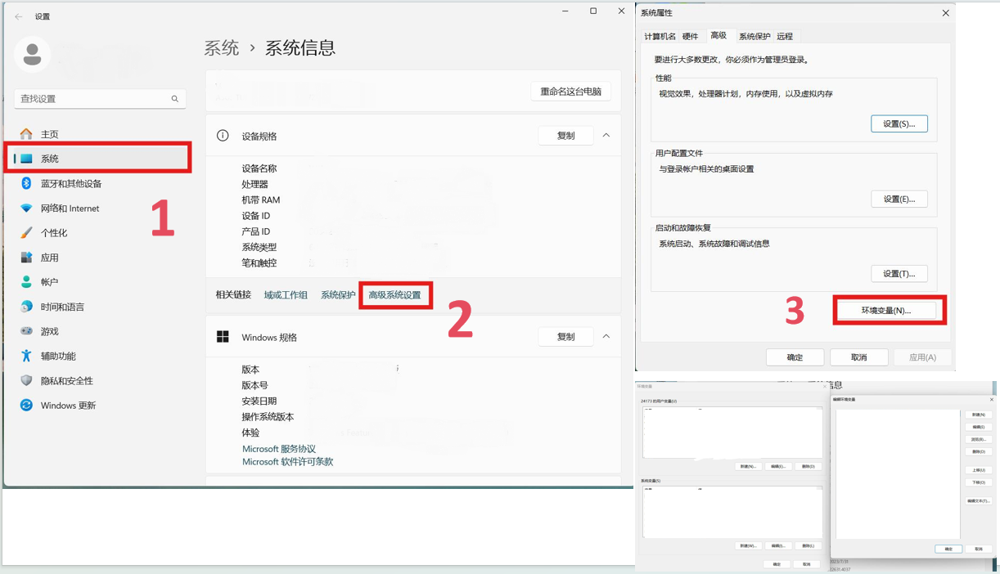

<h1 align="center">做e时代的主人</h1>

### 前言

<h6><b>[注:这不仅是一份预习文档，也可以当作以后学习期间的长期方向指导]</h6>

​	推荐用手机或者平板，可以躺在床上或者沙发上。在电脑上也可以使用 WIN + ← 将此文档放到屏幕一侧，右边可以用自己的IDE动手做实验。

​	可以按照顺序阅读，也可以直接跳到感兴趣的章节。

**符号约定**：

 这个用来表示暂时无需完全理解的细节问题，供深入研究和思考所用；

 这个用来表示联想内容或是温馨提示;

 这个用来表示下面的内容是一段笑话或是在项目开发过程出现的梗;

 这个用来表示下面的内容是容易犯错的地方，特此警告；

我们会在每章前面使用⭐标出本章难度，5星即为最重要的内容，只用文本难以阐述完全，需要大家查阅更多资料。


**写给读者:**

​	这只是一份参考文档，并不能作为学习的唯一工具，我们推荐自己动手查阅更多资料，学习如何阅读官方文档，**这对以后的学习开发非常重要**。我们的培训不能覆盖到所有方面，而现实情况下我们遇到的问题和困难却是防不胜防的。本文档也将着力向大家传授部分阅读官方文档的方法。

​	另一方面，我们也不希望读者会对开发项目和写代码这些概念理解的过于沉重，代码只是我们在信息时代的一款语言，我们不需要去死记硬背各种标签或是函数，但是我们需要理解它们是一种什么样的存在，以及为什么而存在。

​	最后一点，在计算机领域虽然看似很抽象，但是却比现实世界要单纯许多。希望我们社团的培训能够使大家产生对计算机的兴趣，进一步学会更多技能。也希望大家正确对待计算机，多多学习和实践，成为e时代的主人。


### 章节列表

<h6><b>入门篇</b></h6>

1. [你好, 0和1的世界](#hello)
2. [网页简介:元素](#page)
3. [开发环境和基础平台配置](#configuration)
4. [进入代码(上):基本类型和逻辑](#type)
5. [让函数再次伟大!](#MFGA)

<h6><b>进阶篇</b></h6>

1. [进入代码(下):指针和自定义类型，更多特性](#pointer)
2. [编程思想浅谈](#idea)
3. [网络沉思录](#brainfuck)
4. [同步与异步](#sync)

<h6><b>实践篇</b></h6>

1. [前后端以及通用工具简介](#common)
3. [前后端学习浅谈和开发规范](#stack)


#### <span id="hello">入门篇其1-你好，0和1的世界</span>

> [!NOTE]
>
> 本章作者：syl
>
> 难度：⭐


##### 计算机的常规操作

###### 1.开机和关机：

开机方法比较简单，连接电源通电后按下电脑/机箱的开机键，如果有需要的话再开启显示屏即可开机。

关机的方法多样，可以通过系统提供的关机选项，也可以使用命令行(cmd,powershell,terminal等)关机。以cmd举例：

```cmd
#设置多少秒后关机
shutdown -s -t 秒数
```

###### 2.电脑截屏

windows自带截屏工具，可以在`开始->所有应用`里找，也可以使用更快捷的方法：`Win+Shift+S`

macOS，可使用`Command+Shift+4`，进行截屏

如果上面两种方式你都不喜欢，那么你也可以使用QQ的截屏工具，如下图


请务必不要使用手机拍屏，因为图片质量非常差，完全没法看清楚内容


###### 3.常用计算机的组件介绍：

1. 最常用的肯定就是浏览器，推荐Microsoft Edge或者Google Chrome浏览器，当然FireFox也很好。至于国内那些逆天厂商的，只能说懂得都懂。现在的浏览器一般除了访问网页的基本功能以外也可以增加丰富的插件，大家可以按需求添加。

2. 文件阅览的工具：大学中最常用到的就是word文档和PPT,也有pdf文档。可以使用系统自带的（如Microsoft），当然pdf直接就可以在浏览器中打开。我们社团也会经常用到markdowm文档，这是Github主流的文档。可以使用Typora等工具预览和修改markdown文档，也可以使用vscode（配置vscode见入门篇其3）。

3. 压缩工具：推荐7zip, xz等。极力反对国内某数字公司自研的快压（纯纯逆天）。

4. 命令行工具：后续学习中将涉及到一些基本命令，windows用户可以学习以下powershell,比cmd好用。Linux用户就默认会用了。

   其他的可以按需配置。

###### 4.文件后缀名

文件后缀名（File Extension）是一个在文件名后面的标识，用来指示文件的类型或格式。它通常由一个句点（.）后跟一到多个字符组

成，例如 `.txt `、`.jpg `、`.pdf ` 等。文件后缀名是计算机操作系统和应用程序用来识别文件类型的一种方式。

不同的文件后缀名通常表示不同的文件格式。例如：

`.txt ` 表示纯文本文件。

`.jpg ` 或 `.jpeg ` 表示JPEG图像文件。

`.pdf ` 表示Adobe PDF文档。

`.html ` 表示HTML网页文件。

这些后缀名有助于计算机系统和应用程序根据文件类型选择适当的程序来打开或处理文件。它们也有助于用户快速识别文件类型，以便

进行适当的操作。

按照如下的流程来打开文件的扩展名显示


###### 5.F12开发者工具

F12开发者工具是浏览器内置的一个特殊工具，用于帮助网页开发者调试和优化网站。它提供了一些有用的功

能，让开发者可以更容易地理解和修改网页。

点击左上角的箭头图标（或按快捷键Ctrl+Shift+C）进入**元素选择模式**，从页面中选择需要查看的元素，可以在开发者工具元素（Elements）一栏中快速定位到该元素源代码的具体位置。


使用控制台来进行一些代码调试


##### 配置和自学路线

###### 1.更多推荐：

1. 字体：后续面对代码场景时建议选用等宽字体，视觉效果会比较好，另外还有些特殊的图标也可以显示，比如 Hard Nerd Fonts,或者 JetBrains Mono系列的。
2. 网站避雷：下载东西或者查阅文档时强烈建议访问官方网站，现在国内有一堆逆天的高仿网站，把免费的东西高价出售，用什么一键安装就是为了骗小白。
3. 搜索引擎：建议使用必应、谷歌，不要用百度！！（百度就是用来搜广告的）
4. AI工具：现在使用AI已经烂大街了，我们当然允许使用AI解决问题，但是自己也得有所学习。更重要的是我们以后遇到困难的方面比如逻辑关系、数据分析等，这些并非AI的强项，而是我们自己需要思考的地方。所以不应该过度依赖AI。
5. 更新：windows用户请注意多更新你的系统，因为windows的漏洞和病毒太多了（若是存储不足可以清除更新完成之后的旧版本，在设置里面修改即可）。Linux重要软件上建议使用仓库源的话是stable版本的，毕竟谁也不能保证xz后门事件再次出现。但是另一方面我们以后用到的技术性的软件或者框架等建议时刻保持最新版本，因为旧版本可能有很多不支持的问题或是功能不完善。

###### 2.自学路线推荐

1. 入门可以通过网课、简单的教程快速先把握一门语言的基本语法和基本要点，可以使用菜鸟教程等入门教程网站。
2. 完成基本语法后可以继续精进，这一阶段建议查看官方文档和社区论坛。例如学习C./C++可以查阅cppreference等。
3. 后面就可以了解语言在实际业务的应用。这一块需要我们了解框架，学会自己阅读框架官方文档，可能也要去查看框架的源码。另一方面也需要了解业务方面的通用工具，比如基本的算法，设计模式，语言特性等。

​	总之一句话，要自己学会搜索查阅，以及如何查阅官方文档。


#### <span id="page">入门篇其2-网页简介:元素</span>

> [!NOTE]
>
> 本章作者：cjx
>
> 难度：⭐

网页是构成网站的基本元素，是承载各种网站应用的平台。通俗地说，网站就是由网页组成的。网页是一个包含HTML标签的纯文本文件，它可以存放在世界某个角落的某一台计算机中，是万维网中的一“页”，是超文本标记语言格式（标准通用标记语言的一个应用，文件扩展名为`.html`或`.htm`）。


网页由多个元素构成，每个元素都有其独特的功能和作用。

##### 文本

一般情况下，网页中最多的内容是文本，可以根据需要对其字体、大小、颜色、底纹、边框等属性进行设置。

##### 图像

丰富多彩的图像是美化网页必不可少的元素，用于网页上的图像一般为JPG格式和GIF格式(当然还有无限缩放而不失去清晰度的SVG格式)。网页中的图像主要用于点缀标题的小图片，介绍性的图片，代表企业形象或栏目内容的标志性图片，用于宣传广告等多种形式。

这个挑战logo就是由以下代码导入的

```html
<!-- .html文件 -->

```

上面的一串代码中，img标签被添加了三个属性，其中src属性规定了图像的路径、alt属性规定了图像无法显示时的替代文本、width属性规定了图像的宽度。除此之外，img标签还有height、draggable等属性，大家在后续学习中会逐渐接触到。

说起图像路径，我们就不得不提到两个名词：绝对路径和相对路径。

```
绝对路径是从硬盘的根目录或者Web站点的根目录开始，指明文件的真实位置，路径单一，不易更改。
相对路径是从当前工作目录出发，指定一个文件的路径。使用相对路径时，路径是相对于当前目录的，这样可以使得文件在不同的目录下可以被访问。

例：
F盘的绝对文件（夹）                      F:\Riot Games\VALORANT 
指向当前目录的子目录中的文件的相对路径   Genshin Impact Game\YuanShen.exe
指向从上一层目录开始的文件的相对路径     ..\osu!\scores.db

在相对路径中， .\ 指当前目录, ..\ 指当前目录的上一级目录, 后者可以嵌套使用, 如 ..\..\HMCL.exe

```

##### 超链接

超级链接是Web网页的主要特色，是指从一个网页指向另一个目的端的链接。这个“目的端”通常是另一个网页，也可以是下列情况之一：相同网页上的不同位置、一个下载的文件、一副图片、一个E-mail地址等。超级链接可以是文本、按钮或图片，鼠标指针指向超级链接位置时，会变成小手形状。

<a href='https://www.tiaozhan.com/'>跳转至挑战网首页</a>

```html
<!-- .html文件 -->
<a href='https://www.tiaozhan.com/'>跳转至挑战网首页</a>
```

##### 动画

动画是网页中最活跃的元素，创意出众、制作精致的动画是吸引浏览者眼球的最有效方法之一。但是如果网页动画太多，也会物极必反，使人眼花缭乱，进而产生视觉疲劳。

下面的代码定义了一个动画，实现了一个元素颜色的变化。

```css
/* .css文件 */
@keyframes animation {
  from {
    color: red;
  }
  to {
    color: green;
  }
}
```

##### 表单

表单是用来收集访问者信息或实现一些交互作用的网页，浏览者填写表单的方式是输入文本、选中单选按钮或复选框、从下拉菜单中选择选项等。

姓名：<input placeholder="请输入你的姓名" style="background-color:white">
性别：<input type='radio' name="gender" style="background-color:white">男 <input type='radio' name="gender" style="background-color:white">女

```html
<!-- .html文件 -->
<input placeholder="请输入你的姓名" style="background-color:white">
<input type='radio' name="gender" style="background-color:white">男
<input type='radio' name="gender" style="background-color:white">女
```


#### <span id="configuration">入门篇其3-开发环境和基础平台配置</span>

> [!NOTE]
>
> 本章作者：syl+wjj
>
> 难度：⭐


##### 开发平台选择：

> ​	推荐Arch Linux或者Ubuntu作为开发环境，当然我们培训是基于windows开展的。


**编译器，编辑器和IDE**
$$
编译器 \neq IDE！
$$


	编译器是将源代码转换为可执行程序的工具，比如gcc,llvm,go build等。编译器通过多个阶段（如词法分析、语法分析、语义分析、代码⽣成等）将源代码转换成可执⾏⽂件或库。特点是可以⼀次性转换整个源代码。可以进⾏语法和语义检查，提⾼代码质量。⽣成的代码执⾏效率⾼，但编译过程可能耗时较⻓。


	编辑器是程序员⽤于编写和修改源代码的软件⼯具。它提供了⽂本编辑的基本功能，如插⼊、删除、复制和粘贴等，以及针对编程语⾔的特定功能，如语法⾼亮、代码折叠和⾃动完成等。本⾝并不参与代码的执⾏和转换，如vscode，记事本。


	IDE是⼀种集成了多种开发⼯具和功能的软件应⽤程序，旨在提⾼软件开发的效率和质量。它通常包括源代码编辑器、编译器、调试器、构建⼯具、版本控制系统等，为程序员提供了⼀个全⾯的开发环境。集成了多种开发⼯具，⽅便程序员在同⼀个界⾯下完成开发任务。提供了丰富的功能和插件，满⾜不同开发需求。⽀持代码⾃动完成、语法⾼亮、代码重构等，提⾼编程效率和质量。可以⾃动管理代码库、构建⼯具和⽂档等，减少⼿动操作的时间和错误。如Visual Studio，IDEA，Pycharm。

 我们在入门过程中不需要完全理解编译器的原理，而是选择使用合适的编辑器或者IDE来开发项目。我们推荐使用vscode来进行开发工作。


##### 编辑器vscode 配置

使用记事本来写代码显示我们太逊了:innocent:，我们需要一个更酷炫更方便的开发工具。

这里推荐大家使用 `Visual Studio Code` 编辑器，先到其[官网下载](https://code.visualstudio.com/)安装。选择适合自己电脑的发行版进行安装。windows就一条龙到底就行了。记得选择添加到PATH中，这样方便以后在终端直接 `code .`打开这个项目文件夹。桌面快捷方式可以自行选择是否创建。


> 有关 vscode 可以看我们B站的一个视频了解一下。为什么 Visual Studio Code 被誉为 IDE 中最强的男人：https://www.bilibili.com/video/BV13v411w7Fb

现在我们已经完成了软件的安装。但是打开vscode的话里面还是空空的，因为它本身只是一个文本编辑器，我们需要安装一些插件来让它变得强大(:yum:vscode补全计划)


下面我们以配置html开发环境为例，其他语言如何配置可以查阅相关文档。先介绍vscode上几个常用组件。

**插件市场**

vscode 自身的产品思路就是一个轻量级的开发工具加上繁荣开放的插件市场组成。因此很多强大的功能需要通过安装插件来实现，目前 vscode 的插件市场中已经有着几万个插件。通过 `侧边栏上的按钮` 或快捷键 `Ctrl + Shift + X` 打开 vscode 的插件市场。


**命令面板**

vscode 的命令面板能让我们快速方便地执行很多功能与命令，包括自身的设置和插件提供的功能等。

通过 `View -> Command Palette` 或者快捷键 `Ctrl + Shift + P` 可以打开命令面板。


**配置面板**

通过 `File -> Preferences -> Settings` 或 `Ctrl + ,` 打开配置面板。


**简单的配置**

在插件市场搜索并下载一些插件，下面是一些常用的，当然你也可以自行下载：

1.中文插件

2.`Live Server` 可以将当前项目映射到本地的 IP 的端口，通过这个端口就可以像访问网站一样访问项目文件，对我们前端项目开发中的实时预览很有帮助。

3.`Prettier` 是一款强大的格式化插件，支持多种前端语言。

安装插件后还要配置一下，按下 `Ctrl + ,` 打开配置面板，输入 format 过滤配置项。将 `Default Formatter （默认格式化工具）` 选择为 `Prettier`，我个人还习惯将 `Format On Save （保存时格式化）` 勾选上。

4.`CSS Peek` 能够帮助我们快速地定位、预览样式的定义。

5.`JavaScript (ES6) code snippets` 可以帮助我们快速地插入代码块，支持以下多个前端语言。

- JavaScript (.js)
- TypeScript (.ts)
- JavaScript React (.jsx)
- TypeScript React (.tsx)
- Html (.html)
- Vue (.vue)

下载了一些插件之后，就可以进行简单的html网页开发了。

新建一个 HTML 文件，输入代码保存。右键 `Open with Live Server` 便会打开一个浏览器实时显示我们的页面


##### 系统变量设置

我们经常需要将某些路径添加到系统变量中，这样方便我们可以快速调用它们。下面以windows平台为例，演示如何添加环境变量。



点击“环境变量”选项后，可以设置变量名和值。

 

完成以后点击确定，就可以保存到环境变量了:blush:


##### 更多的开发工具

我们上网冲浪的时候，经常会看到好多人在吵用什么工具写程序是最好的。下面是全网统计的编译器/IDE受欢迎图：


​	但是 :cold_sweat: `visual studio`太重了！！而且vs主要经营.Net的开发和调试，也不是我们的主力语言。相比之下`vscode`便捷而且拥有海量插件，配置的好的话也不会比vs差到哪去。

​	不过市场上其他的编译器和IDE同样值得推荐，比如Jetbrains全家桶中的idea(收费，建议使用学信网去申请个教育包)，vim(门槛较高)，用起来也是很爽的。IDE的好处是开盖即用，不需要再过多配置，但是可能比较重而且不够自由。


#### <span id="type">入门篇其4-进入代码(上):基本类型和逻辑</span>

> [!NOTE]
>
> 本章作者：syl
>
> 难度：⭐⭐


##### 走入代码的世界

正如同现实世界中将物质分成了各种类型一样，计算机世界里也将数据存储为了各种类型。相对的，也存在这最小的存储单元：位(bit，或者缩写为b)，也就是一个0或者1。我们通常的信息计量单位是字节(byte，缩写为B)，**一个字节是8个位**。同样的，数据的不同类型也有着不同的大小(size)。下图列举了一些常见的类型和其大小。

| 类型         | 占用存储空间               | 表示范围                         |
| ------------ | -------------------------- | -------------------------------- |
| bool         | 1字节                      | true或者false                    |
| 单精度float  | 4字节                      | -3.403e38 ~ 3.403e38             |
| 双精度double | 8字节                      | -1.798e308~1.798e308             |
| int          | 32位系统4字节64位系统8字节 | -2^31 ~ 2^31-1 或 -2^63 ~ 2^63-1 |
| uint         | 32位系统4字节64位系统8字节 | 0~2^32-1 或 0 ~ 2^64-1           |
| char         | 1字节                      | 存储ASCII字符                    |

另外还有类似int8，int64，string等类型，大家可以自行搜索做了解。

**这些数据在计算机底层都是存储在某个地址中**，可能是0x00这个位置上存了一个int 值1，地址就相当于是变量家的门牌号，变量值就像家里的东西，知道了门牌号自然就知道了如果找到这个房子，进而知道了家里的东西是什么。


当我们知道了如何表示和存储数据后，就可以来尝试来一段代码了：这里就用c语言来演示
**声明/定义变量的方式： [变量类型] 变量名 = 某个值或者表达式**

```c
#include<stdio.h>
int main(void){
    int integer = 1;
    bool condition = false;
    char letter = 'a';
    
    printf("my first variable: %d",integer); // 输出 my first variable: 1
    // ... 其他也可以自行尝试查看如何输出
}
   
```

 我们也可能会遇到定义的变量类型和我们需要的类型不一致的情况，这时我们需要转换这个变量。一般情况下有隐式转换和显示转换两种方式，读者可以自行查阅了解相关内容，如何转换以及什么情形下可以转换。

**注意：有些符号我们称之为“关键字”，这是语言本身提供的，用来编写代码的元素。比如上面的int, bool等。我们给变量起名时不可以和关键字重名。大家可以自行查阅常用关键字。**

有没有想过把一堆同样类型的变量放到一起？就像我们学校每个专业都是同学的集合一样。我们可以使用一个叫做**数组**的数据结构来存储。顺便一提，数组本身也是一个变量，我们会在指针章节细说。

```c
//声明和使用数组：以c语言为例
// 变量类型 数组名[大小] = {好多变量 用“，”隔开}
//举一个整型数组的例子：
int arr1[3]={1,2,3}; //这里的3是数组大小，如果后面括号里写出了所有要存储的变量的话可以省略大小，编译器会自动推断出来。

//访问数组：通过 数组名[索引]  找到对应位置的变量值 
int a1 = arr1[0]; //注意不同语言索引计数可能不一样，c语言是从0开始的
arr[2] = 10; //给对应位置赋值/修改值
int a3=arr1[3]; //出界啦！
```

 课外阅读：<a href="https://mp.weixin.qq.com/s?__biz=MzA5NDIzNzY1OQ==&mid=2735628657&idx=1&sn=379a9423f2a449ab5b94d795cedaff93&chksm=b7fab396327572047b4749532f4e901311efe16820cf52440aea3f717da440bc93ef75f7e27f&mpshare=1&scene=23&srcid=0909tArK7FVSGAARjnU7qOHP&sharer_shareinfo=e08c8cede59f8c572ad27f13b09e7726&sharer_shareinfo_first=e08c8cede59f8c572ad27f13b09e7726#rd">编程语言是怎么被实现出来的？</a> 这篇文章用生动的语言简述了编程的底层逻辑，有精力的话推荐阅读下。

##### 表达式

将变量通过某些运算符号连接起来，就是表达式了。比如：

```c
int v1 = 100;
float v2 = 200;
// 表达式举例
float expression_1 = v1+v2;
float expression_2 = v2-v1;
bool equal = v1==v2;

//表达式也可以连接起来：使用()来改变运算顺序
float expression_3 = 3*(expression_1+expression_2)
// 更多可以自行探索
```


##### 基本运算符

+，-， *， / ：这是表示四则运算的符号。使用%取余。


##### 逻辑运算和逻辑运算符

逻辑运算会返回真，假两个值其中之一，判断规则是第二列所示
| 符号 | 含义                         |
| ---- | ---------------------------- |
| ==   | 左右两个元素是否相等         |
| !=   | 左右两个是否不相等           |
| >    | 左边是否大于右边             |
| <    | 左边是否小于右边             |
| >=   | 左边是否不小于右边           |
| <=   | 左边是否不大于右边           |
| &&   | 左边和右边同时成立           |
| \|\| | 左边或者右边成立             |
| !    | 逻辑非，将真变为假，假变为真 |

> [注：不同语言中可能有更多的逻辑运算符，可自行查找]


##### 简单语句

一般情况下，编程语言中都是在 if 关键字语句中使用逻辑运算，也称"控制语句"，例如：

```c
//格式： if(condition){
// 	herein code will run if condition is true
// }else{
//	herein code will run if condition is false
// }
int a=10;
int b=20;
if(a>=0 && b<=30){ //判断如果a不小于0，同时b不大于30，如果成立则执行if语句内部的代码
	printf("right!");
}
if(a!=b){ //判断如果a不等于b，成立则执行内部代码
	//...
}else if(a<b){ // 继续判断，如果a小于b,执行内部代码
	printf("a is smaller!");
}else{ //如果之前的判断都不成立，执行这个内部的代码
	pritnf("b is smaller!");
}
```

另一方面，我们也有所谓的“循环语句”，以 for 关键字为例，

```c
//全写格式是： for(initial;final;operation)
int i=0;
for(;i<10;){
	printf("%d",i);
	i=i+1;
}
// 这个等价于
for(int j=0;j<10;j++){
	printf("%d",j);
}
```

可以自行查询 switch, while,goto等控制、循环语句关键字的作用


##### 位运算和位运算符

(这一部分建议自行了解)

| 符号 | 描述     | 运算规则                                    |
| :--- | :------- | :------------------------------------------ |
| &    | 与       | 两个位都为1时，结果才为1                    |
| \|   | 或       | 两个位都为0时，结果才为0                    |
| ^    | 异或     | 两个位相同为0，相异为1                      |
| ~    | 取反(非) | 0变1，1变0                                  |
| <<   | 左移     | 各二进位全部左移若干位，高位丢弃，低位补0   |
| >>   | 右移     | 各二进位全部右移若干位，高位补0或符号位补齐 |

位运算我们一般用的不多，不过可能有时候会出现左移和右移的代码，通俗来讲，左移后移就是乘以2的某次幂：

``` c
int a =1;
a<<2; // = a*(2^2)
a>>1; // = a/(2^1)
```


##### 运算顺序

 在开发过程中往往会有多个运算符出现在一起，和数学上的运算一样，这时候需要规定运算顺序，以及如何改变运算顺序。

这里是一份以c语言为例的运算符优先级排序，其他语言可以自行查阅了解。有些运算符我们现在还没有提到，可以搜索看看都是什么。

| 优先级 | 操作符             | 描述                   |
| :----- | :----------------- | :--------------------- |
| 1      | `++` `--`          | 后缀自增自减运算符     |
|        | `()`               | 函数调用               |
|        | `[]`               | 数组下标               |
|        | `.`                | 类成员变量             |
|        | `−>`               | 类成员变量（指针访问） |
|        | `(*type*){*list*}` | 复合字面量             |
| 2      | `++` `--`          | 前缀自增自减运算符     |
|        | `+` `−`            | 一元加减法             |
|        | `!` `~`            | 逻辑非和位运算非       |
|        | `(*type*)`         | 显式类型转换           |
|        | `*`                | 解引用                 |
|        | `&`                | 取地址                 |
|        | `sizeof`           | Size-of                |
|        | `_Alignof`         | 对齐                   |
| 3      | `*` `/` `%`        | 乘法，除法，取余       |
| 4      | `+` `−`            | 加法和减法             |
| 5      | `<<` `>>`          | 左移和右移             |
| 6      | `<` `<=`           | 小于和不大于           |
|        | `>` `>=`           | 大于和不小于           |
| 7      | `==` `!=`          | 等于和不等于           |
| 8      | `&`                | 位运算与               |
| 9      | `^`                | 位运算异或             |
| 10     | \|                 | 位运算或               |
| 11     | `&&`               | 逻辑运算与             |
| 12     | \|\|           | 逻辑运算或             |
| 13     | `?:`               | 三元条件判断符         |
| 14     | `=`                | 赋值运算               |
|        | `+=` `−=`          | 加、减到左边           |
|        | `*=` `/=` `%=`     | 乘、除、取余到左边     |
|        | `<<=` `>>=`        | 左移、右移到左边       |
|        | `&=` `^=` `|=`     | 位运算到左边           |
| 15     | `,`                | 逗号                   |


#### <span id="MFGA">入门篇其5-让函数再次伟大！</span>

> [!NOTE]
>
> 本章作者：syl
>
> 难度：⭐⭐⭐


##### 函数是将计算机和数学联系起来的桥梁

<h6> 注虽然讲这个有点早了， 但是如果你学习过抽象代数和范畴论的话，就会知道计算机学的函数和数学上的函数本质上就是一模一样的东西。</h6>

**什么是函数**：我们一般将某个可以**控制何时使用**，可以**传入参数**，处理后**存储返回信息**的代码块称作过程，在高级编程语言中，它也被称为函数。

举个例子：c语言中函数的结构是这样的：

```c
定义：
	[返回值类型]函数名(传入参数){
		//函数体
		return 某个需要返回的值或表达式
	}
调用：
	函数名(选择传入某些参数)  //这里()是必需的,调用函数会得到这个函数返回的类型和值
```

来几个术语：

```
调用：在代码中某个地方使用已经定义的函数
传参：将需要的参数传入函数进行处理
函数体：在{}中处理参数的过程
返回：函数处理传入的参数后返回结果
```

下面是一个完整的函数定义与调用：

```c
int twice(int i){
	return i*2；
}

int main(){
	int i=1;
	int j=twice(i);
	printf("%d",j);
}
```

你可以把定义过的函数视作一个待使用的变量，可以扔到另一个函数里调用(称为回调，会在指针章节谈到)，也可以自己调用自己(称为递归)。但是如何使用变量和函数需要注意它们的生命周期，我们会在后面介绍生命周期这个概念。

```c
//递归的例子：计算第n项斐波那契数列的值
int fibonacci(int n){
    if(n == 1)
        return 1;
    if(n == 2)
        return 1;
    return fibonacci(n-1)+fibonacci(n-2);
}
```


##### 变量的生命周期

1.变量和函数都遵循先声明后使用的原则，虽然近年来大部分语言支持了部分变量和函数的声明可以在调用的之后，但是出于良好的学习和实践代码开发规范的需求，我们还是推荐先声明再使用的原则。

2.一个{}里的全部内容称作代码块，代码块内部可以定义变量，调用函数等。我们称在某个代码块内部定义的变量为它的局部变量，对应的，在整个代码文件中、在所有{}之外定义的就是全局变量。如果A代码块在B代码块的外部，那么A代码块是不能使用B代码块的局部变量的。（相当于你的钥匙没法打开隔壁宿舍的门，更进一步的，你也可以认为某些实数域上的法则是不能放到复数域的）。

```c
int global_number = 1;

void foo(){
	int function_number = 2;
}

int main(){
	//这里是main函数的内部
	int local_number = 3;

	printf("global variable: %d",global_number); //可以使用这个变量
    printf("foo variable: %d",function_number); //出错啦，这是个foo的局部变量
    printf("main variable: %d",local_number); //可以，这是main函数自己的变量
}
```

当然你可以在一个{}内写另一个{}，而更内部的能访问外部的，类似于你能打开自己的宿舍门，也能打开宿舍里面的柜子门。

这边是变量的生命周期的概念之一，{}结束时，里面的局部变量会被自动销毁，除此之外我们还可以手动控制一些变量的生命周期。

我们需要介绍几个概念，栈、堆，静态区和常量区。这里它们不是数据结构的栈和堆，而是在内存中的位置。栈用来存储局部变量、函数以及函数的返回值，这一部分我们用户是没法去干涉的。堆则是我们手动分配的内存，可以去做改变。（这一部分我们会在讲到指针的时候讲解，先做了解）。静态区存储全局变量和静态变量，常量区则是存储常量。

顺便提一下，函数也是一个变量，函数名便是指向了它地址的指针。我们会在讲指针时细说。

```c
//常量
#define PI 3.14

//静态变量
static int zero = 0;

//栈上变量，也称为自动生命周期变量
void test(){
	int tmp=10;
}
int main(int argc, char** argv) {
	int tmp=20;
    test();
}
//在函数 test中声明的 tmp变量只有在test函数被调用时才会分配空间，当函数调用结束后自动释放。
//同时main中tmp变量也局部变量。虽然 test和main函数中有同名的 tmp变量，两者是互不可见的，或者说两者存在于 2 个不同的时空中

//手动分配内存,分配了10个int类型大小的内存给了数组array
int array[10]=(int *)malloc(10*sizeof(int))
```

大家可以自行了解更多相关概念，比如静态变量是什么，语言的内存结构是什么。

当然我们也有各种方式来管理变量生命周期，比如使用移动等方式。这些我们会在以后学习中遇到。


##### 传参和返回

我们写一个swap函数如下

```c
void swap(int a,int b){
    int tmp = a;
    a = b;
    b = tmp;
}

int main(){
    int a=1;
    int b=2;
    swap(a,b);
    printf("a= %d,b= %d",a,b); //仍然是a=1 b=2;
}
```

 我们说调用函数时传入了实际参数，简称实参; 而函数接收的参数是形式参数，简称形参，顾名思义这就是实参的副本，所以对形参动手动脚是不会影响实参的。我们称这种传参方式为值传递。导致值传递没有交换成功的原因，还是之前说的那个生命周期的问题。**要明确的一点是，形参其实就是函数的局部变量**。

```c
//这是古早的c的写法，可以看到形参真正的样子是这样的
void swap(){
    int a;
    int b;
    // ...
}
```

看了这个古早c语言，你应该立刻理解了为什么说形参就是实参的副本这个原理。所以如果想要改变实参，方法有两个，一个是用返回值把实参覆盖掉，另一个就是传入实参的地址。后者便是下文的解决方法。

一个解决方法是使用引用传递，对于变量进行修改，我们不传入变量的值，而是传入变量的地址，我们会在指针章节细说这是怎么实现的，现在可以先做了解：

```c
void swap(int *a,int *b){
	int tmp = *a;
	*a = *b;
	*b = tmp;
}
int main(){
    int a=1,b=2;
    swap(&a,&b);
    printf("a=%d,b=%d",a,b); //现在就是a=2 b=1了
}
```

((((这其实就像我们数学上，先设了一个矩阵是A,然后把A带入了某个变换中，得到了B是变换后的值。但是A还是原来的A.


另一种曲线救国，但是其实本质上还是引用传递。

我们之前提过数组这个概念，所以可以这样设计：

``` c
void swap(int arr[]){
	int tmp = arr[0];
	arr[0] = arr[1];
    arr[1] = tmp;
}

int main(){
    int arr[] = {1,2};
    swap(arr);
    printf("a=%d,b=%d",arr[0],arr[1]);
}
```


#### <span id="pointer">进阶篇其1-进入代码(下):指针和自定义类型，更多特性</span>

> [!NOTE]
>
> 本章作者：syl
>
> 难度：⭐⭐⭐⭐⭐

 你可能早就听闻了指针的大名。今年全球windows蓝屏的原因就是一个经典的野指针访问。（图片来自b站epcdiy）


 另一个臭名昭著的叫调用空指针，同样是程序爆炸的典中典了。


##### **所以，什么是指针，指针又为什么这么重要？**

下面是摘自维基百科的定义：

在计算机科学中，指针是一种最简单形式的[引用](https://zh.wikipedia.org/wiki/參照)（reference）。

指针有两种含义，一是作为数据类型，二是作为实体。前者如字符指针、浮点数指针等等；后者如指针对象、指针变量等。

**指针参考（reference）了存储器中一个地址**。通过被称为指针反参考（dereferencing）的动作，可以取出在那个地址中存储的[值](https://zh.wikipedia.org/wiki/值_(電腦科學))。保存在指针指向的地址中的[值](https://zh.wikipedia.org/wiki/值_(電腦科學))，可能代表另一个[变量](https://zh.wikipedia.org/wiki/變數_(程式設計))、[结构](https://zh.wikipedia.org/wiki/資料結構)、[对象](https://zh.wikipedia.org/wiki/对象_(计算机科学))或[函数](https://zh.wikipedia.org/wiki/函數)。但是从指针值是无法得知它所引用的存储器中存储了什么资料类型的信息。可以打个比方，假设将存储器当成一本书，那么一张记录了某个页码加上行号的[便利贴](https://zh.wikipedia.org/wiki/便利貼)，可以被当成是一个指向特定页面的指针；根据便利粘贴面的页码与行号，翻到那个页面，把那个页面的那一行文字读出来，就相当于是对这个指针进行反参考的动作。可做一模拟以增强对指针的理解：整数（integral）也是一类数据类型及其对象或[变量](https://zh.wikipedia.org/wiki/變數_(程式設計))，可定义具体的数据类型如短整数（short）、长整数（long）、超长整数（long long）、无符号整数（unsigned）等等；也可以用于称呼整数值、整数对象、整数变量等。又如，一个浮点数指针（float *），可称作指向了一个浮点数类型的对象。

**这一段话初看可能很迷惑，但是重点就在于，指针指向的，是存储在内存中的地址，而不是简单的变量的值。**

这里解释一下值和引用的区别：如果我想知道你在家里做什么，值相当于你告诉我在做什么，是一个给出了一个副本的过程; 引用就是相当于指针找到了你家的门牌号，通过指针就可以直接找到你在哪里、在家里做什么。我们可以参考这个图片：


指针和引用的使用方式是这样的：

```c
//取出某个变量地址，用 &
int a = 1;
printf("address of a is %p",&a);
//定义指针使用 [类型]*指针名 = 变量地址
int *p= &a;
// 使用指针需要解引用，使用 * 
int b = *p + 1;
printf("b is %d",b); //2
```

 

##### 内存结构

在了解了指针的概念后，我们可以深入探讨以下前面写过的变量生命周期的问题。先来了解一下编程语言的内存结构（不同语言可能有不同的标准内存结构），我们以c语言内存结构为例介绍变量是如何存储的（实际上这就是linux x86_64 gnu的内存结构）


我们主要描述堆和栈，其他大家自行了解即可。

我们在上面提到过，**栈区**是编译器**自动管理的部分**，我们用户不能也不需要干涉。这里主要是存储**局部变量、函数以及返回值**，它们有时候也被称为**自动生命周期变量**。而**堆区**就是我们用户手动管理的区域。下面是申请堆区内存的例子：

```c
// 需要头文件 #include<stdlib.h>

int *arr = (int*)malloc(10*sizeof(int)); //申请了10个int大小的空间
free(arr); //记得释放这个空间，要不然会撑爆内存的（重启电脑除外）
```

是不是感觉这和数组很像？没错，数组是一坨连续的内存组成的结构，它的数组名就是指向这一串变量的第一个的指针，也就是数组名就是指向索引为0的那个元素的指针。

```c
//所以数组也可以写做：
int *array = {1,2,3,4,5};
//可以输出 *array，发现就是array[0]
```

**这一部分大家知道概念即可，因为更先进的语言已经不需要我们再这么深入底层研究了，有很多方便的方式来分配内存，比如go语言中，使用make：**

```go
slice := make([]int,10)
for i:=0;i<10;i++{
    slice[i] = i;
}
fmt.Println(slice) // 会输出 0 1 2 3 4 ... 9
```


##### 自定义数据类型

有时候基本类型没有办法满足我们的使用需求，比如下面这个场景：统计全班的年龄(char*)、身高(int)、体重(double)等数据。

如果我们还是每种类型的数据都定义一个数组，可能是这样的：

```c
char* names[] = {"程锦鑫","孙源隆","王俊杰"};
int height[] = {xxx,xxx,xxx};
double weight[] = {xx.xx,xx.xx,xx.xx};
```

然后我们还需要记住每个数组中变量的顺序和对应其他数组的同一个人的数据，很麻烦。所以，我们可以考虑把数据放到一个整体中去。

我们通常称这种聚合的结构是结构体。

```c
struct Student{
    char* name;
    int height;
    double weight;
};

//结构体数组，也可以用指针表示
struct Student[]students = {
    {"程锦鑫",xxx,xx.xx},
    //...更多了例子
} 
```

结构体中可以放入多种不同类型，一个结构体的大小也等于其中所有类型的总和。

> 我们知道类型大小可能不是4的倍数，而计算机访问时都是按4作为单元的。所以如果能将不是倍数的进行调整为4的倍数（称为对齐）将会提高性能。这一点在嵌入式开发中尤其重要。
>
> 另一方面，我们知道函数是一中类型，所以结构体中也可以放入函数，这也是面向对象的一个重要的实现方式。我们会在下面章节接触面向对象的内容。


##### 再谈形参

所以现在可以解释之前swap函数的问题了，我们使用指针，是直接找到了变量a,b的地址，将存储在这个地址上的值进行了交换，而a，b指针的生命周期在函数swap之外，所以它们交换成功。同样的，使用数组也是一个道理。

```c
void swap(int *a,int *b){
	int tmp = *a;
	*a = *b;
	*b = tmp;
}
int main(){
    int a=1,b=2;
    swap(&a,&b);
    printf("a=%d,b=%d",a,b); //现在就是a=2 b=1了
}
```

 我们有提到过函数存储在栈上，其函数名也是指向函数的指针，大家可以自行了解是什么作用，我们只写一个例子演示：函数指针两个主要用途：第一个是**回调函数**，这个概念我们也会在实际开发中经常用到，会在**异步编程**的章节详细讲述。

```c
int add(int a,int b){
    return a+b;
}

int substract(int a,int b){
    return a-b;
}

//回调函数
//定义方式： [返回类型](*指针名)(形参列表)
//调用方式： 函数名(实参列表)
void operation(int a,int b,int(*func)(int a,int b)){
    printf("result is %d",func(a,b));
}

int main(){
    operation(10,5,add);
    operation(10,5,substract);
    return 0;
}
```

第二种用途：通过函数指针也可以实现**结构体中的函数**（一般称这种函数为方法），这是面向对象的重要内容：

```c
struct Student{
    char* name;
    int* scores;
    //计算总分：假设scores是 {1，2，3，4，5}
    int (*f)(int *arr);
}

int sum(int *arr){
    int res = 0;
    for(int* i=arr;i<=arr+5;i++){
        res+=*i;
    }
    return res
}

int main(){
    struct Student *s = (struct Student)malloc(sizeof(struct Student));
    s->name = "函数指针";
    s->scores = (int*)malloc(sizeof(int)*5);
    for(int i=0;i<=5;i++){
        s->scores[i] = i;
    }
    s->f = sum;
    printf("%d: ",s->f(s->scores));
}
```


##### 指针的威力

C/C++已经被白宫列为了危险的东西，那群老登现在都在鼓吹rust。Linux系统也委员会也因为是否使用rust开发内核处于几乎内战的状态了。说到C/C++内存问题，99%都是因为指针的破坏力太大了。我们举一个例子：

```c
int a = 1;
int *p=&a;
printf("p is %p, p+1 is %p",(void*)p,(void*)(p+1); // 加减法会将地址值加减一个此类型的大小
```

WC，指针居然也能做加减运算，如果你不小心运算到了某个没有存储数据的随机地址，然后你又去尝试取它的数据，便会触发一个叫脏内存的东西。顾名思义，这就是随机的数据，可能导致你的程序崩溃退出。

另一方面，如果你已经使用free手动释放了指针，指针将变为野指针，顾名思义这将指向不可访问/不可预测的区域，如果你不小心又访问或者释放了一次，寄寄。

上面就是野指针的危害，相对的，空指针就是指向没有存储数据的地址，即0地址处，称为NULL或者nil, 这里是没有东西的。我们就不演示空指针和野指针了，大家可以自行了解。


#### <span id="idea">进阶篇其2-编程思想浅谈</span>

> [!NOTE]
>
> 本章作者：wjj
>
> 难度：⭐⭐


##### 面向过程

面向过程其实是最为实际的一种思考方式，就算是面向对象的方法也是含有面向过程的思想。可以说面向过程是一种基础的方法。它考虑的是实际地实现。一般的面向过程是从上往下步步求精，所以面向过程最重要的是模块化的思想方法。面向过程编程，最典型的一个编程语言就是C语言。

> 把大象放进冰箱需要几步？一、把冰箱门打开。二、把大象放进去。三、把冰箱门关上。这就是一个典型的面向过程的思想。


##### 面向对象

所有的编程语言都提供抽象机制。可以认为，人们能够解决的问题的复杂性直接取决于抽象的类型和质量.

------不知道谁说的

你可以将现实生活中的任何事物都看作是（抽象为）一个对象（Object），对象的特点是：拥有自身的属性行

为能力。也就是说，对象拥有属性和方法。

属性是对象所拥有的一些数据，例如如果把班级抽象成一个对象的话，这个班级的专业，人数等等都是这个对

象的属性，同时，每个对象都可以包含其他对象，例如，一个班级对象可以拥有许多学生对象，一个年级对象

可以拥有许多班级对象。

方法是对象能够进行的操作，例如一个班级对象可以拥有班会，考试等方法。一般来说，某一特定类型的所有

对象都可以调用同样的方法。例如，夏和小和47都是属于挑战网部长类型的对象，她们都可以调用讲课方法，

但是因为她们是不同的对象，所以调用讲课方法的结果可以不一样。

面向对象的三大特点是封装继承多态，封装将对象的属性和方法划分为公有和私有，保证了外部和内部的稳定

和效率。继承简单地说就是一种层次模型，这种层次模型能够被重用。层次结构的上层具有通用性，但是下层

结构则具有特殊性。在继承的过程中类则可以从最顶层的部分继承一些方法和变量。多态是指不同事物具有不

同表现形式的能力。多态机制使具有不同内部结构的对象可以共享相同的外部接口，通过这种方式减少代码的

复杂度。


##### 函数式编程

函数式编程（Functional Programming，FP）是一种编程范式，它把计算过程视为数学上的函数运算，并将程序中的计算抽象为函数。与面向对象编程（OOP）不同，函数式编程强调“函数”的概念，注重纯函数、不可变数据和函数的组合。

在函数式编程中，函数是头等对象，这意味着一个函数，既可以作为其它函数的输入参数值，也可以从函数中返回值，被修改或者被分配给一个变量。λ演算是这种范型最重要的基础，λ演算的函数可以接受函数作为输入参数和输出返回值。

```go
//作参数：
func add(a,b int) int{
    return a+b
}
func operator(a,b int,f func(int,int)(int)){
    f(a,b)    
}
func main(){
    operator(1,2,add)
}
//作返回值：
func checkrole(level int){
    return func(c *gin.Context){
        loginLevel := getLoginStatus().Level()
        if loginLevel < level{
            c.Error(errors.New("您无权访问此接口"))
        }
    }
}
```

> 上面的函数，将另一个函数作为返回值，就是函数式编程思想的体现


#### <span id="brainfuck">进阶篇其3-网络沉思录</span>

> [!NOTE]
>
> 本章作者：挑战以往资料+syl
>
> 难度：⭐⭐⭐


##### 什么是计算机网络

```
计算机网络包括两个或更多个通过电缆（有线）或WiFi（无线）连接的计算机，用于传输、交换或共享数据及资源。可以使用硬件（例如，路由器、交换机、接入点和电缆）和软件（例如，操作系统或业务应用程序）来构建计算机网络。

通常按地理位置来定义计算机网络。例如，局域网(LAN)可连接特定物理空间（例如办公大楼）中的计算机，而广域网(WAN)可连接各大洲的计算机。互联网是最大的WAN，它连接了全球数十亿台计算机。
```

常见网络类型是：

```
    • 局域网(LAN)：LAN可在相对短的距离内连接计算机，以便它们可以共享数据、文件和资源。例如，LAN可以连接办公大楼、学校或医院中的所有计算机。通常，LAN由私人拥有和管理。

    • 无线局域网(WLAN)：WLAN类似于LAN，但以无线方式连接网络上的设备。

    • 广域网(WAN)：顾名思义，WAN可以连接一个广阔区域（例如跨地区或跨大洲）内的计算机。互联网是最大的WAN，它连接了全球数十亿台计算机。集体所有权模型或分布式所有权模型都是常见的WAN管理模型。

    • 城域网(MAN)：MAN通常比LAN大，但比WAN小。MAN通常由城市和政府单位拥有和管理。

    • 个人区域网(PAN)：一个PAN为一个人提供服务。例如，如果您同时拥有iPhone和Mac，那么您很有可能已经建立了一个PAN，可以在两个设备之间共享和同步内容（短信、电子邮件、照片等）。

    • 校园网(CAN)：CAN也可表示企业区域网。CAN比LAN大，但比WAN小。CAN可以为学院、大学和商业园区等场所提供服务。

    • 虚拟专用网(VPN)：VPN是两个网络终端之间安全的点到点连接。VPN建立了一个加密通道，该通道将保留黑客都无法访问的用户身份和访问凭证以及所传输的所有数据。
```


##### 常用术语

```
    • IP地址：IP地址是为使用互联网协议进行通信的网络中连接的每个设备分配的唯一编号。每个IP地址都会标识设备的主机网络以及设备在主机网络上的位置。当一个设备向另一个设备发送数据时，数据包含一个"标头"，其中包含发送设备的IP地址和目标设备的IP地址。

    • 节点：节点是网络内可以接收、发送、创建或存储数据的连接点。每个节点都要求您提供某种形式的身份来接收访问权限，例如IP地址。节点的一些例子包括计算机、打印机、调制解调器、网桥和交换机。节点实质上是可以识别和处理信息并将信息传输到任何其他网络节点的任何网络设备。

    • 路由器：路由器是用于在网络之间发送数据包中包含的信息的物理或虚拟设备。路由器会分析数据包中的数据，以确定将信息传输到最终目的地的最佳方式。路由器会转发数据包，直至其到达目标节点。

    • 交换机：交换机是一种设备，它可以连接其他设备并管理网络内节点间通信以确保数据包到达最终目的地。路由器是在网络之间发送信息，而交换机是在单个网络中的节点之间发送信息。在讨论计算机网络时，"交换"是指在网络中的设备之间传输数据的方式。

    • 端口：端口将标识网络设备之间的特定连接。每个端口均由一个编号标识。如果将IP地址比作酒店的地址，那么端口就是该酒店内的套房或房间号。计算机使用端口号确定哪个应用、服务或进程应接收特定报文。（扩展知识：端口转发，一个端口承担多个作用）

    • 网络电缆类型：最常见的网络电缆类型包括以太网双绞线、同轴电缆和光纤。电缆类型的选择取决于网络的规模、网络元素的排列以及设备间的物理距离。
```


##### 网络如何工作

 这些东西阅读了解即可，具体的TCP/IP协议内容很多，今后将会逐步学习

```
计算机网络使用电缆、光纤或无线信号来连接计算机、路由器和交换机等节点。利用这些连接，网络中的设备便可以进行通信并共享信息和资源。
网络需要遵循协议，而协议定义了发送和接收通信内容的方式。协议是规则的集合，在网络中要做到有条不紊地交换数据，就必须遵循一些事先约定好的规则。这些规则明确规定了所交换的数据的格式以及相关的同步问题。为进行网络中的数据交换而建立的规则、标准或约定称为网络协议（Network Protocol），它是控制两个（或多个）对等实体进行通信的规则的集合。设备可使用这些协议进行通信。例如，网络上的每个设备都会使用TCP协议或IP协议来进行通讯。
路由器是可使不同网络进行通信的虚拟或物理设备。路由器会分析信息，以确定数据到达最终目的地的最佳方法。交换机可连接设备并管理网络内的节点间通信，从而确保信息包通过网络到达最终目的地。

最顶层的是一些应用层协议，这些协议定义了一些用于通用应用的数据报结构，包括FTP及HTTP等。中间层是UDP协议和TCP协议，它们用于控制数据流的传输。UDP是一种不可靠的数据流传输协议，仅为网络层和应用层之间提供简单的接口。而TCP协议则具有高的可靠性，通过为数据报加入额外信息，并提供重发机制，它能够保证数据不丢包、没有冗余包以及保证数据包的顺序。对于一些需要高可靠性的应用，可以选择TCP协议；而相反，对于性能优先考虑的应用如流媒体等，则可以选择UDP协议。

最底层的是网际网络协定，是用于报文交换网络的一种面向数据的协议，这一协议定义了数据包在网际传送时的格式。目前使用最多的是IPv4版本，这一版本中用32位定义IP地址，尽管地址总数达到43亿，但是仍然不能满足现今全球网络飞速发展的需求，因此IPv6版本应运而生。在IPv6版本中，IP地址共有128位，“几乎可以为地球上每一粒沙子分配一个IPv6地址”。IPv6目前并没有普及，许多网际网络服务提供商并不支持IPv6协议的连接。但是，可以预见，将来在IPv6的帮助下，任何家用电器都有可能连入网际网络。
```

如果学习大学计算机课程的话，会接触到网络体系结构，也就是下图所示的


##### HTTP协议

HTTP协议的概念如下：

```
超文本传输协议（英语：HyperText Transfer Protocol，缩写：HTTP）是一种用于分布式、协作式和超媒体信息系统的应用层协议。HTTP是万维网的数据通信的基础。
设计HTTP最初的目的是为了提供一种发布和接收HTML页面的方法。通过HTTP或者HTTPS协议请求的资源由统一资源标识符（Uniform Resource Identifiers，URI；URL是uniform resource locator，统一资源定位器，它是一种具体的URI，即URL可以用来标识一个资源，而且还指明了如何locate这个资源）来标识。URL/URI俗称网页地址，简称网址，是因特网上标准的资源的地址（Address），如同在网络上的门牌。）
HTTP是一个客户端（用户）和服务端（网站）之间请求和应答的标准，通常使用TCP协议。通过使用网页浏览器、网络爬虫或者其它的工具，客户端发起一个HTTP请求到服务器上指定端口（默认端口为80）。我们称这个客户端为用户代理程序（user agent，UA），你可以通过改变UA来伪装成不同的浏览器。
应答的服务器上存储着一些资源，比如HTML文件和图像。我们称这个应答服务器为源服务器（origin server）。而在用户代理和源服务器中间可能存在多个“中间层”，比如代理服务器、网关或者隧道（tunnel）。
尽管TCP/IP协议是互联网上最流行的应用，但是在HTTP协议中并没有规定它必须使用或它支持的层。事实上HTTP可以在任何互联网协议或其他网络上实现。HTTP假定其下层协议提供可靠的传输。因此，任何能够提供这种保证的协议都可以被其使用，所以其在TCP/IP协议族使用TCP作为其传输层。
通常，由HTTP客户端发起一个请求，建立一个到服务器指定端口（默认是80端口）的TCP连接。HTTP服务器则在那个端口监听客户端的请求。一旦收到请求，服务器会向客户端返回一个状态，比如"HTTP/1.1 200 OK"，以及返回的内容，如请求的文件、错误消息、或者其它信息。
```


**HTTP方法**

这是HTTP协议中非常重要的一环，HTTP/1.1一共定义了8中方法，我们这里指介绍常用的5种，其余的大家可以自行搜索了解。

***GET* ** 

向指定的资源发出显式的请求。只应该在读取信息时使用GET方法，而不应将其滥用于做出其他操作的请求中，例如需要传输大量内容或更改数据操作。在浏览器内输入URL直接发出的请求默认就为GET。若要在GET内加入请求参数，可在URL中附带请求参数。另外，接受GET请求的网址可能会被网络爬虫等随意访问。

***HEAD***

与GET方法一样，是向服务器发出指定资源的请求。只不过服务器将不传回资源的body部分。该请求可以获取网页中的元数据。它的好处是节省带宽。

***POST***

向指定资源提交数据，请求服务器进行处理（例如提交表单或者上传文件）。数据被包含在请求本文中。这个请求可能会建立新的资源或修改现有资源，或二者皆有。每次提交，表单的数据被浏览器编码到HTTP请求的请求体（body）里。

***PUT***

向指定资源位置上传其最新内容。

***DELETE***

请求服务器删除Request-URI所标识的资源。


 方法名称是**区分大小写**的。当某个请求所针对的资源不支持对应的请求方法的时候，服务器应当返回状态码405（Method Not Allowed），当服务器不认识或者不支持对应的请求方法的时候，应当返回状态码501（Not Implemented）。HTTP服务器至少应该实现GET和HEAD方法，其他方法都是可选的。

另外的，我们的请求方法都有着更多不同的性质，诸如安全性、幂等性等，这些建议大家多多了解。


**HTTP状态码**

我们有时候会遇到页面显示类似404、503等，这些都是常见的HTTP状态码。状态码的第一个数字代表当前响应的类型：

```
1xx 消息——请求已被服务器接收，继续处理

2xx 成功——请求已成功被服务器接收、理解、并接受

3xx 重定向——需要后续操作才能完成这一请求

4xx 请求错误——请求含有词法错误或者无法被执行

5xx 服务器错误——服务器在处理某个正确请求时发生错误
```

更多常见的HTTP状态码如下：

```
200 OK 
请求已成功，请求所希望的响应头或数据体将随此响应返回。实际的响应将取决于所使用的请求方法。在GET请求中，响应将包含与请求的资源相对应的实体。在POST请求中，响应将包含描述或操作结果的实体。
301 Moved Permanently
被请求的资源已永久移动到新位置，并且将来任何对此资源的引用都应该使用本响应返回的若干个URI之一。如果可能，拥有链接编辑功能的客户端应当自动把请求的地址修改为从服务器反馈回来的地址。除非额外指定，否则这个响应也是可缓存的。
302 Found
要求客户端执行临时重定向（原始描述短语为“Moved Temporarily”）。
400 Bad Request
由于明显的客户端错误，服务器不能或不会处理该请求。
403 Forbidden
服务器已经理解请求，但是拒绝执行它。与401响应不同的是，身份验证并不能提供任何帮助，而且这个请求也不应该被重复提交。
404 Not Found
请求失败，请求所希望得到的资源未被在服务器上发现，但允许用户的后续请求。没有信息能够告诉用户这个状况到底是暂时的还是永久的。
405 Method Not Allowed
请求行中指定的请求方法不能被用于请求相应的资源。
406 Not Acceptable
请求的资源的内容特性无法满足请求头中的条件，因而无法生成响应实体，该请求不可接受。除非这是一个HEAD请求，否则该响应就应当返回一个包含可以让用户或者浏览器从中选择最合适的实体特性以及地址栏表的实体。
408 Request Timeout
请求超时。根据HTTP规范，客户端没有在服务器预备等待的时间内完成一个请求的发送，客户端可以随时再次提交这一请求而无需进行任何更改。
429 Too Many Requests 
用户在给定的时间内发送了太多的请求。旨在用于网络限速。
500 Internal Server Error
通用错误消息，服务器遇到了一个未曾预料的状况，导致了它无法完成对请求的处理。没有给出具体错误信息。
501 Not Implemented
服务器不支持当前请求所需要的某个功能。当服务器无法识别请求的方法，并且无法支持其对任何资源的请求。（例如，网络服务API的新功能）
502 Bad Gateway
作为网关或者代理工作的服务器尝试执行请求时，从上游服务器接收到无效的响应。
503 Service Unavailable
由于临时的服务器维护或者过载，服务器当前无法处理请求。这个状况是暂时的，并且将在一段时间以后恢复。如果能够预计延迟时间，那么响应中可以包含一个Retry-After头用以标明这个延迟时间。如果没有给出这个Retry-After信息，那么客户端应当以处理500响应的方式处理它。
504 Gateway Timeout
作为网关或者代理工作的服务器尝试执行请求时，未能及时从上游服务器（URI标识出的服务器，例如HTTP、FTP、LDAP）或者辅助服务器（例如DNS）收到响应。某些代理服务器在DNS查询超时时会返回400或者500错误。
```

虽然 RFC 2616 中已经推荐了描述状态的短语，例如"200 OK"，"404 Not Found"，但是WEB开发者仍然能够自行决定采用何种短语，用以显示本地化的状态描述或者自定义信息


**HTTP请求**

请求信息格式中需要包含：

​	请求行（例如GET /images/logo.gif HTTP/1.1，表示从/images目录下请求logo.gif）

​	请求头（例如Accept-Language: en）

​	空行

​	其他消息体


来一个例子：

```
客户端请求:
GET / HTTP/1.1 （第一行指定方法、资源路径、协议版本）
Host: www.google.com （第二行是在1.1版里必须指定的一个参数，用于确定主机名称）
（……其他请求头，如Application:json）
（末尾有一个空行）

服务器应答:
HTTP/1.1 200 OK
Content-Length: 3059
Server: GWS/2.0
Date: Sat, 11 Jan 2077 02:44:04 GMT
Content-Type: text/html
Cache-control: private
Connection: keep-alive
（紧跟着一个空行，并且由HTML格式的文本组成了Google的主页）
```


**网址是什么**

统一资源定位符（URL）的标准格式如下：
[协议类型]://服务器地址:端口号/资源层级文件路径文件名?查询#片段ID
统一资源定位符的完整格式如下：
[协议类型]://访问资源需要的凭证信息@服务器地址:端口号/资源层级UNIX文件路径文件名?查询#片段ID
其中[访问凭证信息]、[端口号]、[查询]、[片段ID]都属于选填项。

这些名词解释是这样的：

1.传送协议，如http或https

2.层级URL标记符号（为“//”，固定不变）

3.访问资源需要的凭证信息（可省略）

4.服务器（通常为域名，有时为IP地址）

5.端口号（以数字方式表示，若为预设值可省略）

6.路径（以“/”区别路径中的每一个目录名称）

7.查询（GET模式的表单参数，以“?”字元为起点，每个参数以“&”隔开，再以“=”分开参数名称与资料，通常以UTF-8的URL编码，避开文字编码冲突的问题）

9.片段ID（以“#”为起点，标记了网页上的哪一部分）


 DNS负责域名解析为IP，具体方式可以自行了解。


**如何设计和进行交互**

一个重要的概念是 API： 应用程序接口（英语：application programming interface），缩写为API，是一种计算接口，它定义多个软件之间的交互，以及可以进行的调用（call）或请求（request）的种类，如何进行调用或发出请求，应使用的数据格式，应遵循的惯例等。它还可以提供扩展机制，以便用户可以通过各种方式对现有功能进行不同程度的扩展。一个API可以是完全定制的，针对某个组件的，也可以是基于行业标准设计的以确保互操作性。通过隐藏无关信息，API实现了模块化编程，从而允许用户实现独立地使用接口。

应用程序接口有诸多不同设计。用于快速执行的接口通常包括**函数名、常量、变量与其他数据结构**。在向他人提供一个API时，你需要显式地提供以上信息。下面是cppreference上的一个API：


**我们用到的API架构是 RESTful API, 后续会逐步教学，现在可以作了解**

RESTful API，Web服务必须遵守以下六个 REST 架构约束：

客户端-服务端（Client-Server）: RESTful专注于客户端和服务端的分离，服务端独立可更好服务于前端、安卓、IOS等客户端设备。

无状态（Stateless）：服务端不保存客户端状态，客户端保存状态信息每次请求携带状态信息。

可缓存性（Cacheability） ：服务端需回复是否可以缓存以让客户端甄别是否缓存提高效率。

统一接口（Uniform Interface）：通过一定原则设计接口降低耦合，简化系统架构，这是RESTful设计的基本出发点。

分层系统（Layered System）：客户端无法直接知道连接的到终端还是中间设备，分层允许你灵活的部署服务端项目。

按需编码（Code-On-Demand，可选）：按需编码允许我们灵活地发送一些可执行代码给客户端，例如JavaScript代码。
我们在设计API时URL的path是需要认真考虑的，而RESTful对path的设计做了一些规范，

```
通常一个RESTful API的path组成如下：
/{version}/{resources}/{resource_id}
version：API版本号，有些版本号放置在头信息中也可以，通过控制版本号有利于应用迭代。
resources：资源，RESTful API推荐用小写英文单词的复数形式。
resource_id：资源的id，访问或操作该资源。

当然，有时候可能资源级别较大，其下还可细分很多子资源也可以灵活设计URL的path，例如：
/{version}/{resources}/{resource_id}/{subresources}/{subresource_id}
此外，有时可能增删改查无法满足业务要求，可以在URL末尾加上action，例如
/{version}/{resources}/{resource_id}/action
其中action就是对资源的操作。
```

从大体样式了解URL路径组成之后，对于RESTful API的URL具体设计的规范如下：
  ```
   1. 不用大写字母，所有单词使用英文且小写。
   2. 连字符用中杠"-"而不用下杠"_"
   3. 正确使用 "/"表示层级关系,URL的层级不要过深，并且越靠前的层级应该相对越稳定
   4. 结尾不要包含正斜杠分隔符"/"
   5. URL中不出现动词，用请求方式表示动作
   6. 资源表示用复数不要用单数
   7. 不要使用文件扩展名
  ```


举个例子，比如我们要抽取一道题目，可以这样设计URL：

```
http://api.example.com/v1/draw
```


#### <span id="sync">进阶篇其4-同步与异步</span>

> [!NOTE]
>
> 本章作者：syl
>
> 难度：⭐⭐⭐⭐⭐⭐⭐⭐⭐⭐（手动表情：流汗黄豆

本章中有很多重要的概念，大家需要多琢磨琢磨，因为这一块很重要，而且概念性很强。


##### **概念0：时间**

就像我们上课一样排好了课表，写好程序后程序运行也是有流程的，对应的课表就是你写在代码里的顺序流程。比如在c++中：

```c++
int add(int a,int b){
    return a+b;
}
int substract(int a,int b){
    return a-b;
}
int main(){
	add(1,2);
    substract(4,3);
}
```


###### 测一测时间

我们这里先执行了add,后面是subtract，每一个函数都需要时间来执行，当然可以观测函数运行的时间，不同语言中关键字不同罢了：

```c++
int main(){
    //时间戳是unix从1970年记录到现在的
    auto t0 = std::chrono::steady_clock::now(); //记录一个流程开始时间戳
    for(int i=0;i<10000000;i++); // 10,000,000次自增操作
    auto t1 = std::chrono::steady_clock::now(); //记录一个流程结束时间戳
    auto dt = t1 - t0; //减掉就是中间流程的时间了
    int64_t ms = std::chrono::duration_cast<std::chrono::milliseconds>(dt).count; //转换成int类型的数据
    std::cout<<"time elapsed "<<ms<<"ms"<<std::endl;  //比如我执行完输出了13ms
    return 0;
}
```


###### 砸瓦路多！

我们可以控制一个流程的执行时间，使用sleep关键字（不同语言可能关键字不同），将流程睡眠一会。

```c++
std::this_thread::sleep_for(std::chrono::milliseconds(400)); //睡眠400ms

auto t = std::chrono::steady_clock::now() + std::chrono::milliseconds(400);
std::this_thread::sleep_until(t); //睡眠到从现在起过400ms的时间点
```


##### 概念1：进程、线程

念个经先～

**进程（Routines）：**

是操作系统中的一个基本概念，它包含着一个运行程序所需要的资源，或者说是**程序运行的最小单元**。一个正在运行的应用程序在操作系统中被视为一个进程，进程可以包括一个或多个线程。

线程是操作系统分配处理器时间的基本单元，在进程中可以有多个线程同时执行代码。**进程之间是相对独立的**，一个进程无法访问另一个进程的数据（除非利用分布式计算方式），一个进程运行的失败也不会影响其他进程的运行，系统就是利用进程把工作划分为多个独立的区域的。进程可以理解为一个程序的基本边界。是应用程序的一个运行例程，是应用程序的一次动态执行过程。

**线程（Thread）：**

是进程中的基本执行单元，是**操作系统分配CPU时间的基本单位**，**一个进程可以包含若干个线程**，在进程入口执行的第一个线程被视为这个进程的主线程。线程主要是由CPU寄存器、调用栈和线程本地存储器（Thread Local Storage，TLS）组成的。CPU寄存器主要记录当前所执行线程的状态，调用栈主要用于维护线程所调用到的内存与数据，TLS主要用于存放线程的状态信息。

**进程和线程的区别**

进程和线程的主要差别在于它们是不同的操作系统资源管理方式。进程有独立的地址空间，一个进程崩溃后，在保护模式下不会对其它进程产生影响，而线程只是一个进程中的不同执行路径。

从属关系：进程 > 线程。一个进程可以拥有多个线程。
每个线程共享同样的内存空间，开销比较小。
每个进程拥有独立的内存空间，因此开销更大。
对于高性能并行计算，更好的是多线程。

线程有自己的堆栈和局部变量（进阶篇1阐述了这些概念），但线程之间没有单独的地址空间，一个线程死掉就等于整个进程死掉，所以多进程的程序要比多线程的程序健壮，但在进程切换时，耗费资源较大，效率要差一些。但对于一些要求同时进行并且又要共享某些变量的并发操作（我们一会会详细阐述这个概念），只能用线程，不能用进程。


- 简而言之，一个程序至少有一个进程，一个进程至少有一个线程。
- 线程的划分尺度小于进程，使得多线程程序的并发性高。
- 另外，进程在执行过程中拥有独立的内存单元，而多个线程共享内存，从而极大地提高了程序的运行效率。
- 线程在执行过程中与进程还是有区别的。每个独立的线程有一个程序运行的入口、顺序执行序列和程序的出口。但是线程不能够独立执行，必须依存在应用程序中，由应用程序提供多个线程执行控制。
- 从逻辑角度来看，多线程的意义在于一个应用程序中，有多个执行部分可以同时执行。但操作系统并没有将多个线程看做多个独立的应用，来实现进程的调度和管理以及资源分配。这就是进程和线程的重要区别。


**多线程能做什么：无阻塞多任务！！！**

###### 场景需求

​	我们希望一边下载/观看东西一边随便输入点内容来评论，常规操作可能是这样的：

```c++
#include <iostream>
#include <string>
#include <thread>
#include <chrono>
void download(std::string file){
    for(int i=0;i<100000;i++){
        std::cout<<"downloading!"<<file<<"("<<i*10<<"%)..."<<"\n";
        std::this_thread::sleep_for(std::chrono::milliseconds(400));
    }
	std::cout<<"Complete: "<<file<<'\n';
}

void interact(){
    std::string name;
    std::cin>>name;
    std::cout<<"Welcome: "<<name<<'\n';
}

int main(){
    download("王俊杰的黑历史.mp4");
    interact();
    return 0;
}
```

执行效果如下，我们可以在download的同时随意输入东西，但是输出却不会执行，因为main被阻塞了，只有download结束才会执行interact，输入完之后并不能立刻得到反馈：


###### **多线程，启动！**

```c++
#include <iostream>
#include <string>
#include <thread>
#include <chrono>

void download(const std::string& file) {
    for (int i = 0; i < 10; i++) {
        std::cout << "downloading! " << file << " (" << i * 10 << "%)..." << "\n";
        std::this_thread::sleep_for(std::chrono::milliseconds(400));
    }
    std::cout << "Complete: " << file << '\n';
}

void interact() {
    std::string name;
    std::cin>>name;
    std::cout << "Hi, " << name << '\n';
}

int main() {
    std::thread download_file([&]{
        download("王俊杰的黑历史.zip");
    });
    interact();
    //join是为了等待这个download线程结束，再退出main
    download_file.join();
    
    return 0;
}
```


现在就非常nice了，可以一边下载/观看王俊杰的黑历史一边发表评论了~~（bushi~~


> 我们知道线程执行完就会销毁，有时候需要自己管理什么时候销毁，请大家自行查阅分离线程、线程池的概念。


##### 概念2：协程

**背景**：在传统的J2EE系统中都是基于每个请求占用一个线程去完成完整的业务逻辑（包括事务）。所以系统的吞吐能力取决于每个线程的操作耗时。如果遇到很耗时的I/O（input和output）行为，则整个系统的吞吐立刻下降，因为这个时候线程一直处于阻塞状态，如果线程很多的时候，会存在很多线程处于空闲状态（等待该线程执行完才能执行），造成了资源应用不彻底.

而协程的目的就是当出现长时间的I/O操作时，通过让出目前的协程调度，执行下一个任务的方式，来消除ContextSwitch上的开销。


**协程**（coroutines），由字面意思就知道是和进程对应的东西。协程其实是分割进程，但是分割的同时保留了之前处理过的信息，所以可以用来组件之间的协作工作。协程的初始处就是第一个的入口点。通过yield返回一部分结果值以及执行到这个时刻的协程的状态，作为下次进入这个协程的入口点。

​	举个例子，就像你看一道数学题，有思路的时候去写，卡住了然后回去看题，有思路了继续写，这样循环下去。如果不出意外的话，你应该就是在卡住的地方去看了题，看的就是上次没看明白的地方，然后返回上次卡住的地方继续写。


```java
//伪代码：
var q := new queue //新建队列

coroutine produce //生产者
    loop
        while q is not full //队列不满时就添加新物品进去
            create some new items
            add the items to q
        yield to consume //中断生产者，开始消费者的行为

coroutine consume //消费者
    loop
        while q is not empty //队列不空时拿到物品开始消耗
            remove some items from q
            use the items
        yield to produce //中断消费者，开始生产者的行为

call produce //开工了
```

队列用来存放产品的空间有限，同时制约生产者和消费者：为了提高效率，生产者协程要在一次执行中尽量向队列多增加产品，然后再放弃控制使得消费者协程开始运行；同样消费者协程也要在一次执行中尽量从队列多取出产品，从而倒出更多的存放产品空间，然后再放弃控制使得生产者协程开始运行。尽管这个例子常用来介绍[多线程](https://zh.wikipedia.org/wiki/多线程)，实际上简单明了的使用协程的`yield`即可实现这种协作关系。


###### 协程的特点

1. 线程的切换由操作系统负责调度，协程由用户自己进行调度，因此减少了上下文切换，提高了效率。
2. 线程的默认Stack大小是1M，而协程更轻量，接近1K。因此可以在相同的内存中开启更多的协程。
3. 协程之间由于在同一个线程上，因此可以避免竞争关系而使用锁。通常使用一个叫通道的东西用来通信，根据通信共享协程之间的信息，共享数据等。相反的，线程就需要通过共享数据来彼此实现通信。
4. 被阻塞情况下如果仍然需要执行多个任务，就不适合线程了，应该使用协程。


###### 协程的原理

当出现IO阻塞的时候，由协程的调度器进行调度，通过将数据流立刻yield掉（主动让出），并且记录当前栈上的数据，阻塞完后立刻再通过线程恢复栈，并把阻塞的结果放到这个线程上去跑，这样看上去好像跟写同步代码没有任何差别，这整个流程可以称为coroutine，而跑在由`coroutine`负责调度的线程称为`Fiber`。比如Golang里的 go关键字其实就是负责开启一个`Fiber`，让`func`逻辑跑在上面。

由于协程的暂停完全由程序控制，发生在用户态上；而线程的阻塞状态是由操作系统内核来进行切换，发生在内核态上。
因此，协程的开销远远小于线程的开销，也就没有了ContextSwitch上的开销。


回到刚才的场景，能否使用协程来做呢

###### 协程，启动！

这里使用go语言举例子，毕竟c++开协程是一项高级技术，有点难度，举例子的话没有那么清晰。

```go
package main

import (
	"fmt"
	"time"
)

func download(file string) {
	for i := 0; i < 10; i++ {
		fmt.Println("Downloading", file, "(", i*10, "%)")
		time.Sleep(1 * time.Second)
	}
	fmt.Println("Downloaded", file)
}

func interact() {
	var name string
	fmt.Println("What's your name?")
	fmt.Scanln(&name)
	fmt.Println("Hello", name)
}

func main() {
    //go开协程很方便，go 函数名（变量） 就可以了
	go download("王俊杰的黑历史.mp4")
	interact()
    //这里阻塞一下main,等download执行完
	select {}
}

```

继续迫害王俊杰结果如下：


##### 概念3：同步与异步


###### 阻塞与非阻塞

阻塞和非阻塞是进程在访问数据的时候，数据是否准备就绪的一种处理方式。当数据没有准备的时候，阻塞需要等待调用结果返回之前，进程会被挂起，函数只有在得到结果之后才会返回。非阻塞和阻塞的概念相对，指在不能立刻得到结果之前，该函数不会阻塞当前线程，而会立刻返回。


###### 同步与异步

同步指的是在发出一个功能调用时，在没有得到结果之前，该调用就不返回。也就是必须一件一件事做,等前一件做完了才能做下一件事。异步的概念和同步相对，当一个异步过程调用发出后，调用者不能立刻得到结果。实际处理这个调用的部件在完成后，通过状态、通知和回调来通知调用者。

举个例子来说，对于我们经常使用B/S架构来说，同步和异步指的是从客户端发起访问数据的请求，阻塞和非阻塞指的是服务端进程访问数据，进程是否需要等待。这两者存在本质的区别，它们的修饰对象是不同的。

阻塞和非阻塞是指进程访问的数据如果尚未就绪，进程是否需要等待，简单说这相当于函数内部的实现区别，也就是未就绪时是直接返回还是等待就绪。

同步和异步是指访问数据的机制，同步一般指主动请求并等待I/O操作完毕的方式，当数据就绪后在读写的时候必须阻塞，异步则指主动请求数据后便可以继续处理其它任务，随后等待I/O，操作完毕的通知，这可以使进程在数据读写时也不阻塞。


###### 举个例子

妈妈让我去厨房烧一锅水，准备下饺子。

**阻塞**：水只要没烧开，我就干瞪眼看着这个锅，沧海桑田，日新月异，我自岿然不动，厨房就是我的家，烧水是我的宿命；

**非阻塞**：我先去我屋子里打把王者，但是每过一分钟，我都要去厨房瞅一眼，生怕时间长了，水烧干了就坏了，这样导致我游戏也心思打，果不然，又掉段了；

**同步**：不管是每分钟过来看一眼锅，还是寸步不离的一直看着锅，只要我不去看，我就不知道水烧好没有，浪费时间啊，一寸光阴一寸金；

**异步**：我在淘宝买了一个电水壶，只要水开了，它就发出响声，嗨呀，可以安心打王者喽，打完可以吃饺子喽；

总结：

阻塞/非阻塞：我在等你干活的时候我在干啥？

阻塞：啥也不干，死等；

非阻塞：可以干别的，但也要时不时问问你的进度；

同步/异步：你干完了，怎么让我知道呢？

同步：我只要不问，你就不告诉我；

异步：你干完了，直接喊我过来就行；


###### 异步的实现

1. 使用多线程，开始多个任务
2. 使用协程 （这两个直接看上面的代码例子就行了）
3. 多线程+promise+future 实现线程间传递结果
4. 函数式编程范式上的异步概念：**回调函数**（我们之前将函数指针时候提到过这个概念），演示如下：

其实就是将需求拆成了不同的函数来实现，在函数式编程范式上这称之为**反应式编程**。

```c++
//回调函数异步 c++
#include<iostream>
#include<functional>

void download(std::string file,std::function<void(std::string)> callback){
    std::cout<<"Downloading file: "<<file<<std::endl;
    callback("Downloaded file: "+file);
}

int main(){
    download("tutorial.txt",[](std::string result){
        std::cout<<result<<std::endl;
    });
    return 0;
}
//回调函数异步 go
package main

import (
    "fmt"
    "time"
)

func download(file string, callback func()) {
    for i := 0; i < 10; i++ {
        fmt.Println("Downloading", file, "(", i*10, "%)")
        time.Sleep(1 * time.Second)
    }
    fmt.Println("Downloaded", file)
    callback()
}

func main() {
    download("王俊杰的黑历史.mp4", func() {
        fmt.Println("Download complete callback")
    })
}
```


##### 概念3.5：IO阻塞与复用

以网络IO为例，其本质是Socket的读取，Socket在Linux系统被抽象为流，IO可以理解为对流的操作。Linux标准文件访问方式如下:


当发起一个read操作的时候，会经历2个阶段:

1. 等待数据准备；
2. 将数据从内核拷贝到进程中;

对于socket流也会经历两个阶段:

1. 将磁盘或者其他设备到达以后的信息，拷贝到内核的缓存区中；
2. 将内核的缓存区的数据复制到应用进程缓存中；

网络应用需要处理的无非就是两大类问题，网络IO，数据计算。相对于后者，网络IO的延迟，给应用带来的性能瓶颈大于后者，接下来我们介绍下IO模型。

> 这一段不用完全理解，先了解一下都是什么。


###### 同步阻塞IO（blocking IO）

同步阻塞 IO 模型是最常用的一个模型，也是最简单的模型。在Linux中，默认情况下所有的socket都是blocking。阻塞就是进程休息, CPU处理其它进程去了。

用户空间的应用程序执行一个系统调用（recvform），这会导致应用程序阻塞，直到数据准备好，并且将数据从内核复制到用户进程，最后进程再处理数据，在等待数据到处理数据的两个阶段，整个进程都被阻塞。不能处理别的网络IO。


###### 同步非阻塞IO（nonblocking IO）

同步非阻塞就是采用轮询的方式，定时去查看数据是否准备完成。在这种模型中，进程是以非阻塞的形式打开的。IO 操作不会立即完成，如果该缓冲区没有数据的话，就会直接返回一个EWOULDBLOCK错误，不会让应用一直等待中。

非阻塞IO也会进行recvform系统调用，检查数据是否准备好，与阻塞IO不一样，非阻塞将大的整片时间的阻塞分成N多的小的阻塞, 所以进程不断地有机会被CPU访问。


###### IO多路复用（ IO multiplexing）

同步非阻塞方式需要不断主动轮询，轮询占据了很大一部分过程，轮询会消耗大量的CPU时间，当并发情况下服务器很可能一瞬间会收到几十上百万的请求，这种情况下同步非阻塞IO需要创建几十上百万的线程去读取数据，同时又因为应用线程是不知道什么时候会有数据读取，为了保证消息能及时读取到，那么这些线程自己必须不断的向内核发送recvfrom 请求来读取数据。这么多的线程不断调用recvfrom 请求数据，明细是对线程资源的浪费。

于是有人就想到了由一个线程循环查询多个任务的完成状态(fd文件描述符)，只要有任何一个任务完成，就去处理它。这样就可以只需要一个或几个线程就可以完成数据状态询问的操作，当有数据准备就绪之后再分配对应的线程去读取数据，这么做就可以节省出大量的线程资源出来，这个就是IO多路复用。


###### 信号驱动IO（signal-driven IO）

IO多路复用解决了一个线程或者多个线程可以监控多个文件描述符的问题，但是select是采用轮询的方式来监控多个文件描述符的，通过不断的轮询文件描述符的可读状态来知道是否有可读的数据，这样无脑的轮询就显得有点浪费，因为大部分情况下的轮询都是无效的，于是乎有人就想，能不能不要总是去轮询数据是否准备就绪，能不能发出请求后，等数据准备好了在通知我，所以这样就出现了信号驱动IO。

信号驱动IO不是用循环请求询问的方式去监控数据就绪状态，而是在调用sigaction时候建立一个SIGIO的信号联系，当内核数据准备好之后再通过SIGIO信号，通知线程数据准备好后的可读状态，当线程收到可读状态的信号后，此时再向内核发起recvfrom读取数据的请求。因为信号驱动IO的模型下，应用线程在发出信号监控后即可返回，不会阻塞，所以这样的方式下，一个应用线程也可以同时监控多个文件描述符。


###### 异步非阻塞 IO（asynchronous IO）

不管是IO多路复用还是信号驱动，我们要读取数据的时候，总是要发起两阶段的请求，第一次发送select请求，询问数据状态是否准备好，第二次发送recevform请求读取数据。这个时候我们会有一个疑问，为什么在读数据之前总要有个数据就绪的状态，可不可以应用进程只需要向内核发送一个read 请求，告诉内核要读取数据后，就立即返回。当内核数据准备就绪，内核会主动把数据从内核复制到用户空间，等所有操作都完成之后，内核会发起一个通知告诉应用，所以这样就出现了异步非阻塞 IO模型。

异步非阻塞IO模型应用进程发起aio_read操作之后，立刻就可以开始去做其它的事。后续的操作有内核接管，当内核收到一个asynchronous read之后，它会立刻返回，不会对用户进程产生任何block。然后，内核会等待数据准备完成，然后将数据拷贝到用户内存，当这一切都完成以后，内核会给用户进程发送一个signal或执行一个基于线程的回调函数来完成这次 IO 处理过程。


##### 概念4：并发和并行

并发（Concurrent），**在操作系统中，是指一个时间段中有几个程序都处于已启动运行到运行完毕之间，且这几个程序都是在同一个处理机上运行。**就想前面提到的操作系统的时间片分时调度。打游戏和听音乐两件事情在**同一个时间段内**都是在同一台电脑上完成了**从开始到结束的动作**。那么，就可以说听音乐和打游戏是并发的。


并行（Parallel），**当系统有一个以上CPU时，当一个CPU执行一个进程时，另一个CPU可以执行另一个进程，两个进程互不抢占CPU资源，可以同时进行，这种方式我们称之为并行(Parallel)。**这里面有一个很重要的点，那就是系统要有多个CPU才会出现并行。在有多个CPU的情况下，才会出现真正意义上的『同时进行』。换言之，对于**GPU**这种原生就是多核结构的，**并行**才是最好的选择。


###### **并发和并行的区别**

并发，指的是多个事情，在同一时间段内同时发生了。   并行，指的是多个事情，在同一时间点上同时发生了。

并发的多个任务之间是互相抢占资源的。   并行的多个任务之间是不互相抢占资源的、

只有在多CPU的情况中，才会发生并行。否则，看似同时发生的事情，其实都是并发执行的。


###### 对应关系

一般情况下：

​	协程->并发，协程适合用于阻塞、多任务场景，例如网络交互里面，而且不会消耗太多系统资源，也不会互相抢占进程。并发适合放到系统层面。

​	多线程->并行，多线程适合于多核CPU/GPU、非阻塞、多任务场景。例如模型渲染、服务器架构。并行往往能够最大限度利用CPU/GPU资源（互相不冲突前提下），适合游戏引擎和服务器这种超级高性能的场景。（比如虚幻引擎就是C++的重量级产物）。并行就适合高性能场景。


当然使用promise+future技术结合多线程，也可以实现并发。但是本质上线程之间还是在抢CPU,而协程是在分割进程资源的。所以使用什么技术需要看业务场景。也不要说什么协程轻所以就一定比线程好，这其实是一种偏见。

> 我们后续一般并发编程场景较多，这一块也是Go语言的优势。有条件和感兴趣的读者可以自行了解这一块的内容。


#### <span id="common">实践篇其1-通用工具介绍</span>

> [!NOTE]
>
> 本章作者：wjj
>
> 难度：⭐⭐


##### git

在介绍`git`之前，我们不妨先从**代码托管平台**开始说起。世界上最大最热门的代码托管平台，当然要数`Github`，你可以从上面下载项目源代码、一些课程资料等等等等。国内也有类似的平台比如`Gitee(码云，全是广告)`，`Gitcode（'自主研发'的sb玩意）`等。

 你可以为自己注册`Github`账号，并通过平台的学生认证，然后你就可以免费试用一些付费软件或者网站了，比如`jetbrains`系列，`overleaf`。  

想要在这些平台上下载资源，我们就需要使用到`git`工具。事实上，`git`是一个版本控制工具，概括起来，就是实现开发者本地仓库与远程仓库之间的文件互传等操作。你可以在<a href="https://git-scm.com/downloads">这个网址</a>来下载`git`，然后按照下面推荐的流程进行安装（仅以windows为例）


关于`git`的使用教学，我们在这里只举一个简单的例子，深入的学习可以参考<a href="https://git-scm.com/docs">推荐文档</a>来进行学习，当然，网上相关的教程也是很多的。

当你想要创建一个新项目的时候，在`powershell`中按照如下流程：

```shell
cd <你的项目文件夹目录>
git init
git config user.name <你的用户名>
git config user.email <你的邮箱>
git remote add <你的仓库url>.git

// 然后你对你的项目进行了更新，想要提交到仓库
git add ./
git commit -m "<你的提交信息>"
git push <remote name> <分支>
```

 文档看得太累了怎么办，还是打会儿<a href="https://learngitbranching.js.org/?locale=zh_CN">游戏</a>吧，一个挺有意思的git学习小游戏。


##### apifox

`apifox`是一个国内开发的免费的接口调试工具，非常适合个人和团体使用。前后端都可以使用它来检查接口是否能正常运行，处理返回值。在项目中开发过程中，合适的接口调试工具会让开发轻松很多，类似的工具还有`postman`，`swagger`等等。你可以在<a href="https://apifox.com/">apifox的官网来获取</a>

`apifox`提供了一个示例项目用于学习，同时你也可以参阅<a href="https://apifox.com/help/">官方文档</a>获取帮助，~~他们甚至提供了视频~~

#####  Navicat

`Navicat`是一个可以图形化操作`MySQL`的工具，在命令行操作数据库毕竟是一件比较费眼睛的事情，图形化的界面会方便很多。我们在后端的开发和部署时会频繁地用到它。此外`Navicat`支持操作多种数据库，比如`MongoDB`，`SQL Server`，`Redis`等等。这样强大的工具是需要付费的，所以我们也推荐一些其他的工具，如<a href="https://dbeaver.io/download/">`DbServer`</a>，它提供了免费的社区版。

你可以在<a href="https://navicat.com.cn/products">官网</a>来下载`Navicat`。

在你第一次下载`Navicat`之后，需要和你原先的`MySQL`建立连接，如图所示：~~请忽略掉我已经建立的连接~~


然后你可以在一个连接中建立数据库，如图所示。对于一个独立的项目来说，建立独立的数据库显然是很有必要的


如果你要使用`MySQL`来进行一些操作，在上方菜单中点击查询，然后新建查询，就可以了，如图所示


具体的使用方法，可以参考<a href="https://www.navicat.com.cn/manual/online_manual/cn/navicat_16/win_manual/">官方文档</a>获取帮助。


#### <span id="stack">实践篇其2-前后端学习浅谈和开发规范</span>

> [!NOTE]
>
> 本章作者：cjx+wjj+syl
>
> 难度：⭐⭐⭐


##### 前端技术栈

###### 简介

**`html`,`css`,`js`**三件套，使用他们可以设计网页界面，交互逻辑，及向后端发数据。`html`和`css`都有着简单的语法，容易上手进行开发。

`html`也很容易嵌入到其他的一些标记语言中，比如你正在看的这篇文档，是使用`markdown`编写的，就支持内嵌的`html`语句。

`css`，中文名叫层叠样式表，可以修改`html`中元素的样式，提高代码的可读性和可维护性。

快速开始编写一个网页页面很简单，在`vscode`中安装好相关插件之后，在空的`.html`文件中输入`!`，然后代码提示的第一个就会为你自动生成一个`html`模板。

具体的三件套教程可参考<a href="https://www.runoob.com">菜鸟教程</a>和<a href="https://www.w3school.com.cn/">w3school</a>，里面有很详细的讲解和示例。


**`vue.js`**  `Vue.js`是一套用于构建用户界面的渐进式框架。它与其他大型框架不同，被设计为可以自底向上逐层应用。`Vue` 的核心库只关注视图层，易于上手，且便于与第三方库或既有项目整合。当与现代化的工具链以及各种支持类库结合使用时，`Vue` 也完全能够为复杂的单页应用提供驱动。

`Vue.js`还有一个十分强大的组件库，`element plus`，它是基于`vue` 开发的一套ui组件库，提供丰富的网页开发组件，可用快速开发网站，降低前端开发成本

<a href="https://cn.vuejs.org/">`Vue.js`官方文档</a>

<a href="https://element-plus.org/zh-CN/">`emelent plus`官方文档</a>


###### 更多

如果你对前端开发有浓厚的兴趣，我们也推荐你更加广泛的学习，这里我们列举一些例子：

<a href="https://zh-hans.react.dev/learn">`React`文档</a>

<a href="https://www.webpackjs.com/">`Webpack`中文文档</a>

>  -*你知道回答的人是谁吗，哈哈哈*
>        -*我知道啊，一个不懂vue的胖子*


##### 后端技术栈

###### 简介

后端将使用**`go`**语言进行开发，它是由谷歌推出的新兴的开发语言，在2024年8月的语言流行度排名中，位列第9。`go`语言是一种强类型语言，其运行速度接近C语言，同时又具有简单的语法，易于上手。其最大特点莫过于提供了一种简洁且高效的方式来处理并发事务，这使得它非常适合用来开发一些有高并发场景的服务，比如Web后端。


 推荐阅读：<a href="https://mp.weixin.qq.com/s?__biz=MzIxMzgyNTQyOA==&mid=2247487919&idx=1&sn=20e3b80796c6abd995af55ad1cd2007d&chksm=96715836363d799f3b3b5df2608256f033362e8d351d6ebac6279e522b6d87d144c94cd3a50e&mpshare=1&scene=23&srcid=0909d0ju8PpaT7dGiaJrsEQ6&sharer_shareinfo=1fa7d4e29ed415209d630b05d85f1edf&sharer_shareinfo_first=1fa7d4e29ed415209d630b05d85f1edf#rd">Go 语言中不可不知的语法糖</a> 这篇文章提到了很多`go`语言可以用来简化开发的用法， 在对`go`基础有一定的了解之后，可以阅读下这篇文章。

更具体地，我们将使用基于`go`语言的`gin`框架来进行后端开发，~~应该有人的面试题就是这个吧~~，使用`gorm`来操作数据库。`gin`框架的优点包括高性能、支持中间件、路由管理方便、数据验证方便等等。而`gorm`的语法接近`MySQL`，易于掌握。在这些技术的加持下，我们就可以进行一些后端的开发了。

在这些技术的学习中，`go`语言基础毫无疑问是最重要的，我们会在后续的课程中详细讲解。我们希望你能拥有扎实的语言基础，这样在使用框架的时候会更加的得心应手。我们更推荐你在使用框架的过程中，能逐渐地了解这个框架的架构，学习到更本质的东西，而不是仅停留在调包的水平。

<a href="https://golang.google.cn/doc/">`go`语言官方文档 </a>                         <a href="https://gorm.io/zh_CN/docs/index.html">`gorm`官方文档</a>


如果你对后端开发的兴趣浓厚，那么也可以考虑进一步学习，我们在这里给出一些例子，仅供参考

<a href="https://nodejs.cn/api/">Node.js官方文档</a>

<a href="https://flask.palletsprojects.com/en/3.0.x/">Flask(python)官方文档</a>

<a href="https://oi-wiki.org/">oi wiki</a>


######  后端学习中重要的额外内容

1.**更多的数学知识**：不要以为上课学了个高数和线代就可以高枕无忧了，时代在变化，这些最浅层的数学内容不能让你有着解决所有问题的能力，所以建议了解以及学习**阶的估计**、**基础数论**、**抽象代数**等内容，多学数学百利而无一害，不要停止这方面的持续精进，特别是在计算机方面，你会发现你几百行代码解决不了的问题可能就只需要做一个简单的流形的变换就解决了。

2.语言特性：迭代器，静态期和运行期特性，**上下文（context）**，可变参数，反射，泛型，管理垃圾回收等。

3.算法基础：包括基本的排序，搜索，数据结构，优化等内容。了解常用容器的底层结构（如map底层是红黑树），判断、鉴权api时考虑前缀树等。

4.调试工具：我们可能不会详细讲述如何进行调试，但是自己需要了解，这点很重要。比如go test如何使用，如何查看内存占用，段错误（segment error）是什么意思以及如何修复等。

5.常用框架：学会如何阅读框架源码，更进一步最好做到自己看框架底层。

6.学习复杂逻辑问题的解决：往后会遇见要求高性能的并行开发，如何共享内存、如何进行线程间的通信等，以及多线程中数据安全以及雷神之锤等问题场景。

7.数据库更多内容：mysql索引（存储节点是B树结构），以及为什么少用limit做分页（考虑性能的话建议手动使用where）等业务开发中的细节内容。学习缓存怎么设置，使用Redis，Redis为什么高效（存储节点是红黑树结构）。

8.更多计算机通用知识：强烈建议参照linux系统进行学习，包括内存结构（静态区、堆、栈等），存储中分页等细节内容，cpu底层细节优化（如有时候大循环展开成4个循环反而高效的原因是因为cpu会自己进行数据的大小比较，循环展开有效的先将数据分块排序这些底层内容），并行开发时cpu和gpu的负载和表现，io复用等底层内容。深入网络模块，协议，websocket，有条件的了解下epoll。


##### 开发规范 Restful API

`Rest`是一种软件架构风格，并不是一种标准，相应的`Restful API`是一种接口设计风格，规范。前后端在开发过程中都会遇到路由管理的问题，遵循一些规范能让后端的接口设计更加合理， 便于前端使用，也能让前端对资源的管理更加直观。

这种规范下的URL的path是需要认真考虑的，通常其组成如下

```url
/{version}/{resources}/{resource_id}
```

并且遵循下面的约定

+ 不用大写字母，所有单词使用英文且小写。

+ 连字符用中杠"-"而不用下杠"_"

+ 正确使用 "/"表示层级关系,URL 的层级不要过深，并且越靠前的层级应该相对越稳定

+ 结尾不要包含正斜杠分隔符"/"

+ URL 中不出现动词，用请求方式表示动作

+ 资源表示用复数不要用单数

+ 不要使用文件扩展名

对于动词(请求方式)的使用，遵循下面的约定:

+ GET：从服务器查询

+ POST：在服务器创建新的资源

+ PUT：更新服务器资源

+ DELETE：从服务器删除资源

关于`Restful API`的文章推荐：

<a href="http://www.ruanyifeng.com/blog/2014/05/restful_api.html">RESTful API 设计指南 - 阮一峰的网络日志</a>

<a href="https://www.cnblogs.com/bigsai/p/14099154.html">一文搞懂RESTful API</a>


##### 开发规范 git提交信息

当你使用`git`向仓库进行提交的时候，你可以附带提交信息，如下：

```shell
git commit -m "<提交信息>"
```

在提交信息部分，你应当遵守<a href="https://devdiv.github.io/school/tools/dev/git/commit-message.html#commit-规范化">这样</a>的规范


### 后文

> 为什么要攀登，因为山就在那里

​	非常感谢各位能够阅读到这里。时代在发展，计算机知识已经成为了现代社会生存必要技能。希望本文档和后续培训能够对各位起到帮助。本文档由:dash:程锦鑫，:cupid:孙源隆，:pizza:王俊杰共同编写，也感谢对文档提出指导和改进意见的所有人。

​	:heart:我们从来不要求任何人一定要成为什么计算机大师，也不要求任何人完美完成各种任务，只是想通过这门综合性科学，让有着共同兴趣爱好的大家聚在一起。，你们的计算机之路刚刚开始，正如同人生一样未来充满了可能。我们也希望学习和相处的过程中各位对计算机世界有更多的了解，对世界的神秘和未知产生更多的斗志和想法。如果有可能的话，我们同样希望未来的某一天，当各位回顾过往，能够想起计算机的玄妙，想起自己沉浸在0和1的世界，也能够想起在挑战网度过的时光。祝你们未来无限进步！
