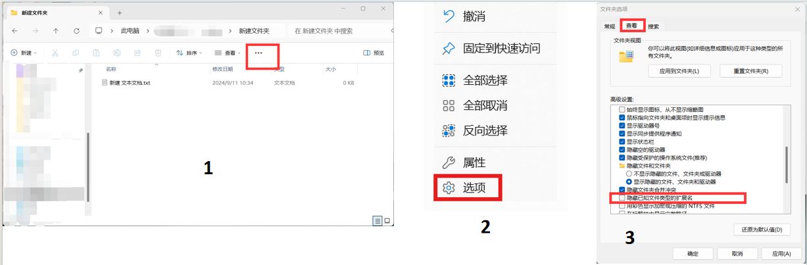
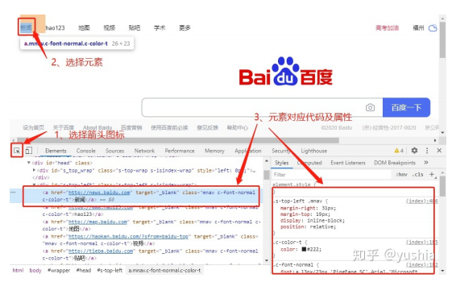
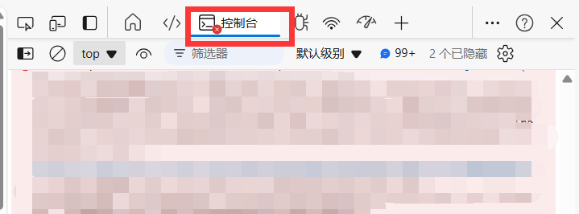

#### <span id="hello">入门篇其 1 - 你好，0 和 1 的世界</span>

> [!NOTE]
>
> 本章作者：syl + wjj
>
> 难度：⭐
>
> 涉及语言：cmd


##### 计算机的常规操作

###### 1. 开机和关机

开机方法比较简单，连接电源通电后按下电脑 / 机箱的开机键，如果有需要的话再开启显示屏即可开机。

关机的方法多样，可以通过系统提供的关机选项，也可以使用命令行 (cmd, powershell, bash 等) 关机。以 cmd 举例：

```cmd
#shell
#设置多少秒后关机
shutdown -s -t 秒数
```

###### 2. 电脑截屏

Windows 自带截屏工具，可以在 `开始 -> 所有应用` 里找，也可以使用更快捷的方法：`Win + Shift + S`

macOS，可使用 `Command + Shift + 4`，进行截屏

如果上面两种方式你都不喜欢，那么你也可以使用 QQ 的截屏工具，如下图


请务必不要使用手机拍屏，因为图片质量非常差，完全没法看清楚内容


###### 3. 打开 cmd 或 powershell

快捷键打开：`Win + R` 然后输入 `cmd` 或者 `powershell` 就可以打开。

常用指令

 说起路径，我们就不得不提到两个名词：绝对路径和相对路径。

```
绝对路径是从硬盘的根目录或者Web站点的根目录开始，指明文件的真实位置，路径单一，不易更改。
相对路径是从当前工作目录出发，指定一个文件的路径。使用相对路径时，路径是相对于当前目录的，这样可以使得文件在不同的目录下可以被访问。

例：
F盘的绝对文件（夹）                      F:\Riot Games\VALORANT 
指向当前目录的子目录中的文件的相对路径   Genshin Impact Game\YuanShen.exe
指向从上一层目录开始的文件的相对路径     ..\osu!\scores.db

在相对路径中， .\ 指当前目录, ..\ 指当前目录的上一级目录, 后者可以嵌套使用, 如 ..\..\HMCL.exe

```

```shell
#shell
cd <目标路径> // 切换到目标路径
ls  // 查看当前路径下的所有文件
mkdir -p <路径名称> //创建一个文件夹，如果没有-p参数，在重名的情况下会覆盖原来的文件夹
code <路径> // 用vscode打开目标路径。后面会讲vscode的安装和配置
exit // 退出终端
```

###### 4. 常用计算机的组件介绍：

1. 最常用的肯定就是浏览器，推荐 Microsoft Edge 或者 Google Chrome 浏览器，当然 FireFox 也很好。至于国内那些逆天厂商的，只能说懂得都懂。现在的浏览器一般除了访问网页的基本功能以外也可以增加丰富的插件，大家可以按需求添加。

2. 文件阅览的工具：大学中最常用到的就是 word 文档和 PPT, 也有 pdf 文档。可以使用系统自带的（如 Microsoft office），当然 pdf 直接就可以在浏览器中打开。我们社团也会经常用到 markdown 文档，这是 Github 主流的文档。可以使用 Typora 等工具预览和修改 markdown 文档，也可以使用 vscode（配置 vscode 见入门篇其 3）。

3. 压缩工具：推荐 7zip, xz 等。在需要传输多个文件时，通常会打包成一个文件（可压缩可不压缩）再把这个文件发送给对方。在 Windows 11 / Mac OS 下压缩文件，可以直接选中想要压缩（打包）的文件，右键选择压缩即可。Linux 用户可参见[实践篇其 1](#common)。

4. 命令行工具：后续学习中将涉及到一些基本命令，Windows 用户可以学习一下 powershell, 比 cmd 好用。 Linux 用户就默认会用了。

   其他的可以按需配置。

###### 5. 文件后缀名

文件后缀名（File Extension）是一个在文件名后面的标识，用来指示文件的类型或格式。它通常由一个句点（.）后跟一到多个字符组成，例如 `.txt`、`.jpg`、`.pdf` 等。文件后缀名是计算机操作系统和应用程序用来识别文件类型的一种方式。

不同的文件后缀名通常表示不同的文件格式。例如：

`.txt` 表示纯文本文件。

`.jpg` 或 `.jpeg` 表示 JPEG 图像文件。

`.pdf` 表示 Adobe PDF 文档。

`.html` 表示 HTML 网页文件。

这些后缀名有助于计算机系统和应用程序根据文件类型选择适当的程序来打开或处理文件。它们也有助于用户快速识别文件类型，以便进行适当的操作。

按照如下的流程来打开文件的扩展名显示



###### 6. F12 开发者工具

F12 开发者工具是浏览器内置的一个特殊工具，用于帮助网页开发者调试和优化网站。它提供了一些有用的功能，让开发者可以更容易地理解和修改网页。

点击左上角的箭头图标（或按快捷键 Ctrl + Shift + C）进入 **元素选择模式**，从页面中选择需要查看的元素，可以在开发者工具元素（Elements）一栏中快速定位到该元素源代码的具体位置。



使用控制台来进行一些代码调试



##### 配置和自学路线

###### 1. 更多推荐

1. 字体：后续面对代码场景时建议选用等宽字体，视觉效果会比较好，另外还有些特殊的图标也可以显示，比如 Hard Nerd Fonts，或者 JetBrains Mono 系列的。
2. 网站避雷：下载东西或者查阅文档时强烈建议访问官方网站，现在国内有一堆逆天的高仿网站，把免费的东西高价出售，用什么一键安装就是为了骗小白。
3. 搜索引擎：建议使用必应、谷歌。
4. AI 工具：现在使用 AI 已经烂大街了，我们当然允许使用 AI 解决问题，但是自己也得有所学习。更重要的是我们以后遇到困难的方面比如逻辑关系、数据分析等，这些并非 AI 的强项，而是我们自己需要思考的地方。所以不应该过度依赖 AI。
5. 更新：Windows 用户请注意多更新你的系统，因为 Windows 的漏洞和病毒太多了（若是存储不足可以清除更新完成之后的旧版本，在设置里面修改即可）。Linux 重要软件上建议使用仓库源的话是 stable 版本的，毕竟谁也不能保证 xz 后门事件再次出现。但是另一方面我们以后用到的技术性的软件或者框架等建议时刻保持最新版本，因为旧版本可能有很多不支持的问题或是功能不完善。

###### 2. 自学路线推荐

1. 入门可以通过网课、简单的教程快速先把握一门语言的基本语法和基本要点，可以使用菜鸟教程等入门教程网站。
2. 完成基本语法后可以继续精进，这一阶段建议查看官方文档和社区论坛。例如学习 C./C++ 可以查阅 cppreference 等。
3. 后面就可以了解语言在实际业务的应用。这一块需要我们了解框架，学会自己阅读框架官方文档，可能也要去查看框架的源码。另一方面也需要了解业务方面的通用工具，比如基本的算法，设计模式，语言特性等。

​	 总之一句话，要自己学会搜索查阅，以及如何查阅官方文档。
