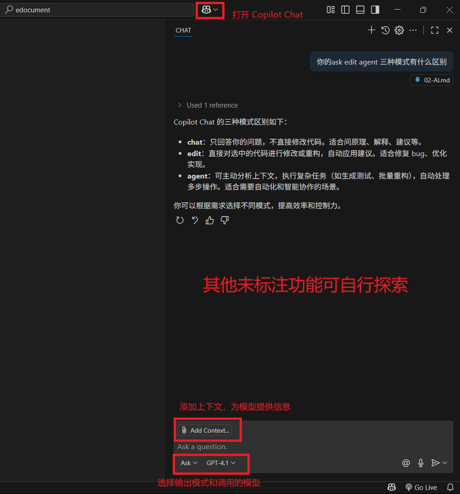

#### 入门篇其 2 - 大模型工具的使用

> [!NOTE]
>
> 本章作者：cgy + Claude Sonnet 4
>
> 难度：⭐
>
> 涉及语言：汉语

##### 第一章：初识大模型工具

**什么是大模型（生成式 AI）？**
- 它能做什么：聊天、答题、写文案、写代码、改错、总结、翻译、分析数据。
- 把它当成超级聪明的助手：能听懂自然语言，执行你给的任务，但需要清晰的> 指令。
- 核心能力：理解（读懂你说的）、推理（按逻辑解决问题）、生成（写出内容）。

**为什么需要掌握大模型工具？**
- 提升学习效率：快速获取知识点、要点总结、例子对照。尤其在你不清楚一个知识的背景时，你可以追问它的回答中你不知道的概念，以全面理解相关知识。
- 辅助编程：生成代码、解释报错、编写单元测试、梳理思路与边界条件。
- 创意与文档：闪击各种水课的报告（不过请根据课程要求合理使用）

##### 第二章：核心工具入门

- 文本生成：我个人的推荐是 DeepSeek, Gemini, ChatGPT
  - 提问技巧：
    - 核心原则：清晰、具体、有约束。不要问得太宽泛。
    - 结构化：可提供背景、目标、限制、输出格式。
    - 丰富上下文：模型需要足够的信息才能生成准确的答案。给你提供的上下文加上引号有助于模型判断哪些是你的指令，哪些是上下文信息。问 Gemini 日语单词的意思但不加引号，会导致它以为你说日语，然后用日语回答你
    - 角色扮演：如果有特定领域需求，可让模型扮演相关角色。如“经验丰富的后端工程师”、“攻击力极强的贴吧老哥”（慎用）。
    - 迭代与追问：可拆解相关问题，分步地来解决，一次性让模型完成大量需求效果可能偏差。
    - 警惕 [XY 问题](https://zhuanlan.zhihu.com/p/620688366)：现今大模型大多是推理模型，且推理能力强大，因此只需给它期望结果，不必为它提供思维路径。
    - 示例提示词：
      - “我是一个计算机小白，给我讲解 RESTful API。请同时介绍背景知识，让零基础也能听懂。生成一份 md 文档”
- 辅助编程：以 GitHub Copilot 为例
  - 安装与配置：VS Code / JetBrains IDE → 扩展市场搜索“GitHub Copilot” → 安装 → 登录 GitHub → 启用建议。
  -  建议注册 GitHub Education Pack，可白嫖顶级大模型。
  - 用法速览：
    - 注释驱动：写注释说明这个函数的行为，等待自动补全。
    - 片段生成：选中函数签名，按下触发快捷键查看建议多样化方案。
    - Copilot Chat：这个是重头戏，用好它会让你的写代码体验起飞。点击 VS Code 上方搜索栏右侧的小机器人，即可调出 Copilot Chat。有三种模式：chat, edit, agent。chat 模式下只会回答你的问题（回答中会包含建议代码），edit 模式会对你提供的上下文（即你希望它读取和修改的文件）进行修改，agent 模式会主动分析上下文以执行测试、重构等复杂任务（轮椅程度依次递增）。可根据需求来灵活使用。
    

##### 第三章：常见问题与风险防范

1. 局限性
- 可能错误、过时、缺上下文；不懂你隐含的前提；对非公共数据一无所知；
- 目前大模型还 handle 不了复杂项目，单纯 vibe coding 会写成屎山，需求分析与架构设计仍需人工。

2. “幻觉”与事实核查
- 由于大模型本质只是在重复它学到的模式，并不是真正的理解，因此有小概率生成看上去正确实则错误的结论。需要用户有辨别能力。
- 可要求给出来源链接或版本号；关键信息二次验证（官方文档/实验复现/运行结果）。
- 对代码：跑测试、看日志、加断言；对结论：用小样本先试，再推广。

3. 避免过度依赖
- 模型只是辅助，目前仍无法替代人工。保留独立思考与基本功训练，才能让你在复杂项目的开发中得心应手。
- 多做“闭卷练习”：先自己写，再让模型评审与改进。

