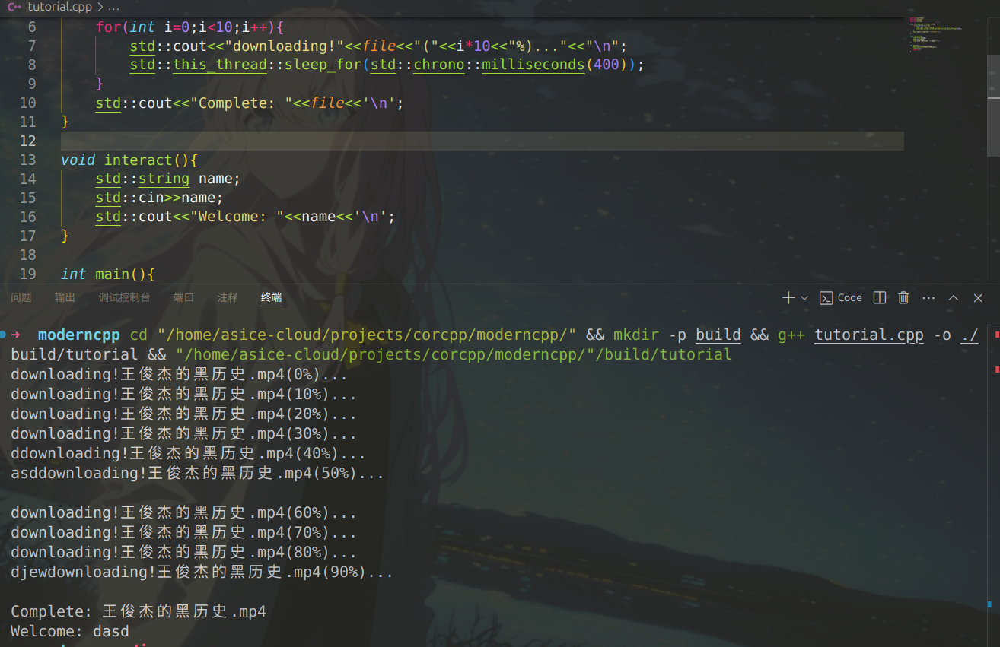
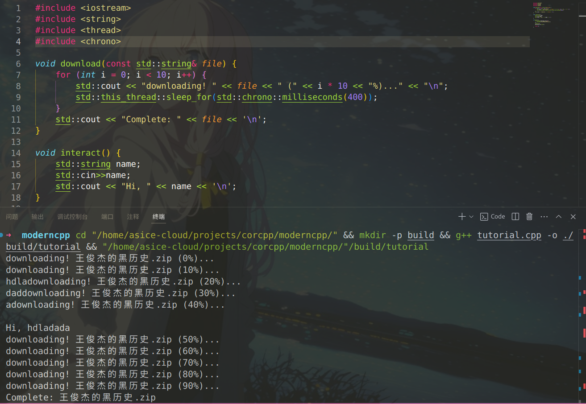
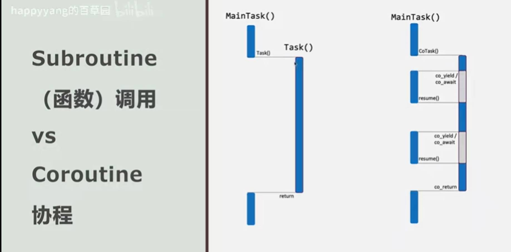
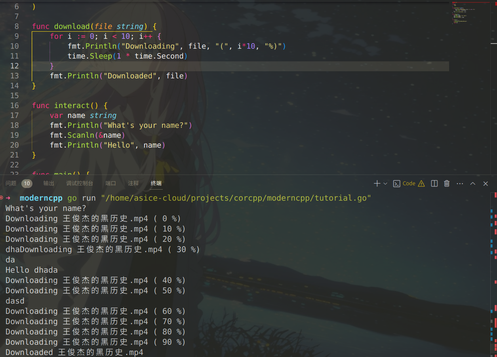
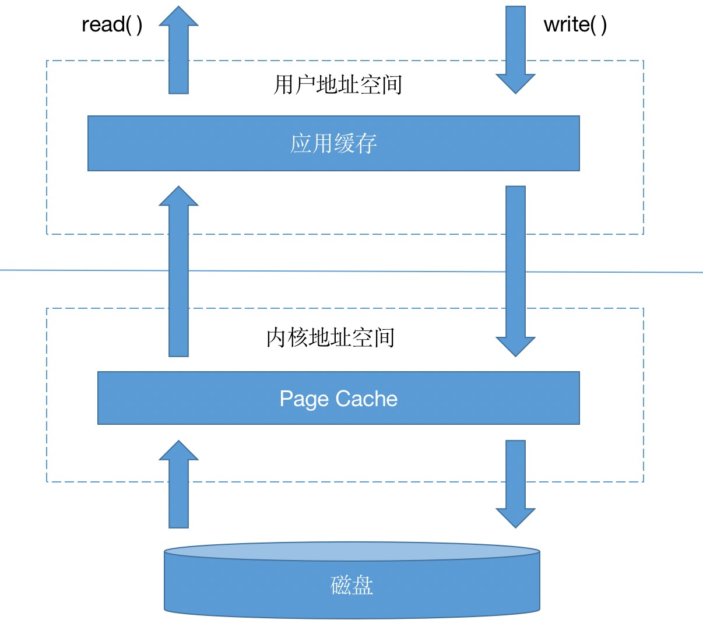
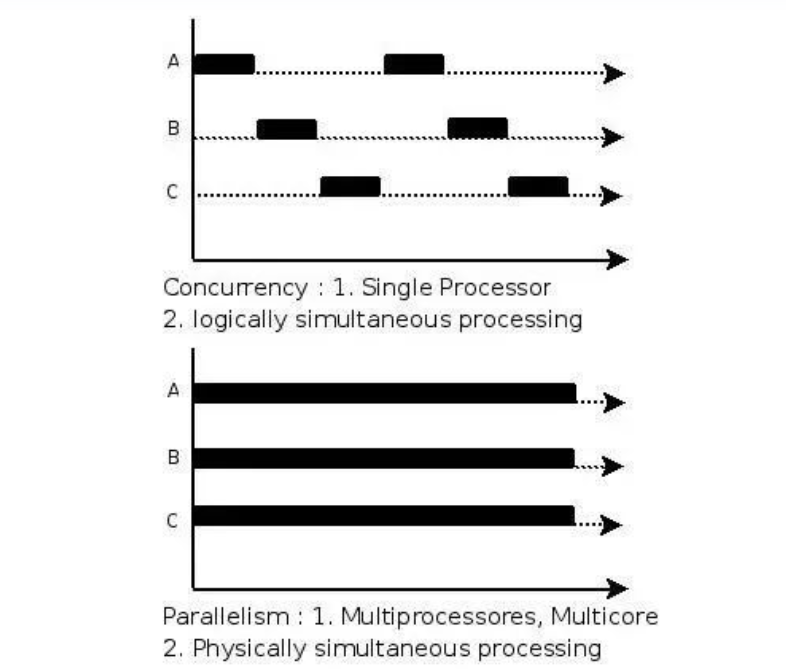
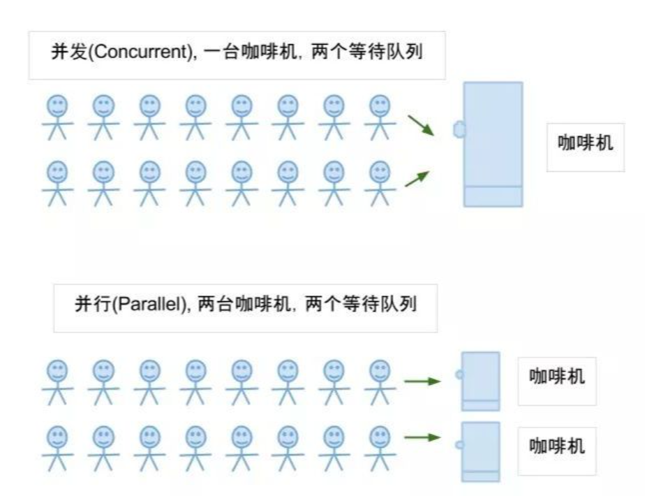

#### <span id="sync">进阶篇其 4-同步与异步</span>

> [!NOTE]
>
> 本章作者：syl
>
> 难度：⭐⭐⭐⭐⭐⭐⭐⭐⭐⭐（手动表情：流汗黄豆
>
> 涉及语言：C/C++，Go

本章中有很多重要的概念，大家需要多琢磨琢磨，因为这一块很重要，而且概念性很强。


##### **概念 0：时间**

就像我们上课一样排好了课表，写好程序后程序运行也是有流程的，对应的课表就是你写在代码里的顺序流程。比如在 C++ 中：

```c++
// C++
int add(int a, int b){
    return a + b;
}
int substract(int a, int b){
    return a - b;
}
int main(){
    add(1, 2);
    substract(4, 3);
}
```


###### 测一测时间

我们这里先执行了 add, 后执行 subtract，每一个函数都需要时间来执行，当然可以观测函数运行的时间，不同语言中关键字不同罢了，在 C++ 中可以这样做：

```c++
// C++
int main(){
    //时间戳是unix从1970年记录到现在的
    auto t0 = std::chrono::steady_clock::now(); //记录一个流程开始时间戳
    for(int i=0; i<10000000; i++); // 10,000,000次自增操作
    auto t1 = std::chrono::steady_clock::now(); //记录一个流程结束时间戳
    auto dt = t1 - t0; //减掉就是中间流程的时间了
    int64_t ms = std::chrono::duration_cast<std::chrono::milliseconds>(dt).count; //转换成int类型的数据
    std::cout<<"time elapsed "<<ms<<"ms"<<std::endl;  //比如我执行完输出了13ms
    return 0;
}
```


###### 砸瓦路多！

我们可以控制一个流程的执行时间，C++ 可以使用 sleep_for（或者 sleep_until）关键字（不同语言可能关键字不同），将流程睡眠一会。

```c++
// C++
std::this_thread::sleep_for(std::chrono::milliseconds(400)); //睡眠400ms

auto t = std::chrono::steady_clock::now() + std::chrono::milliseconds(400);
std::this_thread::sleep_until(t); //睡眠到从现在起过400ms的时间点
```


##### 概念 1：进程、线程

念个经先～

**进程（Process/有些地方也称 Routines）：**

是操作系统中的一个基本概念，它包含着一个运行程序所需要的资源，或者说是**程序运行的最小单元**。一个正在运行的应用程序在操作系统中被视为一个进程，进程可以包括一个或多个线程。

线程是操作系统分配处理器时间的基本单元，在进程中可以有多个线程同时执行代码。**进程之间是相对独立的**，一个进程无法访问另一个进程的数据（除非利用分布式计算方式），一个进程运行的失败也不会影响其他进程的运行，系统就是利用进程把工作划分为多个独立的区域的。进程可以理解为一个程序的基本边界。是应用程序的一个运行例程，是应用程序的一次动态执行过程。

**线程（Thread）：**

是进程中的基本执行单元，是**操作系统分配 CPU 时间的基本单位**，**一个进程可以包含若干个线程**，在进程入口执行的第一个线程被视为这个进程的主线程。线程主要是由 CPU 寄存器、调用栈和线程本地存储器（Thread Local Storage，TLS）组成的。CPU 寄存器主要记录当前所执行线程的状态，调用栈主要用于维护线程所调用到的内存与数据，TLS 主要用于存放线程的状态信息。

**进程和线程的区别**

进程和线程的主要差别在于它们是不同的操作系统资源管理方式。进程有独立的地址空间，一个进程崩溃后，在保护模式下不会对其它进程产生影响，而线程只是一个进程中的不同执行路径。

从属关系：进程 > 线程。一个进程可以拥有多个线程。
每个线程共享同样的内存空间，开销比较小。
每个进程拥有独立的内存空间，因此开销更大。
对于高性能并行计算，更好的是多线程。

线程有自己的堆栈和局部变量（进阶篇 1 阐述了这些概念），但线程之间没有单独的地址空间，一个线程死掉就等于整个进程死掉，所以多进程的程序要比多线程的程序健壮，但在进程切换时，耗费资源较大，效率要差一些。但对于一些要求同时进行并且又要共享某些变量的并发操作（我们一会会详细阐述这个概念），只能用线程，不能用进程。


- 简而言之，一个程序至少有一个进程，一个进程至少有一个线程。
- 线程的划分尺度小于进程，使得多线程程序的并发性高。
- 另外，进程在执行过程中拥有独立的内存单元，而多个线程共享内存，从而极大地提高了程序的运行效率。
- 线程在执行过程中与进程还是有区别的。每个独立的线程有一个程序运行的入口、顺序执行序列和程序的出口。但是线程不能够独立执行，必须依存在应用程序中，由应用程序提供多个线程执行控制。
- 从逻辑角度来看，多线程的意义在于一个应用程序中，有多个执行部分可以同时执行。但操作系统并没有将多个线程看做多个独立的应用，来实现进程的调度和管理以及资源分配。这就是进程和线程的重要区别。


**多线程能做什么：无阻塞多任务！！！**

###### 场景需求

​	我们希望一边下载/观看东西一边随便输入点内容来评论，常规操作可能是这样的（使用 C/C++ 演示）：

```c++
// C++
#include <iostream>
#include <string>
#include <thread>
#include <chrono>
void download(std::string file){
    for(int i = 0; i < 100000; i++){
        std::cout << "downloading!" << file << "(" << i * 10 << "%)..." << "\n";
        std::this_thread::sleep_for(std::chrono::milliseconds(400));
    }
    std::cout << "Complete: " << file << '\n';
}

void interact(){
    std::string name;
    std::cin >> name;
    std::cout << "Welcome: " << name << '\n';
}

int main(){
    download("王俊杰的黑历史.mp4");
    interact();
    return 0;
}
```

执行效果如下，我们可以在 download 的同时随意输入东西，但是输出却不会执行，因为 main 被阻塞了，只有 download 结束才会执行 interact，输入完之后并不能立刻得到反馈：




###### **多线程，启动！**

```c++
// C/C++
#include <iostream>
#include <string>
#include <thread>
#include <chrono>

void download(const std::string& file) {
    for (int i = 0; i < 10; i++) {
        std::cout << "downloading! " << file << " (" << i * 10 << "%)..." << "\n";
        std::this_thread::sleep_for(std::chrono::milliseconds(400));
    }
    std::cout << "Complete: " << file << '\n';
}

void interact() {
    std::string name;
    std::cin >> name;
    std::cout << "Hi, " << name << '\n';
}

int main() {
    std::thread download_file([&]{
        download("王俊杰的黑历史.zip");
    });
    interact();
    //join是为了等待这个download线程结束，再退出main
    download_file.join();
    
    return 0;
}
```


现在就非常 nice 了，可以一边下载/观看王俊杰的黑历史一边发表评论了~~（bushi~~




> 我们知道线程执行完就会销毁，有时候需要自己管理什么时候销毁，请大家自行查阅分离线程、线程池的概念。


##### 概念 2：协程

**背景**：在传统的 J2EE 系统中都是基于每个请求占用一个线程去完成完整的业务逻辑（包括事务）。所以系统的吞吐能力取决于每个线程的操作耗时。如果遇到很耗时的 I/O（input 和 output）行为，则整个系统的吞吐立刻下降，因为这个时候线程一直处于阻塞状态，如果线程很多的时候，会存在很多线程处于空闲状态（等待该线程执行完才能执行），造成了资源应用不彻底.

而协程的目的就是当出现长时间的 I/O 操作时，通过让出目前的协程调度，执行下一个任务的方式，来消除 ContextSwitch 上的开销。


**协程**（coroutines），由字面意思就知道是和进程（Process/Routines）或者函数调用（Subroutines）对应的东西。协程其实是分割进程，但是分割的同时保留了之前处理过的信息，所以可以用来组件之间的协作工作。协程的初始处就是第一个的入口点。通过 yield 返回一部分结果值以及执行到这个时刻的协程的状态，作为下次进入这个协程的入口点。形象的演示，比如这张图（来自 b 站 up 百草园），容易看出函数调用和协程的关系。



​	举个例子，就像你看一道数学题，有思路的时候去写，卡住了然后回去看题，有思路了继续写，这样循环下去。如果不出意外的话，你应该就是在卡住的地方去看了题，看的就是上次没看明白的地方，然后返回上次卡住的地方继续写。

```
// 伪代码演示：
var q := new queue //新建队列

coroutine produce //生产者
    loop
        while q is not full //队列不满时就添加新物品进去
            create some new items
            add the items to q
        yield to consume //中断生产者，开始消费者的行为

coroutine consume //消费者	
    loop
        while q is not empty //队列不空时拿到物品开始消耗
            remove some items from q
            use the items
        yield to produce //中断消费者，开始生产者的行为

call produce //开工了
```

队列用来存放产品的空间有限，同时制约生产者和消费者：为了提高效率，生产者协程要在一次执行中尽量向队列多增加产品，然后再放弃控制使得消费者协程开始运行；同样消费者协程也要在一次执行中尽量从队列多取出产品，从而倒出更多的存放产品空间，然后再放弃控制使得生产者协程开始运行。尽管这个例子常用来介绍 [多线程](https://zh.wikipedia.org/wiki/多线程)，实际上简单明了的使用协程的 `yield` 即可实现这种协作关系。


###### 协程的特点

1. 线程的切换由操作系统负责调度，协程由用户自己进行调度，因此减少了上下文切换，提高了效率。
2. 线程的默认 Stack 大小是 1M，而协程更轻量，接近 1K。因此可以在相同的内存中开启更多的协程。
3. 协程之间由于在同一个线程上，因此可以避免竞争关系而使用锁。通常使用一个叫通道的东西用来通信，根据通信共享协程之间的信息，共享数据等。相反的，线程就需要通过共享数据来彼此实现通信。
4. 被阻塞情况下如果仍然需要执行多个任务，就不适合线程了，应该使用协程。


###### 协程的原理

当出现 IO 阻塞的时候，由协程的调度器进行调度，通过将数据流立刻 yield 掉（主动让出），并且记录当前栈上的数据，阻塞完后立刻再通过线程恢复栈，并把阻塞的结果放到这个线程上去跑，这样看上去好像跟写同步代码没有任何差别，这整个流程可以称为 coroutine，而跑在由 `coroutine` 负责调度的线程称为 `Fiber`。比如 Golang 里的 go 关键字其实就是负责开启一个 `Fiber`，让 `func` 逻辑跑在上面。

由于协程的暂停完全由程序控制，发生在用户态上；而线程的阻塞状态是由操作系统内核来进行切换，发生在内核态上。
因此，协程的开销远远小于线程的开销，也就没有了 ContextSwitch 上的开销。


回到刚才的场景，能否使用协程来做呢

###### 协程，启动！

这里使用 Go 语言举例子，毕竟 C++ 开协程是一项高级技术，有点难度，举例子的话没有那么清晰。

```go
// Go
package main

import (
    "fmt"
    "time"
)

func download(file string) {
    for i := 0; i < 10; i++ {
        fmt.Println("Downloading", file, "(", i*10, "%)")
        time.Sleep(1 * time.Second)
    }
    fmt.Println("Downloaded", file)
}

func interact() {
    var name string
    fmt.Println("What's your name?")
    fmt.Scanln(&name)
    fmt.Println("Hello", name)
}

func main() {
    //go开协程很方便，go 函数名（变量） 就可以了
    go download("王俊杰的黑历史.mp4")
    interact()
    //这里阻塞一下main,等download执行完
    select {}
}

```

继续迫害王俊杰结果如下：




##### 概念 3：同步与异步


###### 阻塞与非阻塞

阻塞和非阻塞是进程在访问数据的时候，数据是否准备就绪的一种处理方式。当数据没有准备的时候，阻塞需要等待调用结果返回之前，进程会被挂起，函数只有在得到结果之后才会返回。非阻塞和阻塞的概念相对，指在不能立刻得到结果之前，该函数不会阻塞当前线程，而会立刻返回。


###### 同步与异步

同步指的是在发出一个功能调用时，在没有得到结果之前，该调用就不返回。也就是必须一件一件事做, 等前一件做完了才能做下一件事。异步的概念和同步相对，当一个异步过程调用发出后，调用者不能立刻得到结果。实际处理这个调用的部件在完成后，通过状态、通知和回调来通知调用者。

举个例子来说，对于我们经常使用 B/S 架构来说，同步和异步指的是从客户端发起访问数据的请求，阻塞和非阻塞指的是服务端进程访问数据，进程是否需要等待。这两者存在本质的区别，它们的修饰对象是不同的。

阻塞和非阻塞是指进程访问的数据如果尚未就绪，进程是否需要等待，简单说这相当于函数内部的实现区别，也就是未就绪时是直接返回还是等待就绪。

同步和异步是指访问数据的机制，同步一般指主动请求并等待 I/O 操作完毕的方式，当数据就绪后在读写的时候必须阻塞，异步则指主动请求数据后便可以继续处理其它任务，随后等待 I/O，操作完毕的通知，这可以使进程在数据读写时也不阻塞。


###### 举个例子

妈妈让我去厨房烧一锅水，准备下饺子。

**阻塞**：水只要没烧开，我就干瞪眼看着这个锅，沧海桑田，日新月异，我自岿然不动，厨房就是我的家，烧水是我的宿命；

**非阻塞**：我先去我屋子里打把王者，但是每过一分钟，我都要去厨房瞅一眼，生怕时间长了，水烧干了就坏了，这样导致我游戏也心思打，果不然，又掉段了；

**同步**：不管是每分钟过来看一眼锅，还是寸步不离的一直看着锅，只要我不去看，我就不知道水烧好没有，浪费时间啊，一寸光阴一寸金；

**异步**：我在淘宝买了一个电水壶，只要水开了，它就发出响声，嗨呀，可以安心打王者喽，打完可以吃饺子喽；

总结：

阻塞/非阻塞：我在等你干活的时候我在干啥？

阻塞：啥也不干，死等；

非阻塞：可以干别的，但也要时不时问问你的进度；

同步/异步：你干完了，怎么让我知道呢？

同步：我只要不问，你就不告诉我；

异步：你干完了，直接喊我过来就行；


###### 异步的实现

1. 使用多线程，开始多个任务
2. 使用协程 （这两个直接看上面的代码例子就行了）
3. 多线程 + promise + future 实现线程间传递结果
4. 函数式编程范式上的异步概念：**回调函数**（我们之前将函数指针时候提到过这个概念），演示如下：

其实就是将需求拆成了不同的函数来实现，在函数式编程范式上这称之为**反应式编程**。

```c++
// 回调函数异步 C++实现
#include<iostream>
#include<functional>

void download(std::string file, std::function<void(std::string)> callback){
    std::cout << "Downloading file: " << file << std::endl;
    callback("Downloaded file: " + file);
}

int main(){
    download("tutorial.txt", [](std::string result){
        std::cout << result << std::endl;
    });
    return 0;
}
```

```Go
// 回调函数异步 Go实现
package main

import (
    "fmt"
    "time"
)

func download(file string, callback func()) {
    for i := 0; i < 10; i++ {
        fmt.Println("Downloading", file, "(", i*10, "%)")
        time.Sleep(1 * time.Second)
    }
    fmt.Println("Downloaded", file)
    callback()
}

func main() {
    download("王俊杰的黑历史.mp4", func() {
        fmt.Println("Download complete callback")
    })
}
```


##### 概念 3.5：IO 阻塞与复用

以网络 IO 为例，其本质是 Socket 的读取，Socket 在 Linux 系统被抽象为流，IO 可以理解为对流的操作。Linux 标准文件访问方式如下:




当发起一个 read 操作的时候，会经历 2 个阶段:

1. 等待数据准备；
2. 将数据从内核拷贝到进程中;

对于 socket 流也会经历两个阶段:

1. 将磁盘或者其他设备到达以后的信息，拷贝到内核的缓存区中；
2. 将内核的缓存区的数据复制到应用进程缓存中；

网络应用需要处理的无非就是两大类问题，网络 IO，数据计算。相对于后者，网络 IO 的延迟，给应用带来的性能瓶颈大于后者，接下来我们介绍下 IO 模型。

> 这一段不用完全理解，先了解一下都是什么。


###### 同步阻塞 IO（blocking IO）

同步阻塞 IO 模型是最常用的一个模型，也是最简单的模型。在 Linux 中，默认情况下所有的 socket 都是 blocking。阻塞就是进程休息, CPU 处理其它进程去了。

用户空间的应用程序执行一个系统调用（recvform），这会导致应用程序阻塞，直到数据准备好，并且将数据从内核复制到用户进程，最后进程再处理数据，在等待数据到处理数据的两个阶段，整个进程都被阻塞。不能处理别的网络 IO。


###### 同步非阻塞 IO（nonblocking IO）

同步非阻塞就是采用轮询的方式，定时去查看数据是否准备完成。在这种模型中，进程是以非阻塞的形式打开的。IO 操作不会立即完成，如果该缓冲区没有数据的话，就会直接返回一个 EWOULDBLOCK 错误，不会让应用一直等待中。

非阻塞 IO 也会进行 recvform 系统调用，检查数据是否准备好，与阻塞 IO 不一样，非阻塞将大的整片时间的阻塞分成 N 多的小的阻塞, 所以进程不断地有机会被 CPU 访问。


###### IO 多路复用（IO multiplexing）

同步非阻塞方式需要不断主动轮询，轮询占据了很大一部分过程，轮询会消耗大量的 CPU 时间，当并发情况下服务器很可能一瞬间会收到几十上百万的请求，这种情况下同步非阻塞 IO 需要创建几十上百万的线程去读取数据，同时又因为应用线程是不知道什么时候会有数据读取，为了保证消息能及时读取到，那么这些线程自己必须不断的向内核发送 recvfrom 请求来读取数据。这么多的线程不断调用 recvfrom 请求数据，明细是对线程资源的浪费。

于是有人就想到了由一个线程循环查询多个任务的完成状态（fd 文件描述符），只要有任何一个任务完成，就去处理它。这样就可以只需要一个或几个线程就可以完成数据状态询问的操作，当有数据准备就绪之后再分配对应的线程去读取数据，这么做就可以节省出大量的线程资源出来，这个就是 IO 多路复用。


###### 信号驱动 IO（signal-driven IO）

IO 多路复用解决了一个线程或者多个线程可以监控多个文件描述符的问题，但是 select 是采用轮询的方式来监控多个文件描述符的，通过不断的轮询文件描述符的可读状态来知道是否有可读的数据，这样无脑的轮询就显得有点浪费，因为大部分情况下的轮询都是无效的，于是乎有人就想，能不能不要总是去轮询数据是否准备就绪，能不能发出请求后，等数据准备好了在通知我，所以这样就出现了信号驱动 IO。

信号驱动 IO 不是用循环请求询问的方式去监控数据就绪状态，而是在调用 sigaction 时候建立一个 SIGIO 的信号联系，当内核数据准备好之后再通过 SIGIO 信号，通知线程数据准备好后的可读状态，当线程收到可读状态的信号后，此时再向内核发起 recvfrom 读取数据的请求。因为信号驱动 IO 的模型下，应用线程在发出信号监控后即可返回，不会阻塞，所以这样的方式下，一个应用线程也可以同时监控多个文件描述符。


###### 异步非阻塞 IO（asynchronous IO）

不管是 IO 多路复用还是信号驱动，我们要读取数据的时候，总是要发起两阶段的请求，第一次发送 select 请求，询问数据状态是否准备好，第二次发送 recevform 请求读取数据。这个时候我们会有一个疑问，为什么在读数据之前总要有个数据就绪的状态，可不可以应用进程只需要向内核发送一个 read 请求，告诉内核要读取数据后，就立即返回。当内核数据准备就绪，内核会主动把数据从内核复制到用户空间，等所有操作都完成之后，内核会发起一个通知告诉应用，所以这样就出现了异步非阻塞 IO 模型。

异步非阻塞 IO 模型应用进程发起 aio_read 操作之后，立刻就可以开始去做其它的事。后续的操作有内核接管，当内核收到一个 asynchronous read 之后，它会立刻返回，不会对用户进程产生任何 block。然后，内核会等待数据准备完成，然后将数据拷贝到用户内存，当这一切都完成以后，内核会给用户进程发送一个 signal 或执行一个基于线程的回调函数来完成这次 IO 处理过程。


##### 概念 4：并发和并行

并发（Concurrency），**在操作系统中，是指一个时间段中有几个程序都处于已启动运行到运行完毕之间，且这几个程序都是在同一个处理机上运行。**就想前面提到的操作系统的时间片分时调度。打游戏和听音乐两件事情在**同一个时间段内**都是在同一台电脑上完成了**从开始到结束的动作**。那么，就可以说听音乐和打游戏是并发的。


并行（Parallelism），**当系统有一个以上 CPU 时，当一个 CPU 执行一个进程时，另一个 CPU 可以执行另一个进程，两个进程互不抢占 CPU 资源，可以同时进行，这种方式我们称之为并行（Parallelism）。**这里面有一个很重要的点，那就是系统要有多个 CPU 才会出现并行。在有多个 CPU 的情况下，才会出现真正意义上的『同时进行』。换言之，对于**GPU**这种原生就是多核结构的，**并行**才是最好的选择。



###### **并发和并行的区别**

并发，指的是多个事情，在同一时间段内同时发生了。   并行，指的是多个事情，在同一时间点上同时发生了。

并发的多个任务之间是互相抢占资源的。   并行的多个任务之间是不互相抢占资源的、

只有在多 CPU 的情况中，才会发生并行。否则，看似同时发生的事情，其实都是并发执行的。



###### 对应关系

一般情况下：

​	协程 -> 并发，协程适合用于阻塞、多任务场景，例如网络交互里面，而且不会消耗太多系统资源，也不会互相抢占进程。并发适合放到系统层面。

​	多线程 -> 并行，多线程适合于多核 CPU/GPU、非阻塞、多任务场景。例如模型渲染、服务器架构。并行往往能够最大限度利用 CPU/GPU 资源（互相不冲突前提下），适合游戏引擎和服务器这种超级高性能的场景。（比如虚幻引擎就是 C++ 的重量级产物）。并行就适合高性能场景。


当然使用 promise + future 技术结合多线程，也可以实现并发。但是本质上线程之间还是在抢 CPU, 而协程是在分割进程资源的。所以使用什么技术需要看业务场景。也不要说什么协程轻所以就一定比线程好，这其实是一种偏见。

> 我们后续一般并发编程场景较多，这一块也是 Go 语言的优势。有条件和感兴趣的读者可以自行了解这一块的内容。
