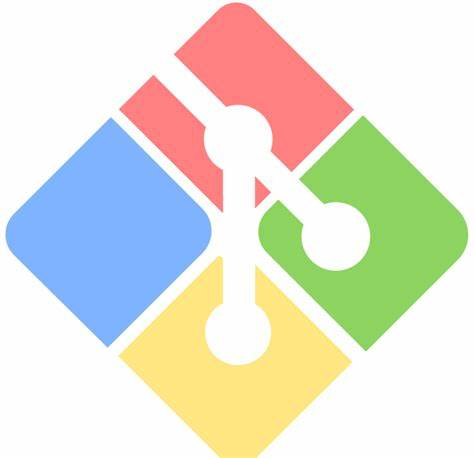
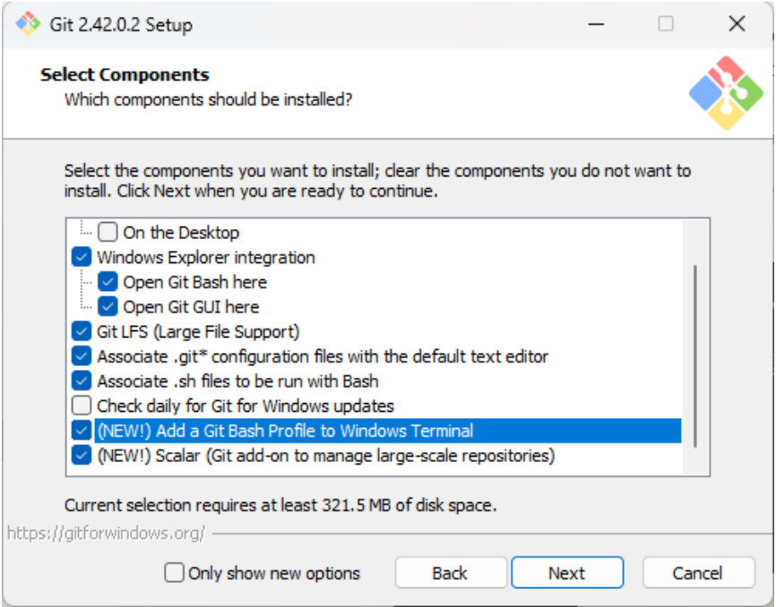
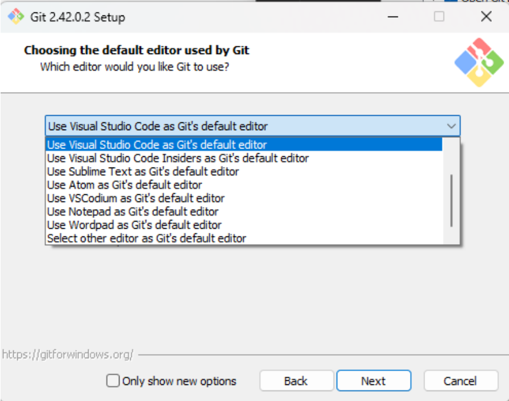
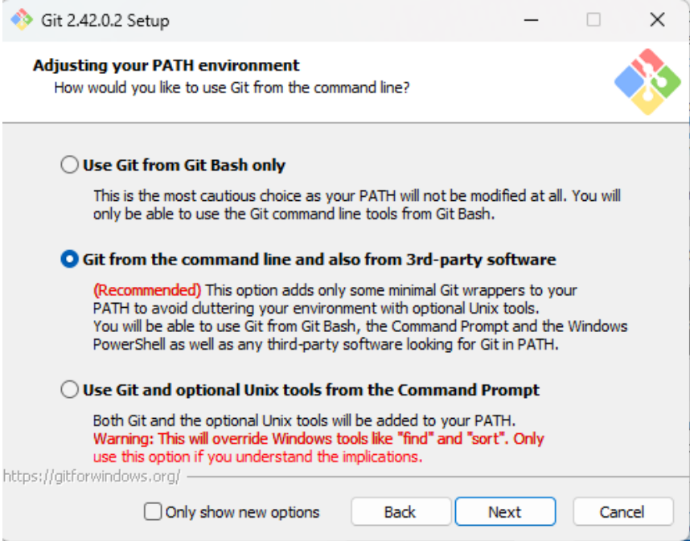
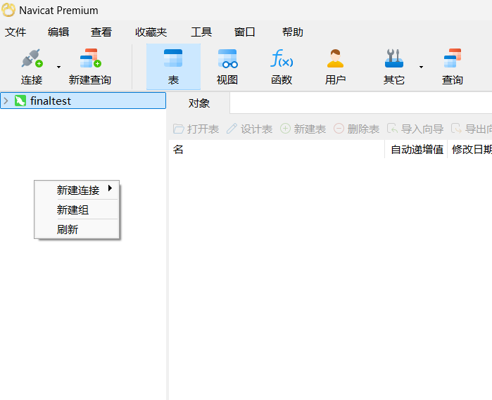
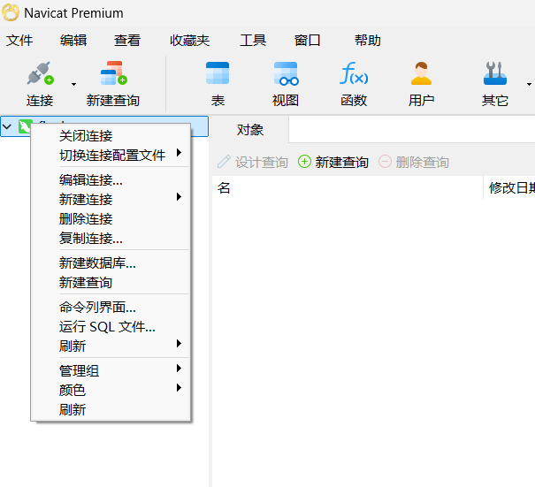
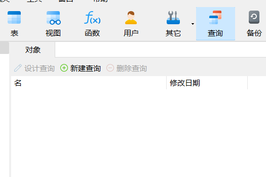

#### <span id="common">实践篇其 1 - 通用工具介绍</span>

> [!NOTE]
>
> 本章作者：wjj
>
> 难度：⭐⭐
>
> 涉及语言：shell


#####  git

在介绍 `git` 之前，我们不妨先从 **代码托管平台** 开始说起。世界上最大最热门的代码托管平台，当然要数 `Github`，你可以从上面下载项目源代码、一些课程资料等等等等。国内也有类似的平台比如 `Gitee (码云，全是广告)`，`Gitcode（'自主研发'的 sb 玩意）` 等。

 你可以为自己注册 `Github` 账号，并通过平台的学生认证，然后你就可以免费使用一些付费软件或者网站了，比如 `jetbrains` 系列，`overleaf`。  

想要在这些平台上下载资源，我们就需要使用到 `git` 工具。事实上，`git` 是一个版本控制工具，概括起来，就是实现开发者本地仓库与远程仓库之间的文件互传等操作。你可以在 <a href="https://git-scm.com/downloads">这个网址</a> 来下载 `git`，然后按照下面推荐的流程进行安装（仅以 windows 为例）







关于 `git` 的使用教学，我们在这里只举几个简单的例子，深入的学习可以参考 <a href="https://git-scm.com/docs">推荐文档</a> 来进行学习，当然，网上相关的教程也是很多的。

当你想要创建一个新项目的时候，在 `powershell` 中按照如下流程：

```shell
#shell
cd <你的项目文件夹目录>
git init
git config user.name <你的用户名>
git config user.email <你的邮箱>
git remote add <你的仓库url>.git

// 然后你对你的项目进行了更新，想要提交到仓库
git add ./
git commit -m "<你的提交信息>"
git push <remote name> <分支>
```

当你想要下载某个仓库的时候

```shell
#shell
git clone <仓库url>.git
```

 文档看得太累了怎么办，还是打会儿 <a href="https://learngitbranching.js.org/?locale=zh_CN">游戏</a> 吧，一个挺有意思的 git 学习小游戏。

#####  apifox

`apifox` 是一个国内开发的免费的接口调试工具，非常适合个人和团体使用。前后端都可以使用它来检查接口是否能正常运行，处理返回值。在项目中开发过程中，合适的接口调试工具会让开发轻松很多，类似的工具还有 `postman`，`swagger` 等等。你可以在 <a href="https://apifox.com/">apifox 的官网</a> 来获取

`apifox` 提供了一个示例项目用于学习，同时你也可以参阅 <a href="https://apifox.com/help/">官方文档</a> 获取帮助，~~他们甚至提供了视频~~

#####  Navicat

`Navicat` 是一个可以图形化操作 `MySQL` 的工具，在命令行操作数据库毕竟是一件比较费眼睛的事情，图形化的界面会方便很多。我们在后端的开发和部署时会频繁地用到它。此外 `Navicat` 支持操作多种数据库，比如 `MongoDB`，`SQL Server`，`Redis` 等等。这样强大的工具是需要付费的，所以我们也推荐一些其他的工具，如 <a href="https://dbeaver.io/download/">`DbServer`</a>，它提供了免费的社区版。

你可以在 <a href="https://navicat.com.cn/products">官网</a> 来下载 `Navicat`。

在操纵 `MySQL` 的时候，首先你需要和你的 `MySQL` 建立连接，如图所示：~~请忽略掉我已经建立的连接~~



然后你可以在一个连接中建立数据库，如图所示。对于一个独立的项目来说，建立独立的数据库显然是很有必要的



如果你要使用 `MySQL` 来进行一些操作，在上方菜单中点击查询，然后新建查询，就可以了，如图所示



具体的使用方法，可以参考 <a href="https://www.navicat.com.cn/manual/online_manual/cn/navicat_16/win_manual/">官方文档</a> 获取帮助。
