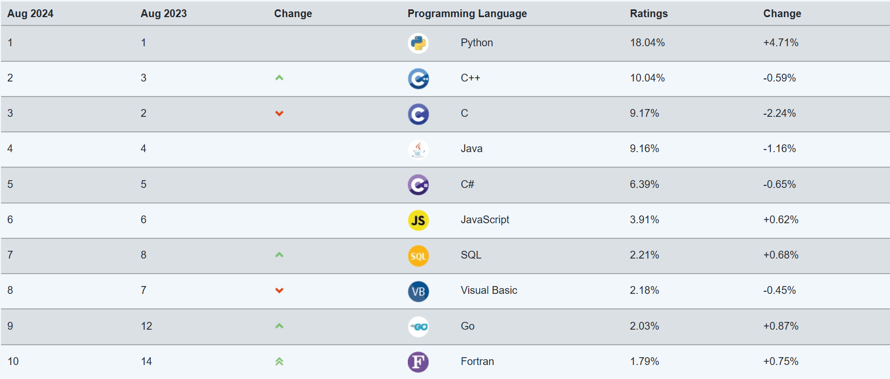
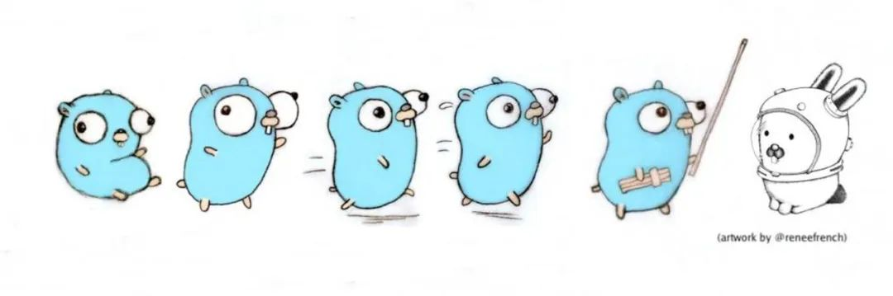

#### <span id="stack">实践篇其 2 - 前后端学习浅谈和开发规范</span>

> [!NOTE]
>
> 本章作者：cjx + wjj + syl
>
> 难度：⭐⭐⭐
>
> 涉及语言：shell


##### 前端技术栈

###### 简介

**`html`，`css`，`js`** 三件套，使用它们可以设计网页界面、交互逻辑，以及向后端发数据。`html` 和 `css` 都有着简单的语法，容易上手进行开发。

`html` 也很容易嵌入到其他的一些标记语言中，比如你正在看的这篇文档，是使用 `markdown` 编写的，就支持内嵌的 `html` 语句。

`css`，中文名叫层叠样式表，可以修改 `html` 中元素的样式，提高代码的可读性和可维护性。

快速开始编写一个网页页面很简单，在 `vscode` 中安装好相关插件之后，在空的 `.html` 文件中输入 `!`，然后代码提示的第一个就会为你自动生成一个 `html` 模板。

具体的三件套教程可参考 <a href="https://www.runoob.com">菜鸟教程</a> 和 <a href="https://www.w3school.com.cn/">w3school</a>，里面有很详细的讲解和示例。


**`vue.js`**  `Vue.js` 是一套用于构建用户界面的渐进式框架。它与其他大型框架不同，被设计为可以自底向上逐层应用。`Vue` 的核心库只关注视图层，易于上手，且便于与第三方库或既有项目整合。当与现代化的工具链以及各种支持类库结合使用时，`Vue` 也完全能够为复杂的单页应用提供驱动。

`Vue.js` 还有一个十分强大的组件库，`element plus`，它是基于 `vue` 开发的一套 UI 组件库，提供丰富的网页开发组件，可用快速开发网站，降低前端开发成本。

<a href="https://cn.vuejs.org/">`Vue.js` 官方文档</a>

<a href="https://element-plus.org/zh-CN/">`element plus` 官方文档</a>


###### 更多

如果你对前端开发有浓厚的兴趣，我们也推荐你更加广泛地学习，这里我们列举一些例子：

<a href="https://zh-hans.react.dev/learn">`React` 文档</a>

<a href="https://www.webpackjs.com/">`Webpack` 中文文档</a>

>  -*你知道回答的人是谁吗，哈哈哈*
>        -*我知道啊，一个不懂 vue 的胖子*


##### 后端技术栈

###### 简介

后端将使用 **`go`** 语言进行开发，它是由谷歌推出的新兴的开发语言，在 2024 年 8 月的语言流行度排名中，位列第 9。`go` 语言是一种强类型语言，其运行速度接近 C 语言，同时又具有简单的语法，易于上手。其最大特点莫过于提供了一种简洁且高效的方式来处理并发事务，这使得它非常适合用来开发一些有高并发场景的服务，比如 Web 后端。



 推荐阅读：<a href="https://mp.weixin.qq.com/s?__biz=MzIxMzgyNTQyOA==&mid=2247487919&idx=1&sn=20e3b80796c6abd995af55ad1cd2007d&chksm=96715836363d799f3b3b5df2608256f033362e8d351d6ebac6279e522b6d87d144c94cd3a50e&mpshare=1&scene=23&srcid=0909d0ju8PpaT7dGiaJrsEQ6&sharer_shareinfo=1fa7d4e29ed415209d630b05d85f1edf&sharer_shareinfo_first=1fa7d4e29ed415209d630b05d85f1edf#rd">Go 语言中不可不知的语法糖</a> 这篇文章提到了很多 `go` 语言可以用来简化开发的用法，在对 `go` 基础有一定的了解之后，可以阅读下这篇文章。

更具体地，我们将使用基于 `go` 语言的 `gin` 框架来进行后端开发，~~应该有人的面试题就是这个吧~~，使用 `gorm` 来操作数据库。`gin` 框架的优点包括高性能、支持中间件、路由管理方便、数据验证方便等等。而 `gorm` 的语法接近 `MySQL`，易于掌握。在这些技术的加持下，我们就可以进行一些后端的开发了。

在这些技术的学习中，`go` 语言基础毫无疑问是最重要的，我们会在后续的课程中详细讲解。我们希望你能拥有扎实的语言基础，这样在使用框架的时候会更加得心应手。我们更推荐你在使用框架的过程中，能逐渐地了解这个框架的架构，学习到更本质的东西，而不是仅停留在调包的水平。

<a href="https://golang.google.cn/doc/">`go` 语言官方文档 </a> <a href="https://gorm.io/zh_CN/docs/index.html">`gorm` 官方文档</a>




如果你对后端开发的兴趣浓厚，那么也可以考虑进一步学习，我们在这里给出一些例子，仅供参考

<a href="https://nodejs.cn/api/">Node.js 官方文档</a>

<a href="https://flask.palletsprojects.com/en/3.0.x/">Flask (python) 官方文档</a>

<a href="https://oi-wiki.org/">oi wiki</a>


######  后端学习中重要的额外内容

> （以下内容适合后端兴趣浓厚，想要长期学习和开发的读者，不建议速通这些内容，但一定要坚持学习）

1.**更多的数学知识**：不要以为上课学了个高数和线代就可以高枕无忧了，时代在变化，这些最浅层的数学内容不能让你有着解决所有问题的能力，所以建议了解以及学习 **阶的估计**、**基础数论**、**抽象代数** 等内容，多学数学百利而无一害，不要停止这方面的持续精进，特别是在计算机方面，你会发现你几百行代码解决不了的问题可能就只需要做一个简单的流形的变换就解决了。

2.语言特性：迭代器，静态期和运行期特性，**上下文（context）**，可变参数，反射，泛型，管理垃圾回收等。

3.算法基础：包括基本的排序、搜索、数据结构、优化等内容。了解常用容器的底层结构（如 map 底层是红黑树），判断、鉴权 api 时考虑前缀树等。

4.调试工具：我们可能不会详细讲述如何进行调试，但是自己需要了解，这点很重要。比如 go test 如何使用，如何查看内存占用，段错误（Segmentation Fault）是什么意思以及如何修复等。

5.常用框架：学会如何阅读框架源码，更进一步最好做到自己看框架底层。

6.学习复杂逻辑问题的解决：往后会遇见要求高性能的并行开发，如何共享内存、如何进行线程间的通信等，以及多线程中数据安全以及雷神之锤等问题场景。

7.数据库更多内容：mysql 索引（存储节点是 B+ 树结构），以及为什么少用 limit 做分页（考虑性能的话建议手动使用 where）等业务开发中的细节内容。学习缓存怎么设置，使用 Redis，Redis 为什么高效（存储节点是红黑树结构）。

8.更多计算机通用知识：强烈建议参照 linux 操作系统进行学习，包括内存结构（静态区、堆、栈等），存储中分页等细节内容，cpu 底层细节优化（如有时候大循环展开成 4 个循环反而高效的原因是因为 cpu 会自己进行数据的大小比较，循环展开有效的先将数据分块排序这些底层内容），并行开发时 cpu 和 gpu 的负载和表现，io 复用等底层内容。深入网络模块、协议、websocket，有条件的了解下 epoll。


##### 开发规范 Restful API

`Rest` 是一种软件架构风格，并不是一种标准，相应的 `Restful API` 是一种接口设计风格，规范。前后端在开发过程中都会遇到路由管理的问题，遵循一些规范能让后端的接口设计更加合理，便于前端使用，也能让前端对资源的管理更加直观。

这种规范下的 URL 的 path 是需要认真考虑的，通常其组成如下

```url
/{version}/{resources}/{resource_id}
```

并且遵循下面的约定

+ 不用大写字母，所有单词使用英文且小写。

+ 连字符用中杠 "-" 而不用下杠 "_"。

+ 正确使用 "/" 表示层级关系，URL 的层级不要过深，并且越靠前的层级应该相对越稳定。

+ 结尾不要包含正斜杠分隔符 "/"。

+ URL 中不出现动词，用请求方式表示动作。

+ 资源表示用复数不要用单数。

+ 不要使用文件扩展名。

对于动词（请求方式）的使用，遵循下面的约定：

+ GET：从服务器查询

+ POST：在服务器创建新的资源

+ PUT：更新服务器资源

+ DELETE：从服务器删除资源

 关于 `Restful API` 的文章推荐：

<a href="http://www.ruanyifeng.com/blog/2014/05/restful_api.html">RESTful API 设计指南 - 阮一峰的网络日志</a>

<a href="https://www.cnblogs.com/bigsai/p/14099154.html">一文搞懂 RESTful API</a>


##### 开发规范 git 提交信息

当你使用 `git` 向仓库进行提交的时候，你可以附带提交信息，如下：

```shell
#shell
git commit -m "<提交信息>"
```

在提交信息部分，你应当遵守 <a href="https://devdiv.github.io/school/tools/dev/git/commit-message.html#commit-规范化">这样</a> 的规范
