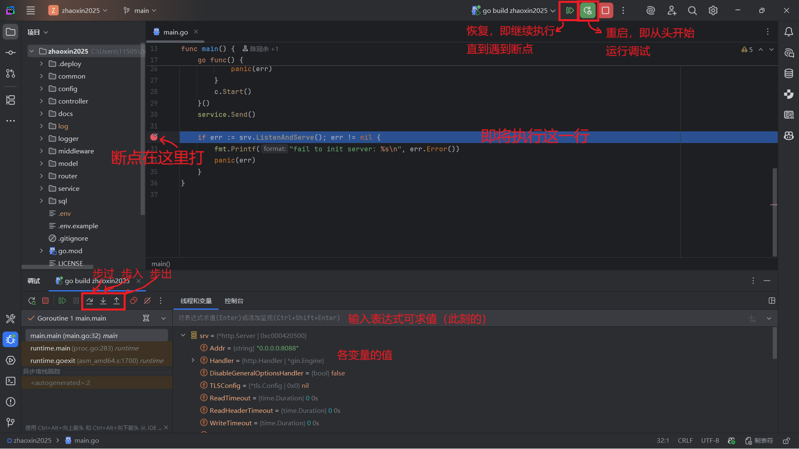

#### <span id="debug">实践篇其 4 - 如何 Debug</span>

> [!NOTE]
>
> 本章作者：cgy + Grok 4
>
> 难度：⭐⭐⭐
>
> 涉及语言：Go

##### 综述

Debug（下面都称作调试，因为中英文切起来很麻烦）的目的是找出代码中的错误、性能瓶颈或意外行为，程序员写程序几乎不可能一遍就写得完全正确，因此掌握调试技能是很重要的。常见的调试场景包括代码逻辑错误、内存泄露问题和并发问题。

由于笔者仅熟悉后端，本篇目前（2025年8月）仅涉及后端（Go 语言）的程序调试。

> [!NOTE] 一点题外话（并非题外）
>
> 在项目正式投入使用前一定要先充分地测试，及早发现问题，避免生产环境崩溃，否则到时候时间紧任务重（因为用户随时都需要用）修 bug 会压力山大。
>  一定不要把未测试过的代码上线到生产环境。

**Go 调试工具概述**
Go 提供了丰富的内置工具和第三方支持：
- **简单方法**：打印语句、日志输出，适合快速验证。
- **调试器**：Delve（dlv），Go 的专用调试器，支持断点、变量检查等。
- **IDE 支持**：VS Code、GoLand 等集成 Delve，提供图形化调试界面。
- **\*高级工具**：如 `go tool pprof`（内存分析）、`-race` 标志（数据竞争检测）。

调试时，建议从简单方法入手，逐步掌握高级工具，标“\*”的部分仅做了解。记住：好的调试习惯包括编写单元测试（使用 `go test`），这能预防许多问题。

##### 简单调试

**1. `fmt.Println`**
最原始但有效的调试方式是使用打印语句。它不需要额外工具，利用它可以快速打印出相应时刻变量值，也能借助它来判断条件分支走向。Go 的 `fmt` 包提供了丰富的打印函数。

```go
package main

import "fmt"

func main() {
    x := 10
    y := 20
    fmt.Println("x 的值是:", x)  // 简单打印
    fmt.Printf("y 的值是: %d\n", y)  // 格式化打印

    sum := x + y
    fmt.Println("计算结果:", sum)
    // 打印变量值
    
	if result == 15 {
		fmt.Println("计算正确！")
	} else {
		fmt.Println("计算错误！")
	}
	// 判断条件分支走向
}
```


**2. （简单调试中的）高级技巧**
- **使用 log 包**：比 fmt 更结构化，它默认会输出到标准错误流（stderr），并自动添加时间戳，方便追溯问题。而且支持不同日志级别，方便区分问题严重级别。一般大项目都需要保存日志，以便事后定位问题。

```go
package main

import (
    "log"
    "os" // 引入操作系统能力，用于读取日志文件
)

func main() {
    // 你可以将日志输出到文件
    logFile, err := os.OpenFile("app.log", os.O_CREATE|os.O_WRONLY|os.O_APPEND, 0666)
    if err != nil {
        log.Fatalln("打开日志文件失败:", err)
    }
    log.SetOutput(logFile)
	
	userID := 1
    log.Printf("开始处理用户 %d 的请求", userID)
	
    // 干活中，处理用户请求
	
    log.Printf("用户 %d 的请求处理完毕", userID) // 一般打印输出
	
	log.Fatalf("警告：自毁程序已启动...") // 发生致命错误
}
  ```
- **JSON 打印**：对于复杂结构体，使用 `json.Marshal` 转换为 JSON 格式打印，便于阅读。
```go
import "encoding/json"

data := struct{ Name string }{Name: "syl"}
jsonData, _ := json.Marshal(data)
fmt.Println(string(jsonData))  // 输出: {"Name":"syl"}
```

**注意**：打印调试适合小规模问题，过度使用会使代码混乱，你也不想从一堆 `println` 中间找出真正在干活的代码吧，因此调试完成后记得移除或注释掉打印语句，或者改用接下来要介绍的方法。

##### IDE 调试功能

集成开发环境（IDE）提供了图形化调试支持，让你能“暂停”代码（ 砸瓦鲁多！），逐步执行、检查变量。推荐使用 JetBrains 的 GoLand 或 VS Code，它们都集成 Delve 调试器。

参考材料：[CS61B 的 Debugging lab](https://sp25.datastructur.es/labs/lab02/) lab2 和 lab3 会引导你快速上手 IntelliJ IDEA 的调试方法，非常推荐，看看图文讲解即可，感兴趣的话推荐系统学 CS61B，数据结构好课。P.S. IntelliJ 是 JetBrains 的 Java IDE，和 GoLand 的使用方法基本是一样的。

**设置 IDE 调试**
 建议直接使用 GoLand 进行尝试，VS Code 的配置比较繁琐。这部分建议上手操作，仅阅读文档很难掌握。
- **VS Code 配置**：
   - 安装 Go 扩展（vscode-go）。
   - 在 launch.json 中添加调试配置：
     ```json
     {
         "version": "0.2.0",
         "configurations": [
             {
                 "name": "Launch",
                 "type": "go",
                 "request": "launch",
                 "mode": "auto",
                 "program": "${fileDirname}"
             }
         ]
     }
     ```
- **GoLand 配置**：开箱即用，直接点击上方虫子形状的“Debug”按钮。（如果不清楚“构建/调试配置”怎么弄就直接添加一个 `Go 构建`，然后确定就行了）

**核心功能**
- **断点（Breakpoints）**：鼠标移动到代码左侧行号上，此时行号会变成一个红点，点击后即设置断点，这行代码背景色会变红，程序运行到这里会暂停。（不打断点的调试就和运行没啥区别了）
- **条件断点**：右键代码行号处的红点，可设置断点条件，比如有一段代码是多次循环，而你需要在 `i = 1145` 时暂停程序，条件中就可以写 `i = 1145`。
- **步进执行**：
 当前变量值是高亮的那一行代码尚未执行时刻的。
	- 步过（Step Over）：执行当前行，不进入函数。
	- 步入（Step Into）：进入函数内部。
	- 步出（Step Out）：跳出当前函数。
- **变量检查**：暂停时，在调试面板中可查看变量值、栈帧和 goroutine 状态。
- **表达式求值**：在调试面板上方输入表达式，如 `x + y`，实时计算，支持函数调用。



##### \*内存泄露调试

内存泄露是指程序未正确释放内存，只从操作系统那里拿而没有还回去，导致内存占用不断增加的现象。如果内存泄露持续发生，内存都要被吃干抹净了，现代操作系统就会触发保护机制，开杀，杀掉一些进程来释放内存，从而恢复正常运转。而在极端的情况下，操作系统都可能被它干崩溃，然后强制重启。

虽然 Go 有垃圾回收（GC），但仍可能发生泄露，如未关闭的 goroutine 或缓存增长，因此掌握如何调试内存泄露也是有好处的。

**使用 Go 的内置 pprof 工具**
1. **启用 pprof**：在代码中导入 `net/http/pprof` 并启动 HTTP 服务。
   ```go
   import (
       _ "net/http/pprof"
       "net/http"
   )

   go func() {
       http.ListenAndServe("localhost:6060", nil)
   }()
   ```
2. **采集数据**：运行程序，访问 `http://localhost:6060/debug/pprof/heap?debug=1` 获取堆快照。
3. **分析**：使用 `go tool pprof`。
   - 命令：在终端中执行 `go tool pprof http://localhost:6060/debug/pprof/heap`
   - 在 pprof 交互模式下，输入 `top` 查看内存占用前几项，`list funcName` 查看具体函数。
   - 多次查看内存占用情况，关注 `inuse_space` 这一项，如果某个函数占用的内存持续增长，表明很可能发生了内存泄露。

##### \*数据竞争调试

数据竞争（Data Race）是并发编程的常见问题，指多个 goroutine 同时读写共享变量，导致不可预测行为。Go 提供了内置检测器。

**启用检测**

编译或运行时添加 `-race` 标志：
- 构建：`go build -race`
- 测试：`go test -race`
- 运行：`go run -race main.go`
 这一工具依赖 gcc，Windows 建议安装 [msys2](https://www.msys2.org/)，类 UNIX 默认都会解决（）。

如果无特殊的输出，说明未检测到竞争，否则Go 会打印详细栈踪迹：
```
WARNING: DATA RACE
Read at 0x000001234567 by goroutine 7:
  main.readVar()
      /path/to/file.go:10 +0x3a

Previous write at 0x000001234567 by goroutine 6:
  main.writeVar()
      /path/to/file.go:15 +0x4b
```

**修复策略**

 这一部分涉及并发编程的知识，感兴趣的话建议系统学习。

- **使用互斥锁（Mutex）**：保护共享变量。
- **通道（Channels）**：用通道代替共享内存，实现安全通信。
- **原子操作**：使用 `sync/atomic` 包，如 `atomic.AddInt32`。
- **避免竞争**：设计时最小化共享状态，使用不可变数据。

**注意**：`-race` 会增加 2-20 倍的开销，仅用于开发/测试。生产环境用其他监控工具。
